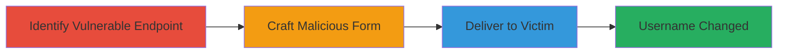

# CSRF Exploitation to Force Unauthorized Username Change on Zomato

Multi-stage attack chain demonstrating a complete CSRF workflow against Zomato's username selection feature.

## Chain Metrics Dashboard

| Metric | Value |
|--------|-------|
| Chain Status | Unverified |
| Total Steps | 3 |
| Execution Time | ~5 minutes |
| Skill Level | Intermediate |
| Complexity | Medium |
| Impact Level | High |

## Attack Flow Visualization

## Prerequisites & Requirements

### Required Tools

- None (uses basic HTML and browser)

### Target Environment

- Web platform
- PHP-based backend (Zomato's /php/username_selector.php)
- No specific ports or services beyond standard HTTPS (443)

### Initial Access Requirements

- Victim must be authenticated to Zomato
- Attacker needs a way to lure victim (e.g., phishing link)
- No prior credentials needed for attacker

## Detailed Attack Procedures

### Step 1: Identify Vulnerable Endpoint
procedure: [[procedures/Identify-CSRF-Vulnerable-Username-Endpoint]]

**Objective**: Locate the username selection endpoint lacking CSRF protection to confirm exploitability.

**Instructions**: Inspect Zomato's username change feature by monitoring network requests during a legitimate username update. Use browser developer tools to observe POST requests to /php/username_selector.php with the 'uname' parameter. Verify no CSRF token is required by attempting a cross-origin request.

**Expected Output**: Confirmation of endpoint URL and parameter details.

**Success Indicators**:
- POST to https://www.zomato.com/php/username_selector.php observed without token validation
- Cross-origin test succeeds without errors

### Step 2: Craft Malicious CSRF Form
procedure: [[procedures/Craft-Malicious-CSRF-HTML-Form]]

**Objective**: Create an HTML page that automatically submits a forged request to change the victim's username.

**Instructions**: Develop a simple HTML file with a hidden form targeting the endpoint. Set the 'uname' input to a desired malicious value (e.g., 'hackedbyattacker'). Use JavaScript to auto-submit on page load.

**Expected Output**: A functional HTML file ready for hosting.

**Success Indicators**:
- Form submits successfully when tested in a browser
- No visible user interaction required

### Step 3: Deliver Payload to Victim
procedure: [[procedures/Deliver-CSRF-Payload-to-Authenticated-Victim]]

**Objective**: Trick the authenticated victim into loading the malicious page, triggering the username change.

**Instructions**: Host the HTML file on a controllable server (e.g., GitHub Pages or local server with ngrok). Send the link to the victim via email, social engineering, or malicious site embedding. Ensure the victim is logged into Zomato when they visit.

**Expected Output**: Victim's Zomato handle changed to the attacker's chosen value.

**Success Indicators**:
- Victim reports or attacker verifies username change on Zomato
- No alerts or confirmations prompted to victim

## Attack Chain Summary

### Key Achievements

1. Identified CSRF-vulnerable endpoint without protection
2. Crafted undetectable auto-submitting form
3. Successfully forced account modification on authenticated users

## Technique & Tactic Coverage

### MITRE ATT&CK Techniques

- [[Drive-by Compromise]]

### MITRE ATT&CK Tactics

- [[Initial Access]]

---
*Last updated: 2024-10-01T00:00:00Z*
