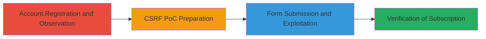

---
tags:
  - csrf
  - web
  - subscription
  - instacart
type: attack_chain
tools:
  - '[[tools/Burp-Suite]]'
tactics:
  - '[[Initial Access]]'
verified: false
platforms:
  - Web
submitted: true
complexity: medium
created_at: '2023-10-01T00:00:00Z'
procedures:
  - '[[procedures/Exploit-Instacart-CSRF-Subscription]]'
step_count: 7
techniques:
  - '[[Exploit Public-Facing Application]]'
updated_at: '2025-12-14T17:27:57.450Z'
description: >-
  A multi-step attack chain exploiting a CSRF vulnerability in Instacart's
  subscription endpoint to force authenticated users into a 14-day express trial
  without consent.
skill_level: intermediate
impact_level: high
id: bc06cff3-7605-42bd-81fb-e0d523c76d9b
validated: true
mitre_tactics:
  - '[[Initial Access]]'
mitre_techniques:
  - '[[Exploit Public-Facing Application]]'
---
# CSRF Exploitation to Force Unwanted Express Trial Subscription on Instacart

Multi-stage attack chain demonstrating a complete CSRF exploitation workflow on Instacart's express trial subscription system.

## Chain Metrics Dashboard

| Metric | Value |
|--------|-------|
| Chain Status | Unverified |
| Total Steps | 7 |
| Execution Time | ~5 minutes |
| Skill Level | Intermediate |
| Complexity | Medium |
| Impact Level | High |

## Attack Flow Visualization



## Prerequisites & Requirements

### Required Tools

- [[tools/Burp-Suite]]

### Target Environment

- Web platform
- Access to Instacart website (https://www.instacart.com)
- Authenticated user session

### Initial Access Requirements

- Valid Instacart account credentials
- Browser with active session
- No special network access beyond internet

## Detailed Attack Procedures

### Step 1: Navigate to Instacart Website
procedure: [[procedures/Exploit-Instacart-CSRF-Subscription]]

**Objective**: Establish initial access to the target application.

**Instructions**: Open a web browser and navigate to the Instacart homepage.

**Expected Output**: The Instacart login or registration page loads.

**Success Indicators**:
- Website accessible without errors
- Browser session established

### Step 2: Register a New Test Account
procedure: [[procedures/Exploit-Instacart-CSRF-Subscription]]

**Objective**: Create an authenticated session to observe the subscription flow.

**Instructions**: Use the registration form to create a new account with an email like testuser1@email.com and a temporary password.

**Expected Output**: Successful registration confirmation and redirect to the dashboard.

**Success Indicators**:
- Account created and login successful
- Authenticated session active

### Step 3: Observe the Limited Offer Popup
procedure: [[procedures/Exploit-Instacart-CSRF-Subscription]]

**Objective**: Identify the subscription endpoint and parameters by inspecting the legitimate flow.

**Instructions**: After registration, note the popup offering the 14-day express trial subscription.

**Expected Output**: Popup displays with options to accept or decline the trial.

**Success Indicators**:
- Popup appears with subscription details
- Parameters like free_trial=true visible in network inspection

### Step 4: Decline the Offer and Proceed
procedure: [[procedures/Exploit-Instacart-CSRF-Subscription]]

**Objective**: Skip the legitimate subscription to prepare for forged request testing.

**Instructions**: Click 'No thanks' on the popup to proceed to the welcome page.

**Expected Output**: Redirect to welcome page with a reminder banner for subscription.

**Success Indicators**:
- User remains unsubscribed
- Banner confirms no active trial

### Step 5: Prepare and Load CSRF Proof-of-Concept Page
procedure: [[procedures/Exploit-Instacart-CSRF-Subscription]]

**Objective**: Create a malicious HTML page to forge the subscription request.

**Instructions**: In a new tab, load a local HTML file containing an auto-submitting form to https://www.instacart.com/v3/subscriptions with hidden fields: free_trial=true, promo=true, term=year.

**Expected Output**: Form loads and auto-submits the POST request.

**Success Indicators**:
- Form visible or auto-submits
- Request intercepted if using proxy

### Step 6: Submit the CSRF Form
procedure: [[procedures/Exploit-Instacart-CSRF-Subscription]]

**Objective**: Execute the forged request to subscribe the victim without consent.

**Instructions**: Use [[commands/instacart-csrf-subscribe-trial]] captured via [[tools/Burp-Suite]] to send the POST request:

```bash
curl -X POST https://www.instacart.com/v3/subscriptions \
  -H "Content-Type: application/x-www-form-urlencoded" \
  -H "Cookie: [session_cookie]" \
  -d "free_trial=true&promo=true&term=year"
```

**Expected Output**: HTTP 200 OK with JSON response confirming subscription creation, e.g., {"id": "sub_123", "duration_in_days": 14, "trial": true}.

**Success Indicators**:
- Subscription confirmed in response
- No CSRF token validation error

### Step 7: Verify the Subscription
procedure: [[procedures/Exploit-Instacart-CSRF-Subscription]]

**Objective**: Confirm the exploitation success by checking the user's status.

**Instructions**: Refresh the main Instacart page to observe changes.

**Expected Output**: Page shows message like "You are now on the express trial."

**Success Indicators**:
- Trial active without user interaction
- Banner or status updated

## Attack Chain Summary

### Key Achievements

1. Successful CSRF exploitation bypassing protection on subscription endpoint
2. Forced subscription leading to potential user confusion or phishing opportunities
3. Demonstrated impact on authenticated users via simple HTML PoC

## Technique & Tactic Coverage

### MITRE ATT&CK Techniques

- [[Exploit Public-Facing Application]]

### MITRE ATT&CK Tactics

- [[Initial Access]]

---
*Last updated: 2023-10-01T00:00:00Z*
