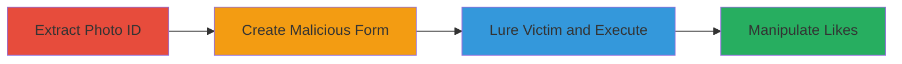

# CSRF Exploitation to Manipulate Photo Likes on Zomato

Multi-stage attack chain demonstrating a complete CSRF workflow to forge photo interactions on Zomato without user consent.

## Chain Metrics Dashboard

| Metric | Value |
|--------|-------|
| Chain Status | Unverified |
| Total Steps | 3 |
| Execution Time | ~5 minutes |
| Skill Level | Intermediate |
| Complexity | Medium |
| Impact Level | High |

## Attack Flow Visualization

## Prerequisites & Requirements

### Required Tools

- Web browser for inspection
- Local web server (e.g., Python's SimpleHTTPServer)

### Target Environment

- Zomato web platform
- Authenticated victim session
- No special ports; standard HTTPS/443

### Initial Access Requirements

- Victim must be logged into Zomato
- Attacker needs victim's browser to visit malicious site
- No prior credentials needed for attacker

## Detailed Attack Procedures

### Step 1: Extract Photo ID
procedure: [[procedures/Extract-Photo-ID-from-Zomato-URL]]

**Objective**: Identify and extract the photo ID from a target Zomato photo URL to prepare for CSRF payload.

**Instructions**: Navigate to the target photo on Zomato and inspect the URL to locate the photo ID in the format `/pv-res-[number]-[photo id]`, such as `/es/photos/pv-res-18342981-r_2MzMzNTg1NzIwO` where `r_2MzMzNTg1NzIwO` is the photo_id. Copy this value for use in the next step.

**Expected Output**: A valid photo_id string, e.g., `r_2MzMzNTg1NzIwO`.

**Success Indicators**:
- Photo ID successfully parsed from URL
- ID matches the expected base64-like format

### Step 2: Create Malicious HTML Form
procedure: [[procedures/Create-Malicious-HTML-Form-for-CSRF]]

**Objective**: Build an auto-submitting HTML form that posts forged requests to Zomato's endpoint to like or unlike the photo.

**Instructions**: Create an `index.html` file with a form targeting `https://www.zomato.com/php/photoViewerActionsHandler.php`. Include hidden inputs for `type` (set to `LIKE_PHOTO` or `UNLIKE_PHOTO`) and `photo_id` (the extracted value). Add a JavaScript snippet to auto-submit the form on page load. Host this file on a local web server.

**Expected Output**: A hosted HTML page that automatically submits the POST request when loaded.

**Success Indicators**:
- Form submission triggers without errors in browser console
- Network tab shows POST to the Zomato endpoint

### Step 3: Lure Victim and Execute
procedure: [[procedures/Lure-Victim-to-Malicious-Site-for-CSRF-Execution]]

**Objective**: Trick the authenticated victim into visiting the malicious site, triggering the CSRF to manipulate the photo like count.

**Instructions**: Share the URL of the hosted malicious page with the victim via phishing, social engineering, or embedding in another site. When the victim (logged into Zomato) visits, the form auto-submits, forging the action on their behalf.

**Expected Output**: Photo like/unlike count changes on Zomato without victim interaction.

**Success Indicators**:
- Victim's session performs the action
- Like count updates in Zomato photo viewer
- No CSRF token validation blocks the request

## Attack Chain Summary

### Key Achievements

1. Successful extraction of photo ID from Zomato URLs
2. Deployment of a stealthy auto-submitting CSRF form
3. Mass manipulation of photo interactions to impact restaurant reputations

## Technique & Tactic Coverage

### MITRE ATT&CK Techniques

- [[Drive-by Compromise]] Drive-by Compromise
- [[Exploit Public-Facing Application]] Exploit Public-Facing Application

### MITRE ATT&CK Tactics

- [[Initial Access]] Initial Access
- [[Execution]] Execution

---
*Last updated: 2023-10-01T12:00:00Z*
