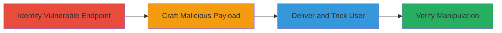

---
tags:
  - csrf
  - web
  - account-manipulation
  - e-commerce
type: attack_chain
tools: []
tactics:
  - '[[Initial Access]]'
  - '[[Lateral Movement]]'
verified: false
platforms:
  - Web
submitted: true
complexity: medium
created_at: '2023-10-01T00:00:00Z'
procedures:
  - '[[procedures/Identify-CSRF-Vulnerable-Endpoint]]'
  - '[[procedures/Craft-and-Deliver-CSRF-Payload]]'
  - '[[procedures/Verify-Cart-Manipulation]]'
step_count: 3
techniques:
  - '[[Exploit Public-Facing Application]]'
  - '[[Drive-by Compromise]]'
updated_at: '2025-12-14T17:27:49.461Z'
description: >-
  A multi-stage attack leveraging the absence of CSRF protection on a
  state-changing POST endpoint to trick authenticated users into adding
  unauthorized items to their shopping cart, potentially leading to account
  manipulation or unintended purchases.
skill_level: intermediate
impact_level: high
id: fe524796-14c1-4a27-b383-803c3fb8358d
validated: true
mitre_tactics:
  - '[[Initial Access]]'
  - '[[Lateral Movement]]'
mitre_techniques:
  - '[[Exploit Public-Facing Application]]'
  - '[[Drive-by Compromise]]'
---
# CSRF Exploitation to Manipulate User Cart in Mars Web Application

Multi-stage attack chain demonstrating a complete CSRF workflow against the Mars web application, exploiting the lack of CSRF tokens on a POST endpoint for adding items to a cart.

## Chain Metrics Dashboard

| Metric | Value |
|--------|-------|
| Chain Status | Unverified |
| Total Steps | 3 |
| Execution Time | ~5 minutes |
| Skill Level | Intermediate |
| Complexity | Medium |
| Impact Level | High |

## Attack Flow Visualization



## Prerequisites & Requirements

### Required Tools

- Browser developer tools
- HTML editor or simple text editor for PoC page

### Target Environment

- Web platform (Mars e-commerce application)
- Authenticated user session required
- No specific ports; standard HTTPS (443)

### Initial Access Requirements

- Attacker needs to know the target endpoint (e.g., /cart/add)
- Victim must be authenticated to the Mars app
- Network access to the attacker's hosted malicious page

## Detailed Attack Procedures

### Step 1: Identify Vulnerable Endpoint
procedure: [[procedures/Identify-CSRF-Vulnerable-Endpoint]]

**Objective**: Locate the state-changing POST endpoint lacking CSRF protection to confirm exploitability.

**Instructions**: Use browser developer tools to inspect network requests while adding an item to the cart normally. Look for POST requests to endpoints like /cart/add without CSRF tokens in headers or forms.

**Expected Output**: Identification of the vulnerable endpoint URL, parameters (e.g., item_id, quantity), and confirmation of no anti-CSRF measures.

**Success Indicators**:
- POST request observed without CSRF token
- Endpoint responds to unauthenticated or forged requests when simulated

### Step 2: Craft and Deliver CSRF Payload
procedure: [[procedures/Craft-and-Deliver-CSRF-Payload]]

**Objective**: Create a malicious HTML page that automatically submits the forged POST request to add an item to the victim's cart.

**Instructions**: Write an HTML file with an auto-submitting form targeting the vulnerable endpoint. Host it on a server (e.g., GitHub Pages or local server) and send the link to the victim via email or social engineering.

Example PoC HTML:

```html
<!DOCTYPE html>
<html>
<body>
<form id="csrf-form" action="https://mars.example.com/cart/add" method="POST">
  <input type="hidden" name="item_id" value="123">
  <input type="hidden" name="quantity" value="1">
</form>
<script>
document.getElementById('csrf-form').submit();
</script>
</body>
</html>
```

Host and deliver the link to the authenticated victim.

**Expected Output**: Victim's browser submits the request invisibly, adding the item to their cart.

**Success Indicators**:
- Form submission triggers without user interaction
- No errors from missing CSRF token

### Step 3: Verify Cart Manipulation
procedure: [[procedures/Verify-Cart-Manipulation]]

**Objective**: Confirm the unauthorized action was performed by checking the victim's cart contents.

**Instructions**: After delivery, have the victim (or monitor if possible) log in to the Mars app and inspect their cart for the added item. Alternatively, simulate as the attacker by testing on a controlled account.

**Expected Output**: Unauthorized item appears in the cart, demonstrating successful manipulation.

**Success Indicators**:
- Item added without victim's intent
- Potential for further abuse like forced purchases

## Attack Chain Summary

### Key Achievements

1. Identified CSRF-vulnerable endpoint in Mars app
2. Delivered invisible payload to authenticated user
3. Achieved unauthorized cart modification

## Technique & Tactic Coverage

### MITRE ATT&CK Techniques

- [[Exploit Public-Facing Application]]
- [[Drive-by Compromise]]

### MITRE ATT&CK Tactics

- [[Initial Access]]
- [[Lateral Movement]]

---
*Last updated: 2023-10-01T00:00:00Z*
