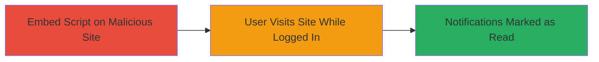

---
tags:
  - csrf
  - twitter
  - web
  - notifications
type: attack_chain
tools: []
tactics:
  - '[[Initial Access]]'
verified: false
platforms:
  - Web
submitted: true
complexity: low
created_at: '2023-10-01T00:00:00Z'
procedures:
  - '[[procedures/Embed-Malicious-Script-Tag-for-Twitter-CSRF]]'
  - '[[procedures/Trigger-CSRF-via-User-Visit-to-Malicious-Site]]'
step_count: 2
techniques:
  - '[[Drive-by Compromise]]'
updated_at: '2025-12-14T17:27:22.828Z'
description: >-
  A Cross-Site Request Forgery (CSRF) attack targeting Twitter's notifications
  endpoint, allowing a malicious website to automatically mark a user's unread
  notifications as read when they visit the site while logged in.
skill_level: low
impact_level: low
id: 20d85a45-cdd7-4e6a-9432-a14728d6f2a0
validated: true
mitre_tactics:
  - '[[Initial Access]]'
mitre_techniques:
  - '[[Drive-by Compromise]]'
---
# CSRF Exploitation to Mark Twitter Notifications as Read Without Consent

Multi-stage attack chain demonstrating a complete CSRF workflow against Twitter's notifications system.

## Chain Metrics Dashboard

| Metric | Value |
|--------|-------|
| Chain Status | Unverified |
| Total Steps | 2 |
| Execution Time | ~1 minute |
| Skill Level | Low |
| Complexity | Low |
| Impact Level | Low |

## Attack Flow Visualization



## Prerequisites & Requirements

### Required Tools

- None (uses basic HTML/JS)

### Target Environment

- Web platform
- Twitter service (notifications endpoint)
- No specific ports required (HTTPS)

### Initial Access Requirements

- Control over a third-party website to host malicious HTML
- Target user must be authenticated (logged in) to Twitter
- No prior access to Twitter account needed; exploits browser session

## Detailed Attack Procedures

### Step 1: Embed Malicious Script Tag
procedure: [[procedures/Embed-Malicious-Script-Tag-for-Twitter-CSRF]]

**Objective**: Prepare a malicious website by embedding a script tag that loads Twitter's notifications endpoint, setting up the CSRF trigger.

**Instructions**: Create an HTML file with the malicious script tag pointing to the vulnerable endpoint. Host this HTML on a server under your control.

Embed the following in your HTML:

```html
<script src="https://twitter.com/i/notifications"></script>
```

Host the page (e.g., via any web server) and note the URL for sharing.

**Expected Output**: A webpage that, when loaded, fetches the Twitter endpoint via script src.

**Success Indicators**:
- HTML file created and hosted successfully
- Script tag visible in page source

### Step 2: Trigger CSRF via User Visit
procedure: [[procedures/Trigger-CSRF-via-User-Visit-to-Malicious-Site]]

**Objective**: Induce the target user to visit the malicious site while logged into Twitter, triggering the CSRF to mark notifications as read.

**Instructions**: Share the URL of the malicious site with the target user (e.g., via email, social media, or phishing). When the user visits the site in a browser where they are authenticated to Twitter, the script loads automatically.

No additional code execution needed; the browser handles the cross-origin request.

**Expected Output**: Twitter's notifications endpoint is invoked, clearing the user's unread notifications count.

**Success Indicators**:
- User visits the site (observable via server logs if tracked)
- Target's Twitter notification count resets to zero (verify by checking their account)

## Attack Chain Summary

### Key Achievements

1. Successfully embedded CSRF-triggering script in a third-party site
2. Induced victim interaction to execute the cross-origin request
3. Unauthorized state change in victim's Twitter account (notifications cleared)

## Technique & Tactic Coverage

### MITRE ATT&CK Techniques

- [[Drive-by Compromise]]

### MITRE ATT&CK Tactics

- [[Initial Access]]

---
*Last updated: 2023-10-01T00:00:00Z*
