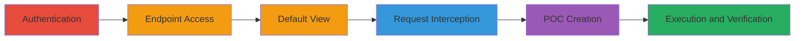

---
tags:
  - csrf
  - web
  - chaturbate
  - affiliates
  - stats
type: attack_chain
tools:
  - '[[tools/Browser-Unspecified]]'
tactics:
  - '[[Initial Access]]'
verified: false
platforms:
  - Web
submitted: true
complexity: medium
created_at: '2023-10-01T00:00:00Z'
procedures:
  - '[[procedures/Authenticate-to-Chaturbate-Account]]'
  - '[[procedures/Navigate-to-Affiliates-Stats-Endpoint]]'
  - '[[procedures/View-Default-Stats]]'
  - '[[procedures/Intercept-and-Modify-Request-Parameters]]'
  - '[[procedures/Create-CSRF-Proof-of-Concept]]'
  - '[[procedures/Execute-CSRF-POC-and-Verify]]'
step_count: 6
techniques:
  - '[[Exploit Public-Facing Application]]'
updated_at: '2025-12-14T17:27:16.029Z'
description: >-
  Demonstrates a CSRF vulnerability in the Chaturbate /affiliates/stats
  endpoint, allowing forged requests to alter stats parameters without user
  consent.
skill_level: intermediate
impact_level: low
id: 74e62eed-f81c-4a6c-b54c-b818c3492840
validated: true
mitre_tactics:
  - '[[Initial Access]]'
mitre_techniques:
  - '[[Exploit Public-Facing Application]]'
---
# CSRF Exploitation to Modify Affiliates Stats on Chaturbate

Multi-stage attack chain demonstrating a complete CSRF workflow on the Chaturbate platform, exploiting missing CSRF protection in the /affiliates/stats endpoint to forge requests and alter user stats parameters without consent.

## Chain Metrics Dashboard

| Metric | Value |
|--------|-------|
| Chain Status | Unverified |
| Total Steps | 6 |
| Execution Time | ~10 minutes |
| Skill Level | Intermediate |
| Complexity | Medium |
| Impact Level | Low |

## Attack Flow Visualization

## Prerequisites & Requirements

### Required Tools

- [[tools/Browser-Unspecified]]

### Target Environment

- Web platform
- Access to Chaturbate affiliates section
- Valid user credentials for authentication

### Initial Access Requirements

- Logged-in session to Chaturbate
- Network access to https://chaturbate.com
- Browser with developer tools for request interception

## Detailed Attack Procedures

### Step 1: Authenticate to Chaturbate

procedure: [[procedures/Authenticate-to-Chaturbate-Account]]

**Objective**: Gain a valid session to access protected endpoints.

**Instructions**: Open a browser and navigate to the Chaturbate login page, then enter valid credentials to authenticate.

**Expected Output**: Successful login redirect to the dashboard with an active session cookie.

**Success Indicators**:
- User is logged in and can access account features
- Session cookie is present in browser storage

### Step 2: Access Affiliates Stats Endpoint

procedure: [[procedures/Navigate-to-Affiliates-Stats-Endpoint]]

**Objective**: Reach the vulnerable endpoint to prepare for exploitation.

**Instructions**: From the logged-in state, directly access the URL https://chaturbate.com/affiliates/stats in the browser address bar.

**Expected Output**: The affiliates stats page loads, displaying default stats interface.

**Success Indicators**:
- Page loads without errors
- Stats form is visible

### Step 3: View Default Stats

procedure: [[procedures/View-Default-Stats]]

**Objective**: Observe the baseline stats to identify modifiable parameters.

**Instructions**: Interact with the stats page to load default views, such as today's or this week's stats, by selecting the default period.

**Expected Output**: Stats data for the default time range is displayed on the page.

**Success Indicators**:
- Default stats load correctly
- Request parameters for default view are captured if intercepting

### Step 4: Intercept and Modify Parameters

procedure: [[procedures/Intercept-and-Modify-Request-Parameters]]

**Objective**: Identify and alter request parameters to understand the vulnerability scope.

**Instructions**: Use browser developer tools to intercept the HTTP request sent when loading stats, then modify parameters like date ranges to arbitrary values and resubmit.

**Expected Output**: Modified stats load based on altered parameters.

**Success Indicators**:
- Parameters can be changed without authentication checks
- Stats update according to modifications

### Step 5: Create CSRF POC

procedure: [[procedures/Create-CSRF-Proof-of-Concept]]

**Objective**: Build a forged request simulator to exploit the CSRF flaw.

**Instructions**: Create an HTML file named Csrf.html containing a form that submits a POST request to https://chaturbate.com/affiliates/stats with modified parameters, such as custom date ranges.

**Expected Output**: A functional HTML file ready for execution.

**Success Indicators**:
- HTML file parses without errors
- Form submission targets the correct endpoint

### Step 6: Execute POC and Verify

procedure: [[procedures/Execute-CSRF-POC-and-Verify]]

**Objective**: Demonstrate the CSRF impact by altering stats without direct interaction.

**Instructions**: While logged into Chaturbate, open the Csrf.html file in the browser to trigger the forged request, then check the legitimate stats page for changes.

**Expected Output**: Stats parameters on the legitimate site update to the forged values.

**Success Indicators**:
- Stats form reflects modified parameters
- No user consent was required for the change

## Attack Chain Summary

### Key Achievements

1. Successful authentication and endpoint access
2. Identification of missing CSRF protection
3. Forged request execution leading to unauthorized stats modification

## Technique & Tactic Coverage

### MITRE ATT&CK Techniques

- [[Exploit Public-Facing Application]]

### MITRE ATT&CK Tactics

- [[Initial Access]]

---

*Last updated: 2023-10-01T00:00:00Z*
