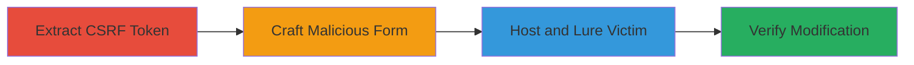

---
tags:
  - csrf
  - web-vulnerability
  - profile-defacement
  - liberapay
type: attack_chain
tools: []
tactics:
  - '[[Initial Access]]'
verified: false
platforms:
  - Web
submitted: true
complexity: medium
created_at: '2023-10-01T00:00:00Z'
procedures:
  - '[[procedures/Extract-CSRF-Token-from-Liberapay-Sign-in-Page]]'
  - '[[procedures/Craft-Malicious-HTML-Form-for-CSRF-Exploitation]]'
  - '[[procedures/Deploy-and-Trigger-CSRF-Attack-via-Victim-Visit]]'
  - '[[procedures/Verify-Profile-Name-Modification]]'
step_count: 4
techniques:
  - '[[Drive-by Compromise]]'
  - '[[Exploit Public-Facing Application]]'
updated_at: '2025-12-14T17:27:15.266Z'
description: >-
  A multi-stage CSRF attack targeting Liberapay's username edit endpoint to
  unauthorizedly change a logged-in user's optional 'Name' field by extracting
  and reusing a CSRF token in a malicious auto-submitting HTML form.
skill_level: intermediate
impact_level: low
id: f5e2eab2-bb43-4812-9391-d10d461f0e5d
validated: true
mitre_tactics:
  - '[[Initial Access]]'
mitre_techniques:
  - '[[Drive-by Compromise]]'
  - '[[Exploit Public-Facing Application]]'
---
# CSRF Exploitation to Modify Liberapay User Profile Name

Multi-stage attack chain demonstrating a complete CSRF workflow against Liberapay's profile editing functionality, allowing unauthorized modification of a user's optional 'Name' field without their direct interaction.

## Chain Metrics Dashboard

| Metric | Value |
|--------|-------|
| Chain Status | Unverified |
| Total Steps | 4 |
| Execution Time | ~5 minutes |
| Skill Level | Intermediate |
| Complexity | Medium |
| Impact Level | Low |

## Attack Flow Visualization

## Prerequisites & Requirements

### Required Tools

- Web browser with developer tools (e.g., Chrome DevTools)
- Local web server (e.g., Python's http.server for hosting HTML)

### Target Environment

- Liberapay web platform
- Victim must be authenticated in the same browser session
- No specific ports or services beyond standard HTTPS (443)

### Initial Access Requirements

- Attacker needs to know victim's username (e.g., via public profile)
- Victim must visit attacker's hosted malicious page while logged into Liberapay
- No prior credentials or network access needed beyond internet connectivity

## Detailed Attack Procedures

### Step 1: Extract CSRF Token
procedure: [[procedures/Extract-CSRF-Token-from-Liberapay-Sign-in-Page]]

**Objective**: Obtain a valid CSRF token from the Liberapay sign-in page to bypass protection in the edit endpoint.

**Instructions**: Open a web browser and navigate to the sign-in page. Use developer tools to inspect the page source or network requests to locate the CSRF token value.

**Expected Output**: A token string, such as "APJk0T5NR7Ut5q4mABPvh61Az8Ro1NtE".

**Success Indicators**:
- CSRF token value extracted successfully
- Token appears in the HTML form or meta tag on the sign-in page

### Step 2: Craft Malicious Form
procedure: [[procedures/Craft-Malicious-HTML-Form-for-CSRF-Exploitation]]

**Objective**: Build an HTML page that mimics the profile edit form and auto-submits a POST request using the extracted token to change the victim's name.

**Instructions**: Create an HTML file with a form targeting the edit endpoint, including hidden fields for the token, username, and desired public_name. Add JavaScript to auto-submit on page load.

**Expected Output**: A functional HTML file ready for hosting.

**Success Indicators**:
- Form HTML validates and includes all required fields
- Auto-submit script executes without errors in a test browser

### Step 3: Deploy and Trigger Attack
procedure: [[procedures/Deploy-and-Trigger-CSRF-Attack-via-Victim-Visit]]

**Objective**: Host the malicious page and induce the victim to visit it while authenticated, triggering the unauthorized name change.

**Instructions**: Serve the HTML file on a local or remote server and send a link to the victim (e.g., via phishing email). Ensure the victim is logged into Liberapay in the same browser.

**Expected Output**: Automatic POST submission upon page load, updating the profile without user prompt.

**Success Indicators**:
- Victim visits the page and form submits successfully
- No visible alerts or blocks from the browser

### Step 4: Verify Modification
procedure: [[procedures/Verify-Profile-Name-Modification]]

**Objective**: Confirm the attack's success by checking the updated profile name.

**Instructions**: Log into the victim's account and navigate to the profile edit page to inspect the 'Name (optional)' field.

**Expected Output**: The field displays the injected value, e.g., "CSRF TOKEN EXPLOIT FOR EDIT NAME".

**Success Indicators**:
- Profile name changed to attacker-specified value
- No errors or reversions detected

## Attack Chain Summary

### Key Achievements

1. Successful extraction and reuse of CSRF token across pages
2. Auto-submission of forged request leading to profile defacement
3. Demonstration of low-severity impact requiring same-session authentication

## Technique & Tactic Coverage

### MITRE ATT&CK Techniques

- [[Drive-by Compromise]]
- [[Exploit Public-Facing Application]]

### MITRE ATT&CK Tactics

- [[Initial Access]]

---
*Last updated: 2023-10-01T00:00:00Z*
