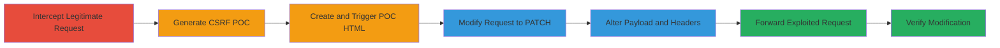

---
tags:
  - csrf
  - web
  - api
  - patch
  - project-settings
type: attack_chain
tools:
  - '[[tools/Burp-Suite]]'
tactics:
  - '[[Initial Access]]'
commands: []
platforms:
  - Web
complexity: medium
procedures:
  - '[[procedures/Generate-and-Execute-CSFR-POC-for-Stripo-Project-Settings]]'
step_count: 8
techniques:
  - '[[Exploit Public-Facing Application]]'
description: >-
  A multi-step CSRF attack chain exploiting the lack of anti-CSRF tokens in the
  Stripo Inc platform to unauthorizedly modify victim project settings via
  forged PATCH requests.
skill_level: intermediate
impact_level: high
id: fd7d7206-e7e9-4323-b905-499531af9f46
created_at: '2025-12-14T17:27:35.990Z'
updated_at: '2025-12-14T17:27:35.990Z'
verified: false
validated: true
submitted: true
mitre_tactics:
  - '[[Initial Access]]'
mitre_techniques:
  - '[[Exploit Public-Facing Application]]'
---
# CSRF Exploitation to Modify Project Settings in Stripo Inc

Multi-stage attack chain demonstrating a complete CSRF workflow to modify sensitive project configurations in the Stripo Inc platform without authentication tokens, relying on the victim's active session.

## Chain Metrics Dashboard

| Metric | Value |
|--------|-------|
| Chain Status | Unverified |
| Total Steps | 8 |
| Execution Time | ~15 minutes |
| Skill Level | Intermediate |
| Complexity | Medium |
| Impact Level | High |

## Attack Flow Visualization

## Prerequisites & Requirements

### Required Tools

- [[tools/Burp-Suite]]

### Target Environment

- Web platform with REST API (JSON-based)
- Access to https://my.stripo.email/cabinet/stripeapi/v1/projects/{Project_Id}
- Victim must be authenticated in the browser

### Initial Access Requirements

- Knowledge of the target project ID
- Attacker's ability to host or deliver malicious HTML (e.g., via phishing)
- No direct credentials needed; exploits session

## Detailed Attack Procedures

### Step 1: Intercept Legitimate Modification Request
procedure: [[procedures/Generate-and-Execute-CSFR-POC-for-Stripo-Project-Settings]]

**Objective**: Capture a genuine project settings update request to understand the structure for later forgery.

**Instructions**: Navigate to the project settings in the victim's browser, make a minor change (e.g., edit an email field), and use Burp Suite Proxy to intercept the outgoing POST request. Forward it to the Repeater tool for inspection.

**Expected Output**: Intercepted HTTP POST request with JSON payload containing project data.

**Success Indicators**:
- Request captured showing endpoint https://my.stripo.email/cabinet/stripeapi/v1/projects/{Project_Id}
- JSON body visible in Repeater

### Step 2: Generate CSRF POC Using Burp Suite
procedure: [[procedures/Generate-and-Execute-CSFR-POC-for-Stripo-Project-Settings]]

**Objective**: Create a basic HTML template that can forge the request from an external site.

**Instructions**: In Burp Suite Repeater, right-click the intercepted request and select Engagement Tools > Generate CSRF POC to auto-generate an HTML file with a form that mimics the request.

**Expected Output**: HTML code snippet with a form submitting to the target endpoint.

**Success Indicators**:
- HTML file generated with <form> action pointing to the Stripo API
- Form fields matching the original JSON data

### Step 3: Create and Open the CSRF POC HTML File
procedure: [[procedures/Generate-and-Execute-CSFR-POC-for-Stripo-Project-Settings]]

**Objective**: Prepare the POC for execution in a browser context.

**Instructions**: Copy the generated HTML into a new file named poc.html and open it in a web browser while the victim is authenticated to Stripo.

**Expected Output**: Loaded HTML page with a submit button or form ready to trigger the request.

**Success Indicators**:
- Page loads without errors
- Form visible and submittable

### Step 4: Trigger the CSRF POC and Intercept the Request
procedure: [[procedures/Generate-and-Execute-CSFR-POC-for-Stripo-Project-Settings]]

**Objective**: Simulate the attack by triggering the forged request and capturing it for modification.

**Instructions**: Submit the form in the HTML file; use Burp Suite Proxy to intercept the outgoing request.

**Expected Output**: Intercepted POST request from the HTML form.

**Success Indicators**:
- Request intercepted matching the POC form data
- No CSRF token validation error (indicating vulnerability)

### Step 5: Change the Request Method from POST to PATCH
procedure: [[procedures/Generate-and-Execute-CSFR-POC-for-Stripo-Project-Settings]]

**Objective**: Align the forged request with the actual API endpoint method for updates.

**Instructions**: In Burp Suite, edit the intercepted request to change the method from POST to PATCH.

**Expected Output**: Updated request header showing PATCH /cabinet/stripeapi/v1/projects/{Project_Id} HTTP/1.1.

**Success Indicators**:
- Method successfully changed without syntax errors

### Step 6: Copy and Modify PATCH Data from Original Request
procedure: [[procedures/Generate-and-Execute-CSFR-POC-for-Stripo-Project-Settings]]

**Objective**: Inject malicious data into the payload to alter project settings like email or contacts.

**Instructions**: From the original Repeater session, copy the JSON payload, paste it into the current intercepted request body, and modify fields (e.g., change "email": "victim@example.com" to "attacker@evil.com").

**Expected Output**: Modified JSON body in the request.

**Success Indicators**:
- Payload updated with attacker-controlled values
- JSON remains valid

### Step 7: Modify the Content-Type Header
procedure: [[procedures/Generate-and-Execute-CSFR-POC-for-Stripo-Project-Settings]]

**Objective**: Ensure the request format matches the API's expectations for JSON processing.

**Instructions**: Edit the request headers in Burp Suite to set Content-Type: application/json;charset=UTF-8.

**Expected Output**: Header updated in the intercepted request.

**Success Indicators**:
- Header matches API requirements
- No format rejection on forward

### Step 8: Forward the Modified Request to Exploit CSRF
procedure: [[procedures/Generate-and-Execute-CSFR-POC-for-Stripo-Project-Settings]]

**Objective**: Execute the exploit to confirm unauthorized modification.

**Instructions**: Forward the fully modified PATCH request through Burp Suite to the target endpoint.

**Expected Output**: HTTP 200 OK response indicating successful update.

**Success Indicators**:
- Project settings changed (e.g., email updated)
- No authentication or CSRF errors

## Attack Chain Summary

### Key Achievements

1. Intercepted and analyzed legitimate API requests to identify CSRF weaknesses.
2. Generated and customized a CSRF POC to forge PATCH updates.
3. Successfully modified sensitive project data like contacts and social networks without direct access.

## Technique & Tactic Coverage

### MITRE ATT&CK Techniques

- [[Exploit Public-Facing Application]]

### MITRE ATT&CK Tactics

- [[Initial Access]]

---
*Last updated: 2023-10-01*
