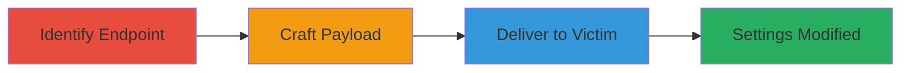

# CSRF Exploitation to Modify Project Watch Settings in Localize

Multi-stage attack chain demonstrating a complete CSRF workflow on the Localize platform.

## Chain Metrics Dashboard

| Metric | Value |
|--------|-------|
| Chain Status | Unverified |
| Total Steps | 3 |
| Execution Time | ~5 minutes |
| Skill Level | Intermediate |
| Complexity | Medium |
| Impact Level | Medium |

## Attack Flow Visualization

## Prerequisites & Requirements

### Required Tools

- Web browser for testing
- Text editor for HTML crafting

### Target Environment

- Web platform (Localize.io)
- Required services/ports: HTTP/HTTPS on port 80/443
- Network access requirements: Internet access to target domain

### Initial Access Requirements

- Victim must be authenticated to Localize platform
- Attacker needs a way to lure victim (e.g., phishing link)
- No prior access to victim account needed

## Detailed Attack Procedures

### Step 1: Identify Vulnerable Endpoint
procedure: [[procedures/Identify-CSRF-Vulnerable-Endpoint-in-Localize]]

**Objective**: Locate the endpoint that handles project watch settings changes without proper CSRF token validation.

**Instructions**: Analyze the Localize platform's network traffic or documentation to find the POST endpoint for watch settings. Test by sending a request with an empty or missing CSRFToken parameter to confirm it processes without validation.

**Expected Output**: Confirmation that the endpoint accepts requests without a valid CSRF token, e.g., settings change succeeds.

**Success Indicators**:
- Request with empty CSRFToken modifies settings
- No error returned for missing token

### Step 2: Craft Malicious HTML Form
procedure: [[procedures/Craft-Malicious-HTML-Form-for-CSRF]]

**Objective**: Create an auto-submitting HTML form that forges the POST request to the vulnerable endpoint.

**Instructions**: Use a text editor to build an HTML page with a form targeting the endpoint. Set the form to submit automatically on load, including parameters like watch[events][1]=0 and watch[events][2]=0, with an empty CSRFToken.

**Expected Output**: A functional HTML file that, when loaded, sends the forged request.

**Success Indicators**:
- Form auto-submits in browser
- Payload parameters match vulnerable endpoint requirements

### Step 3: Deliver Payload to Victim
procedure: [[procedures/Deliver-CSRF-Payload-to-Victim]]

**Objective**: Trick the authenticated victim into loading the malicious page, triggering the CSRF attack.

**Instructions**: Host the HTML page on an attacker-controlled server or use a phishing email/link to direct the victim to it. Ensure the victim is logged into Localize when visiting.

**Expected Output**: Victim's project watch settings are altered without their knowledge.

**Success Indicators**:
- Victim's notifications or watch settings changed
- No user interaction required beyond page load

## Attack Chain Summary

### Key Achievements

1. Identified CSRF flaw in Localize watch settings endpoint
2. Crafted exploitable HTML payload for silent modification
3. Demonstrated impact on authenticated user experience

## Technique & Tactic Coverage

### MITRE ATT&CK Techniques

- [[Drive-by Compromise]]
- [[Exploit Public-Facing Application]]

### MITRE ATT&CK Tactics

- [[Initial Access]]

---
*Last updated: 2023-10-01T00:00:00Z*
