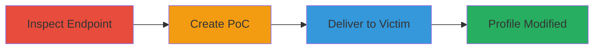

# CSRF Exploitation to Modify User Profile Details

Multi-stage attack chain demonstrating a complete attack workflow exploiting Cross-Site Request Forgery (CSRF) on a web application's user profile editing endpoint.

## Chain Metrics Dashboard

| Metric | Value |
|--------|-------|
| Chain Status | Unverified |
| Total Steps | 3 |
| Execution Time | ~5 minutes |
| Skill Level | Intermediate |
| Complexity | Medium |
| Impact Level | High |

## Attack Flow Visualization

## Prerequisites & Requirements

### Required Tools

- None (relies on browser developer tools and basic HTML editing)

### Target Environment

- Web platform
- Accessible profile editing endpoint (e.g., POST to /users/editmyprofile.action)
- Victim must be authenticated via session cookies

### Initial Access Requirements

- No prior credentials needed for attacker
- Victim must be logged in to the target site
- Attacker needs ability to host or deliver HTML file

## Detailed Attack Procedures

### Step 1: Inspect Endpoint for CSRF Protection
procedure: [[procedures/Inspect-Endpoint-for-CSRF-Vulnerability]]

**Objective**: Identify the lack of CSRF tokens or protections on the profile editing endpoint to confirm exploitability.

**Instructions**: Use browser developer tools to examine the network requests when editing a profile. Look for POST requests to the target endpoint and check form fields for CSRF tokens. Submit a test form from a different origin to verify if it succeeds without additional checks.

**Expected Output**: Confirmation that the endpoint accepts cross-origin POST requests using only session cookies, with no token validation.

**Success Indicators**:
- No CSRF token present in form or headers
- Successful profile update from an external HTML form

### Step 2: Create CSRF Exploit HTML PoC
procedure: [[procedures/Create-CSRF-Exploit-HTML-PoC]]

**Objective**: Develop a malicious HTML file that auto-submits a forged request to alter the victim's profile details.

**Instructions**: Create an HTML file with a hidden form targeting the endpoint. Set form fields to modify name and other details, and use JavaScript to auto-submit on load. Ensure the form uses POST method and includes parameters like user name changes.

**Expected Output**: An HTML file (e.g., csrf.html) that, when loaded in a browser, sends the forged request.

**Success Indicators**:
- Form auto-submits without user interaction
- Request includes victim's session cookies

### Step 3: Deliver CSRF PoC to Victim
procedure: [[procedures/Deliver-CSRF-PoC-to-Victim]]

**Objective**: Induce the authenticated victim to load the PoC file, triggering the profile modification.

**Instructions**: Host the HTML file on an attacker-controlled site or send it via email/phishing. Encourage the victim to open it while logged into the target application. Monitor for changes or use social engineering to confirm impact.

**Expected Output**: Victim's profile details updated (e.g., name changed) without their direct input.

**Success Indicators**:
- Victim opens the file while authenticated
- Profile changes visible on the target site

## Attack Chain Summary

### Key Achievements

1. Identified CSRF vulnerability in profile editing
2. Crafted and delivered a functional PoC exploit
3. Demonstrated unauthorized profile modification leading to potential misinformation or account disruption

## Technique & Tactic Coverage

### MITRE ATT&CK Techniques

- [[Exploit Public-Facing Application]]

### MITRE ATT&CK Tactics

- [[Initial Access]]

---

*Last updated: 2023-10-01T00:00:00Z*
