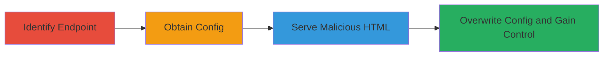

# CSRF Exploitation to Overwrite GoCD Server Configuration

Multi-stage attack chain demonstrating a complete attack workflow exploiting imperfect CSRF protection in GoCD to overwrite the server's cruise-config.xml file, granting full control.

## Chain Metrics Dashboard

| Metric | Value |
|--------|-------|
| Chain Status | Unverified |
| Total Steps | 4 |
| Execution Time | ~5 minutes |
| Skill Level | Intermediate |
| Complexity | Medium |
| Impact Level | High |

## Attack Flow Visualization

## Prerequisites & Requirements

### Required Tools

- None (relies on HTML crafting and browser interaction)

### Target Environment

- GoCD server (web-based CI/CD platform)
- Required services/ports: HTTP/HTTPS on default port 8153 or configured
- Network access requirements: Ability to serve HTML to an admin user (e.g., via phishing or compromised site)

### Initial Access Requirements

- No direct credentials needed
- Network position: External or internal, as long as admin loads the malicious HTML
- Prior access needed: Social engineering to get admin to visit malicious page

## Detailed Attack Procedures

### Step 1: Identify Vulnerable Endpoint
procedure: [[procedures/Identify-Vulnerable-GoCD-Endpoint]]

**Objective**: Analyze the GoCD endpoint for CSRF weaknesses to confirm it allows unauthorized config modifications.

**Instructions**: Review the endpoint /go/admin/restful/configuration/file/POST/xml documentation or source to identify lack of CSRF tokens. Test by inspecting network requests during normal config uploads.

**Expected Output**: Confirmation of no CSRF protection, allowing POST requests without authentication tokens.

**Success Indicators**:
- Endpoint identified as vulnerable to CSRF
- Ability to simulate POST without tokens confirmed

### Step 2: Obtain Historical Config File
procedure: [[procedures/Obtain-Historical-GoCD-Config-File]]

**Objective**: Acquire a baseline or malicious cruise-config.xml to use for overwriting.

**Instructions**: Download or recall the initial empty cruise-config.xml from GoCD installation docs or a test instance. Modify if needed to include attacker payloads.

**Expected Output**: A valid XML file ready for upload via POST.

**Success Indicators**:
- XML file obtained and validated as syntactically correct
- File prepared for config overwrite

### Step 3: Serve Malicious HTML to Admin User
procedure: [[procedures/Serve-Malicious-HTML-for-CSRF-Exploitation]]

**Objective**: Deliver HTML that auto-submits a POST request to the vulnerable endpoint when loaded by an admin.

**Instructions**: Host the HTML on a server or send via email. The HTML uses a form with hidden fields containing the XML payload, auto-submitting via JavaScript.

**Expected Output**: Admin's browser sends unauthorized POST to GoCD endpoint.

**Success Indicators**:
- Admin visits the page
- Network traffic shows POST to /go/admin/restful/configuration/file/POST/xml

### Step 4: Exploit to Gain Control
procedure: [[procedures/Exploit-CSRF-to-Overwrite-Configuration-and-Gain-Control]]

**Objective**: Confirm overwrite and leverage new config for server control.

**Instructions**: After POST, verify config change via GoCD admin interface or API. Use altered config to add pipelines, users, or execute arbitrary code.

**Expected Output**: Updated cruise-config.xml with attacker modifications.

**Success Indicators**:
- Config file overwritten successfully
- Attacker gains admin-level control over GoCD server

## Attack Chain Summary

### Key Achievements

1. Identified CSRF vulnerability in config endpoint
2. Crafted and delivered malicious payload via HTML
3. Overwrote critical server configuration
4. Achieved full control over GoCD instance

## Technique & Tactic Coverage

### MITRE ATT&CK Techniques

- [[Exploit Public-Facing Application]]

### MITRE ATT&CK Tactics

- [[Initial Access]]

---

*Last updated: 2023-10-01T00:00:00Z*
