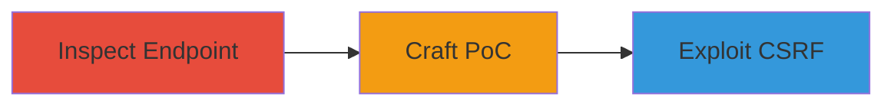

# CSRF Exploitation to Remove Coupons from Teavana Shopping Cart

Multi-stage attack chain demonstrating a complete attack workflow exploiting a missing CSRF token on the Teavana website's coupon removal endpoint.

## Chain Metrics Dashboard

| Metric | Value |
|--------|-------|
| Chain Status | Unverified |
| Total Steps | 2 |
| Execution Time | ~5 minutes |
| Skill Level | Beginner |
| Complexity | Low |
| Impact Level | Low |

## Attack Flow Visualization

## Prerequisites & Requirements

### Required Tools

- Browser Developer Tools
- Text Editor for HTML

### Target Environment

- Web platform
- Demandware (Salesforce Commerce Cloud)
- Authenticated session on Teavana website

### Initial Access Requirements

- Valid user account on Teavana
- Ability to add a coupon to the shopping cart
- Network access to the Teavana site

## Detailed Attack Procedures

### Step 1: Inspect Remove Coupon Endpoint
procedure: [[procedures/Inspect-Remove-Coupon-Endpoint-for-CSRF]]

**Objective**: Analyze the HTTP request for the coupon removal functionality to identify the absence of CSRF protection.

**Instructions**: Open the Teavana website in a browser, add a coupon to the cart, and use developer tools to capture the removal request. Inspect the POST request to confirm no CSRF token is present.

**Expected Output**: Captured POST request to `/on/demandware.store/Sites-Teavana-Site/default/Cart-RemoveCoupon` with `couponCode` parameter but no CSRF token.

**Success Indicators**:
- Request lacks CSRF token
- Endpoint is state-changing POST

### Step 2: Craft CSRF Proof-of-Concept
procedure: [[procedures/Craft-CSRF-Proof-of-Concept-to-Remove-Coupon]]

**Objective**: Develop a malicious HTML page that automatically submits a form to remove a specific coupon from the victim's cart.

**Instructions**: Create an HTML file with a form targeting the vulnerable endpoint, including a hidden `couponCode` field. Set the form to auto-submit on load. Host or open the page in a browser while authenticated to Teavana to test.

**Expected Output**: Automatic form submission removing the coupon without user interaction.

**Success Indicators**:
- Coupon removed from cart upon page load
- No additional user consent required

## Attack Chain Summary

### Key Achievements

1. Identified missing CSRF protection on cart modification endpoint
2. Demonstrated unauthorized coupon removal via crafted webpage
3. Highlighted potential for session disruption in e-commerce flows

## Technique & Tactic Coverage

### MITRE ATT&CK Techniques

- [[Exploit Public-Facing Application]]

### MITRE ATT&CK Tactics

- [[Initial Access]]

---
*Last updated: 2023-10-01T00:00:00Z*
