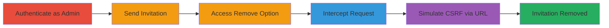

---
tags:
  - csrf
  - web
  - infogram
  - team-management
type: attack_chain
tools:
  - '[[tools/Burp-Suite]]'
tactics:
  - '[[Initial Access]]'
verified: false
platforms:
  - Web
submitted: true
complexity: medium
created_at: '2023-10-01T00:00:00Z'
procedures:
  - '[[procedures/Authenticate-as-Business-Account-User]]'
  - '[[procedures/Send-Team-Member-Invitation]]'
  - '[[procedures/Access-Remove-Invitation-Option]]'
  - '[[procedures/Intercept-Remove-Invitation-Request-with-Burp-Suite]]'
  - '[[procedures/Simulate-CSRF-Attack-via-Direct-URL-Access]]'
step_count: 5
techniques:
  - '[[Drive-by Compromise]]'
updated_at: '2025-12-14T17:27:29.884Z'
description: >-
  A multi-stage attack chain exploiting a CSRF vulnerability in Infogram's team
  management to unauthorizedly remove invited team members by tricking an
  authenticated admin into visiting a malicious URL.
skill_level: intermediate
impact_level: high
id: 903965d4-c7d1-4d59-ae47-479d008cf200
validated: true
mitre_tactics:
  - '[[Initial Access]]'
mitre_techniques:
  - '[[Drive-by Compromise]]'
---
# CSRF Exploitation to Remove Infogram Team Invitations

Multi-stage attack chain demonstrating a complete CSRF workflow in Infogram's team management feature, allowing an attacker to remove invited users without CSRF protection.

## Chain Metrics Dashboard

| Metric | Value |
|--------|-------|
| Chain Status | Unverified |
| Total Steps | 5 |
| Execution Time | ~10 minutes |
| Skill Level | Intermediate |
| Complexity | Medium |
| Impact Level | High |

## Attack Flow Visualization

## Prerequisites & Requirements

### Required Tools

- [[tools/Burp-Suite]]

### Target Environment

- Web platform (Infogram application)
- Authenticated access to business account
- No specific ports or services beyond standard HTTPS

### Initial Access Requirements

- Valid business account credentials for Infogram
- Network access to infogram.com
- Admin privileges in a team

## Detailed Attack Procedures

### Step 1: Authenticate as Business Account User
procedure: [[procedures/Authenticate-as-Business-Account-User]]

**Objective**: Gain authenticated access to Infogram's team management features.

**Instructions**: Log in to the Infogram application using business account credentials to enable access to team settings.

**Expected Output**: Successful login with session established, redirect to dashboard.

**Success Indicators**:
- Dashboard accessible
- Team management section visible

### Step 2: Send Team Member Invitation
procedure: [[procedures/Send-Team-Member-Invitation]]

**Objective**: Create an invitation that can later be targeted for removal to demonstrate the vulnerability.

**Instructions**: Navigate to the team management section and send an invitation to a test user email.

**Expected Output**: Invitation sent, pending user listed in team members.

**Success Indicators**:
- Invitation email sent
- Pending invitation appears in team list

### Step 3: Access Remove Invitation Option
procedure: [[procedures/Access-Remove-Invitation-Option]]

**Objective**: Trigger the remove invitation action to capture the vulnerable request.

**Instructions**: In the team management interface, select the pending invitation and choose the remove option.

**Expected Output**: Remove request initiated but intercepted before execution.

**Success Indicators**:
- Remove option clickable
- No CSRF token prompted

### Step 4: Intercept Remove Invitation Request with Burp Suite
procedure: [[procedures/Intercept-Remove-Invitation-Request-with-Burp-Suite]]

**Objective**: Capture and analyze the remove invitation HTTP request to identify the lack of CSRF protection.

**Instructions**: Configure Burp Suite proxy, trigger the remove action, intercept the request, send to Repeater, and drop the original.

**Expected Output**: Request details in Repeater, including GET URL without CSRF token.

**Success Indicators**:
- Request intercepted successfully
- No CSRF token in headers or parameters

### Step 5: Simulate CSRF Attack via Direct URL Access
procedure: [[procedures/Simulate-CSRF-Attack-via-Direct-URL-Access]]

**Objective**: Exploit the vulnerability by directly accessing the captured URL in an authenticated session to remove the invitation.

**Instructions**: Copy the URL from Burp Repeater and open it in a new tab of the authenticated browser.

**Expected Output**: Invitation removed without additional prompts.

**Success Indicators**:
- Invitation status changed to removed
- No error or confirmation required

## Attack Chain Summary

### Key Achievements

1. Authenticated access to vulnerable team management
2. Identification of CSRF-lacking remove invitation endpoint
3. Successful simulation of unauthorized removal via crafted URL
4. Demonstration of potential for admin deception in real attacks

## Technique & Tactic Coverage

### MITRE ATT&CK Techniques

- [[Drive-by Compromise]]

### MITRE ATT&CK Tactics

- [[Initial Access]]

---

*Last updated: 2023-10-01T00:00:00Z*
