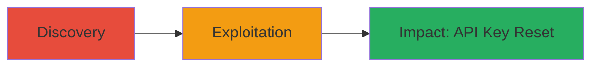

---
tags:
  - csrf
  - weblate
  - api-key
  - web-vulnerability
type: attack_chain
tools: []
tactics:
  - '[[Initial Access]]'
verified: false
platforms:
  - Web
submitted: true
complexity: medium
created_at: '2023-10-01T00:00:00Z'
procedures:
  - '[[procedures/Discover-Weblate-CSRF-Vulnerability]]'
  - '[[procedures/Exploit-Weblate-API-Key-Reset-CSRF]]'
step_count: 2
techniques:
  - '[[Exploit Public-Facing Application]]'
updated_at: '2025-12-14T17:32:10.864Z'
description: >-
  A multi-stage attack chain exploiting a CSRF vulnerability in Weblate's API
  key reset endpoint to force unauthorized resets of victim API keys.
skill_level: intermediate
impact_level: high
id: 7419690b-0eab-432d-afe1-78db6f1b24ca
validated: true
mitre_tactics:
  - '[[Initial Access]]'
mitre_techniques:
  - '[[Exploit Public-Facing Application]]'
---
# CSRF Exploitation to Reset Weblate API Keys

Multi-stage attack chain demonstrating a complete attack workflow exploiting CSRF in Weblate's API key reset functionality.

## Chain Metrics Dashboard

| Metric | Value |
|--------|-------|
| Chain Status | Unverified |
| Total Steps | 2 |
| Execution Time | ~5 minutes |
| Skill Level | Intermediate |
| Complexity | Medium |
| Impact Level | High |

## Attack Flow Visualization

## Prerequisites & Requirements

### Required Tools

- Browser Developer Tools
- Text Editor for crafting malicious HTML

### Target Environment

- Weblate platform (e.g., hosted.weblate.org)
- Web browser with active session cookies
- No specific ports; standard HTTPS (443)

### Initial Access Requirements

- Victim must be authenticated to Weblate
- Attacker needs to trick victim into visiting malicious site (e.g., via phishing)
- No prior credentials needed for attacker

## Detailed Attack Procedures

### Step 1: Vulnerability Discovery
procedure: [[procedures/Discover-Weblate-CSRF-Vulnerability]]

**Objective**: Identify the CSRF vulnerability in the API key reset endpoint by inspecting HTTP requests.

**Instructions**: Use browser developer tools to monitor network traffic while performing a legitimate API key reset. Look for the endpoint /accounts/reset-api-key/ and confirm it uses GET without CSRF tokens.

**Expected Output**: HTTP request details showing GET method to https://hosted.weblate.org/accounts/reset-api-key/ with session cookies but no CSRF protection.

**Success Indicators**:
- Endpoint accepts GET requests cross-origin
- No CSRF token required in request headers or body

### Step 2: Exploitation
procedure: [[procedures/Exploit-Weblate-API-Key-Reset-CSRF]]

**Objective**: Craft and deliver a malicious webpage that forces the victim's browser to reset their API key using their session cookies.

**Instructions**: Create an HTML file with an auto-loading element (e.g.,  tag) that triggers the GET request to the vulnerable endpoint. Host it on a server and lure the victim to visit it while authenticated to Weblate.

**Expected Output**: Victim's API key is reset; they lose access and must recover manually.

**Success Indicators**:
- Network logs show the forged request from victim's browser
- Victim reports API key invalidation

## Attack Chain Summary

### Key Achievements

1. Identified unprotected GET endpoint for API key reset
2. Demonstrated cross-site request forgery leading to unauthorized action
3. Highlighted disruption to API integrations

## Technique & Tactic Coverage

### MITRE ATT&CK Techniques

- [[Exploit Public-Facing Application]]

### MITRE ATT&CK Tactics

- [[Initial Access]]

---
*Last updated: 2023-10-01T00:00:00Z*
