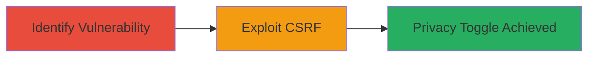

---
tags:
  - csrf
  - web
  - privacy
  - ok.ru
type: attack_chain
tools: []
tactics:
  - '[[Initial Access]]'
commands: []
platforms:
  - Web
complexity: medium
procedures:
  - '[[procedures/Identify-Missing-CSRF-Protection-in-Profile-Settings]]'
  - '[[procedures/Craft-and-Execute-CSRF-Attack-to-Toggle-Privacy]]'
step_count: 2
techniques:
  - '[[Drive-by Compromise]]'
description: >-
  A multi-stage attack chain exploiting a CSRF vulnerability in ok.ru's profile
  privacy toggle feature, allowing unauthorized changes to user privacy settings
  without consent.
skill_level: intermediate
impact_level: high
id: da480240-4bdc-480a-82c4-86a527fdc447
created_at: '2025-12-14T17:27:36.181Z'
updated_at: '2025-12-14T17:27:36.181Z'
verified: false
validated: true
submitted: true
mitre_tactics:
  - '[[Initial Access]]'
mitre_techniques:
  - '[[Drive-by Compromise]]'
---
# CSRF Exploitation to Toggle Profile Privacy Settings on ok.ru

Multi-stage attack chain demonstrating a complete attack workflow exploiting Cross-Site Request Forgery (CSRF) in the 'Closed Profile' or 'Friends only' mode on ok.ru. An attacker crafts a malicious page that, when visited by a logged-in victim, toggles the privacy setting without user interaction, potentially exposing or hiding the profile and leading to privacy violations.

## Chain Metrics Dashboard

| Metric | Value |
|--------|-------|
| Chain Status | Unverified |
| Total Steps | 2 |
| Execution Time | ~5 minutes |
| Skill Level | Intermediate |
| Complexity | Medium |
| Impact Level | High |

## Attack Flow Visualization

## Prerequisites & Requirements

### Required Tools

- None (relies on browser and HTML crafting)

### Target Environment

- Web platform (ok.ru website)
- Victim must be logged in to ok.ru
- Attacker needs to host a malicious webpage or send a link

### Initial Access Requirements

- Victim interaction (visiting malicious link/page)
- No prior credentials needed for attacker
- Network access to ok.ru from victim's browser

## Detailed Attack Procedures

### Step 1: Identify Missing CSRF Protection
procedure: [[procedures/Identify-Missing-CSRF-Protection-in-Profile-Settings]]

**Objective**: Analyze the profile privacy toggle endpoint to confirm absence of CSRF token validation, enabling forged requests.

**Instructions**: Inspect the network traffic while toggling the 'Closed Profile' setting on ok.ru. Use browser developer tools to monitor POST requests to the privacy endpoint and verify no CSRF token is required or validated.

**Expected Output**: Confirmation that the endpoint accepts POST requests without token checks, allowing external forgery.

**Success Indicators**:
- No CSRF token observed in legitimate requests
- Endpoint responds to unauthenticated or tokenless requests

### Step 2: Craft and Execute CSRF Attack
procedure: [[procedures/Craft-and-Execute-CSRF-Attack-to-Toggle-Privacy]]

**Objective**: Create a malicious HTML page or link that submits a forged POST request to toggle the privacy setting when visited by the victim.

**Instructions**: Host an HTML page with a hidden form that auto-submits to the ok.ru privacy endpoint. For example, craft an HTML form targeting the toggle action for 'Closed Profile' mode. Ensure the form uses the same-origin policy bypass via victim's authenticated session.

**Expected Output**: Victim's profile privacy setting toggles (e.g., from public to friends-only or vice versa) without direct interaction.

**Success Indicators**:
- Profile visibility changes for the victim
- No user consent or additional prompts triggered

## Attack Chain Summary

### Key Achievements

1. Identified CSRF vulnerability in privacy toggle endpoint
2. Successfully demonstrated unauthorized privacy changes via malicious page
3. Highlighted critical privacy impact on affected users

## Technique & Tactic Coverage

### MITRE ATT&CK Techniques

- [[Drive-by Compromise]]

### MITRE ATT&CK Tactics

- [[Initial Access]]

---
*Last updated: 2023-10-01*
