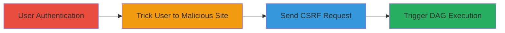

---
tags:
  - csrf
  - apache-airflow
  - dag-trigger
  - cve-2023-49920
  - web-vulnerability
type: attack_chain
tools: []
tactics:
  - '[[Initial Access]]'
  - '[[Execution]]'
verified: false
platforms:
  - Web
submitted: true
complexity: medium
created_at: '2023-12-01T00:00:00Z'
procedures:
  - '[[procedures/Exploit-CSRF-in-Airflow-DAG-Trigger]]'
step_count: 4
techniques:
  - '[[Drive-by Compromise]]'
  - '[[Exploit Public-Facing Application]]'
  - '[[JavaScript]]'
updated_at: '2025-12-14T17:27:42.988Z'
description: >-
  A multi-stage CSRF attack leveraging missing protection on the Airflow DAG
  trigger endpoint to execute workflows without user consent.
skill_level: intermediate
impact_level: high
id: e6cdcf18-b511-4187-98ee-03124c012000
validated: true
mitre_tactics:
  - '[[Initial Access]]'
  - '[[Execution]]'
mitre_techniques:
  - '[[Drive-by Compromise]]'
  - '[[Exploit Public-Facing Application]]'
  - '[[JavaScript]]'
---
# CSRF Exploitation to Trigger Unauthorized DAG Executions in Apache Airflow

Multi-stage attack chain demonstrating a complete CSRF workflow against Apache Airflow versions 2.7.0 through 2.7.3, where the absence of CSRF protection on the DAG trigger endpoint allows cross-origin requests to initiate unauthorized executions.

## Chain Metrics Dashboard

| Metric | Value |
|--------|-------|
| Chain Status | Unverified |
| Total Steps | 4 |
| Execution Time | ~2 minutes |
| Skill Level | Intermediate |
| Complexity | Medium |
| Impact Level | High |

## Attack Flow Visualization



## Prerequisites & Requirements

### Required Tools

- None (relies on browser and basic web hosting)

### Target Environment

- Apache Airflow web UI (versions 2.7.0-2.7.3)
- Exposed on port 8080 (default)
- Authenticated session required

### Initial Access Requirements

- User must be authenticated to Airflow UI with DAG trigger permissions
- Same-browser session for cross-site request
- No prior network access beyond web connectivity

## Detailed Attack Procedures

### Step 1: User Authentication

procedure: [[procedures/Exploit-CSRF-in-Airflow-DAG-Trigger]]

**Objective**: Establish an authenticated session in the victim's browser for the Airflow UI, granting permissions to trigger DAGs.

**Instructions**: The victim logs into the Airflow web interface at http://airflow-host:8080, creating a session cookie that will be leveraged for the CSRF attack.

**Expected Output**: Successful login, dashboard accessible with DAG listing.

**Success Indicators**:
- Airflow UI dashboard loads with user's permissions visible
- Session cookie (e.g., session_id) present in browser dev tools

### Step 2: Trick User to Malicious Website

procedure: [[procedures/Exploit-CSRF-in-Airflow-DAG-Trigger]]

**Objective**: Lure the authenticated user to visit a controlled malicious website in the same browser session.

**Instructions**: Send a phishing link (e.g., via email or social engineering) directing the user to the attacker's site, such as http://malicious-site.com/trick. The site loads without disrupting the Airflow session.

**Expected Output**: Malicious page loads in the browser while Airflow session remains active.

**Success Indicators**:
- User visits the site (confirmed via access logs)
- Browser maintains Airflow cookies

### Step 3: Send GET Request from Malicious Site

procedure: [[procedures/Exploit-CSRF-in-Airflow-DAG-Trigger]]

**Objective**: From the malicious site, issue a cross-origin GET request to the vulnerable /dag/trigger endpoint using the victim's session.

**Instructions**: Embed JavaScript on the malicious page to perform the request. For example, use a fetch API call or an invisible img tag:

```javascript
fetch('http://airflow-host:8080/dag/{dag_id}/trigger?conf=%7B%7D', {
  method: 'GET',
  credentials: 'include'
});
```

Replace {dag_id} with a target DAG name. Alternatively, test locally with [[commands/curl-trigger-dag]] to verify the endpoint:

```bash
curl -X GET "http://airflow-host:8080/dag/example_dag/trigger?conf=%7B%7D" -H "Cookie: session_id=abc123"
```

**Expected Output**: HTTP 200 response indicating trigger initiation.

**Success Indicators**:
- Request succeeds without CSRF token validation
- No CORS or CSRF errors in browser console

### Step 4: Unauthorized DAG Execution

procedure: [[procedures/Exploit-CSRF-in-Airflow-DAG-Trigger]]

**Objective**: Confirm the DAG workflow starts without user interaction, potentially executing harmful tasks.

**Instructions**: Monitor the Airflow UI or logs for the new DAG run. The request from Step 3 bypasses protections, starting the execution.

**Expected Output**: New DAG run appears in the Airflow runs list with recent timestamp and status 'running' or 'queued'.

**Success Indicators**:
- DAG run initiated in Airflow logs/UI
- Workflow tasks begin execution

## Attack Chain Summary

### Key Achievements

1. Bypassed CSRF protections to trigger sensitive workflows
2. Demonstrated cross-site execution using browser sessions
3. Highlighted risks of unauthenticated GET endpoints in web UIs

## Technique & Tactic Coverage

### MITRE ATT&CK Techniques

- [[Drive-by Compromise]] Drive-by Compromise
- [[Exploit Public-Facing Application]] Exploit Public-Facing Application
- [[JavaScript]] JavaScript

### MITRE ATT&CK Tactics

- [[Initial Access]] Initial Access
- [[Execution]] Execution

---
*Last updated: 2023-12-01T00:00:00Z*
