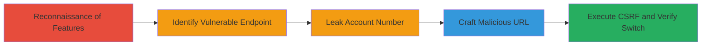

---
tags:
  - csrf
  - host-header-injection
  - account-switch
  - web-vulnerability
type: attack_chain
tools: []
tactics:
  - '[[Initial Access]]'
  - '[[Discovery]]'
commands: []
platforms:
  - Web
complexity: medium
procedures:
  - '[[procedures/Reconnaissance-of-Coinbase-Account-Management]]'
  - '[[procedures/Identify-CSRF-Vulnerable-Endpoint]]'
  - '[[procedures/Leak-Account-Number-via-Host-Header-or-Exposure]]'
  - '[[procedures/Craft-and-Deliver-Malicious-CSRF-URL]]'
step_count: 5
techniques:
  - '[[Exploit Public-Facing Application]]'
  - '[[Drive-by Compromise]]'
description: >-
  A multi-stage attack leveraging CSRF on Coinbase's account management to
  switch primary accounts and Host Header Injection to leak account numbers.
skill_level: intermediate
impact_level: high
id: f6db4c49-29c5-4b04-8983-86a5ebf56913
created_at: '2025-12-14T17:27:15.813Z'
updated_at: '2025-12-14T17:27:15.813Z'
verified: false
validated: true
submitted: true
mitre_tactics:
  - '[[Initial Access]]'
  - '[[Discovery]]'
mitre_techniques:
  - '[[Exploit Public-Facing Application]]'
  - '[[Drive-by Compromise]]'
---
# CSRF Exploitation to Unauthorized Primary Account Switch on Coinbase

Multi-stage attack chain demonstrating a complete attack workflow exploiting CSRF on Coinbase's accounts page to change a user's primary account without consent, combined with Host Header Injection to facilitate account number leakage.

## Chain Metrics Dashboard

| Metric | Value |
|--------|-------|
| Chain Status | Unverified |
| Total Steps | 5 |
| Execution Time | ~10 minutes |
| Skill Level | Intermediate |
| Complexity | Medium |
| Impact Level | High |

## Attack Flow Visualization

## Prerequisites & Requirements

### Required Tools

- Browser developer tools for inspection
- Proxy tool like Burp Suite for header manipulation (optional)

### Target Environment

- Web platform
- Access to Coinbase accounts page (https://coinbase.com/accounts)
- No specific ports or services beyond standard HTTPS (443)

### Initial Access Requirements

- Victim must be logged into Coinbase with an active session cookie
- Attacker needs victim's account number (leaked or phished)
- Network access to deliver phishing link to victim

## Detailed Attack Procedures

### Step 1: Reconnaissance of Account Management
procedure: [[procedures/Reconnaissance-of-Coinbase-Account-Management]]

**Objective**: Observe account management features to identify state-changing actions and their protections.

**Instructions**: Log in to Coinbase, navigate to the accounts page (https://coinbase.com/accounts), and inspect options like create, rename, delete, and set as primary. Note that delete uses POST with CSRF token, while set as primary uses unprotected GET.

**Expected Output**: Identification of multiple accounts and management endpoints.

**Success Indicators**:
- Accounts listed with management options visible
- Differences in request methods and protections noted

### Step 2: Identify CSRF Vulnerable Endpoint
procedure: [[procedures/Identify-CSRF-Vulnerable-Endpoint]]

**Objective**: Locate the specific endpoint for setting primary account and confirm lack of CSRF protection.

**Instructions**: Use browser dev tools to inspect the 'Set as primary' action, revealing the GET request to https://coinbase.com/accounts/<account_number>/set_as_primary authenticated only by session cookie.

**Expected Output**: Endpoint URL and request details captured.

**Success Indicators**:
- GET request confirmed without CSRF token
- Session cookie as sole authenticator

### Step 3: Leak Account Number via Host Header or Exposure
procedure: [[procedures/Leak-Account-Number-via-Host-Header-or-Exposure]]

**Objective**: Obtain the victim's account number through exposure in URLs or Host Header manipulation.

**Instructions**: Check browser history, proxy logs, or referrals for exposed account numbers in GET URLs. Alternatively, manipulate Host header in requests to coinbase.com (e.g., set to attacker-controlled domain like evil.com) to log and leak the account number via misdirected requests or server logs.

**Expected Output**: Account number retrieved (e.g., from logs or phishing).

**Success Indicators**:
- Account number visible in URL parameters
- Leaked via invalid Host header in attacker logs

### Step 4: Craft and Deliver Malicious CSRF URL
procedure: [[procedures/Craft-and-Deliver-Malicious-CSRF-URL]]

**Objective**: Create a malicious URL that triggers the CSRF and deliver it to the victim.

**Instructions**: Construct the URL as https://coinbase.com/accounts/<leaked_account_number>/set_as_primary. Deliver via phishing email, malicious website link, or social engineering to trick the logged-in victim into visiting it, executing the GET request with their session.

**Expected Output**: Victim's browser makes the unauthorized request, switching the primary account.

**Success Indicators**:
- Victim visits the URL while logged in
- Primary account changes without direct interaction

### Step 5: Verify and Demonstrate Impact

**Objective**: Confirm the account switch and demonstrate additional Host Header risks.

**Instructions**: After delivery, have the victim check their accounts page to see the primary account changed. For Host Header demo, intercept a request with a proxy, alter Host to test.com, and observe if account details leak to the attacker's domain via logs or redirects.

**Expected Output**: Primary account switched; potential log entries on attacker domain with account info.

**Success Indicators**:
- Unauthorized primary account change confirmed
- Account number leaked in Host manipulation test

## Attack Chain Summary

### Key Achievements

1. Identified and exploited CSRF on state-changing GET endpoint
2. Leaked sensitive account numbers via Host Header Injection
3. Achieved unauthorized account management disruption without credentials

## Technique & Tactic Coverage

### MITRE ATT&CK Techniques

- [[Exploit Public-Facing Application]]
- [[Drive-by Compromise]]

### MITRE ATT&CK Tactics

- [[Initial Access]]
- [[Discovery]]

---
*Last updated: 2023-10-01*
