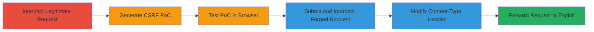

---
tags:
  - csrf
  - web-vulnerability
  - request-forgery
type: attack_chain
tools:
  - '[[tools/Burp-Suite]]'
tactics:
  - '[[Initial Access]]'
commands: []
platforms:
  - Web
complexity: medium
procedures:
  - '[[procedures/CSRF-Exploitation-Using-Burp-Suite]]'
step_count: 6
techniques:
  - '[[Exploit Public-Facing Application]]'
description: >-
  A multi-step CSRF attack leveraging Burp Suite to forge requests and bypass
  content-type restrictions, allowing unauthorized edits to a victim's company
  profile via a malicious HTML page.
skill_level: intermediate
impact_level: high
id: 19f78325-282f-4de4-b8d9-bdfeaaa6520f
created_at: '2025-12-14T17:27:35.454Z'
updated_at: '2025-12-14T17:27:35.454Z'
verified: false
validated: true
submitted: true
mitre_tactics:
  - '[[Initial Access]]'
mitre_techniques:
  - '[[Exploit Public-Facing Application]]'
---
# CSRF Exploitation to Unauthorizedly Modify Company Profile Information

Multi-stage attack chain demonstrating a complete CSRF workflow against a web application endpoint for editing company information.

## Chain Metrics Dashboard

| Metric | Value |
|--------|-------|
| Chain Status | Unverified |
| Total Steps | 6 |
| Execution Time | ~10 minutes |
| Skill Level | Intermediate |
| Complexity | Medium |
| Impact Level | High |

## Attack Flow Visualization

## Prerequisites & Requirements

### Required Tools

- [[tools/Burp-Suite]]

### Target Environment

- Web application with account management features
- Endpoint: /services/user/manageAccountCompany
- Authenticated session required for victim

### Initial Access Requirements

- Attacker access to Burp Suite proxy
- Victim must be authenticated in the browser
- Network access to host the malicious HTML PoC

## Detailed Attack Procedures

### Step 1: Edit Company Info and Intercept the Request
procedure: [[procedures/CSRF-Exploitation-Using-Burp-Suite]]

**Objective**: Capture the legitimate HTTP request for editing company information to understand the structure and parameters.

**Instructions**: Perform the action of editing company information in the application while proxying traffic through Burp Suite to intercept the outgoing HTTP request. Configure your browser to route traffic via Burp's proxy (typically at 127.0.0.1:8080).

**Expected Output**: Intercepted POST request to /services/user/manageAccountCompany with JSON payload containing company details.

**Success Indicators**:
- Request captured in Burp's Proxy > HTTP History tab
- Request shows Content-Type: application/json and relevant parameters like company name or address

### Step 2: Generate CSRF PoC Using Burp Suite
procedure: [[procedures/CSRF-Exploitation-Using-Burp-Suite]]

**Objective**: Create a proof-of-concept HTML form that simulates the intercepted request for cross-site submission.

**Instructions**: In Burp Suite, right-click the intercepted request in the Proxy tab, select Engagement Tools > Generate CSRF PoC. This creates an HTML file with a form that posts the request parameters. Save the HTML file and host it on a server (e.g., via Python's http.server or a web host).

**Expected Output**: HTML file with <form> element targeting the vulnerable endpoint, including hidden inputs for JSON data.

**Success Indicators**:
- HTML file generated successfully
- Form action points to /services/user/manageAccountCompany

### Step 3: Test the PoC in Browser and Share Link with Victim
procedure: [[procedures/CSRF-Exploitation-Using-Burp-Suite]]

**Objective**: Verify the PoC triggers the request and prepare for victim interaction.

**Instructions**: In Burp Suite, click 'Test in Browser' on the CSRF PoC generator to open it in your browser. Ensure you're logged in as the victim account in another tab. Copy the hosted PoC URL and trick the victim into visiting it while authenticated (e.g., via phishing email).

**Expected Output**: Form loads in browser; submitting it sends the forged request.

**Success Indicators**:
- PoC page accessible and form submittable
- Victim visits the page while session is active

### Step 4: Submit the Form and Intercept the Request
procedure: [[procedures/CSRF-Exploitation-Using-Burp-Suite]]

**Objective**: Trigger the CSRF request from the PoC and capture it for modification.

**Instructions**: With Burp proxy active, click the submit button on the PoC page. The request will be intercepted in Burp's Proxy tab due to the browser's proxy configuration.

**Expected Output**: Intercepted request from the cross-origin PoC, likely with default Content-Type like text/plain or multipart/form-data.

**Success Indicators**:
- Forged request appears in Burp Intercept
- Request matches the original structure but originates from external domain

### Step 5: Modify the Content-Type Header
procedure: [[procedures/CSRF-Exploitation-Using-Burp-Suite]]

**Objective**: Bypass the application's strict Content-Type validation to make the forged request acceptable.

**Instructions**: In the intercepted request within Burp Suite's Repeater or Proxy Intercept, edit the Content-Type header to 'application/json'. Ensure the body remains valid JSON. Optionally, mention potential use of Flash for cross-domain if needed, but HTML form suffices here.

**Expected Output**: Modified request with Content-Type: application/json.

**Success Indicators**:
- Header updated without syntax errors
- JSON body parses correctly

### Step 6: Forward the Request to Exploit CSRF
procedure: [[procedures/CSRF-Exploitation-Using-Burp-Suite]]

**Objective**: Send the forged request to the server, resulting in unauthorized company profile changes.

**Instructions**: Forward the modified request through Burp Suite to the target server. Monitor the response for success (e.g., 200 OK with updated confirmation).

**Expected Output**: Server accepts the request, modifies the company info, and returns success response.

**Success Indicators**:
- Company profile updated without victim interaction
- No CSRF token error in response

## Attack Chain Summary

### Key Achievements

1. Successful interception and analysis of legitimate edit request
2. Generation and testing of cross-site HTML PoC
3. Bypass of Content-Type restriction via header manipulation
4. Unauthorized modification of sensitive company data

## Technique & Tactic Coverage

### MITRE ATT&CK Techniques

- [[Exploit Public-Facing Application]]

### MITRE ATT&CK Tactics

- [[Initial Access]]

---
*Last updated: 2023-10-01T00:00:00Z*
