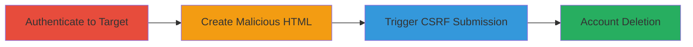

---
tags:
  - csrf
  - web-vulnerability
  - account-deletion
type: attack_chain
tools: []
tactics:
  - '[[Initial Access]]'
verified: false
platforms:
  - Web
submitted: true
complexity: medium
created_at: '2023-10-01T00:00:00Z'
procedures:
  - '[[procedures/Authenticate-to-Target-Application]]'
  - '[[procedures/Create-Malicious-CSRF-HTML-Form]]'
  - '[[procedures/Trigger-CSRF-via-Browser-Submission]]'
step_count: 3
techniques:
  - '[[Drive-by Compromise]]'
  - '[[Exploit Public-Facing Application]]'
updated_at: '2025-12-14T17:27:35.810Z'
description: >-
  A multi-stage attack leveraging a CSRF vulnerability on a GET endpoint to
  delete authenticated user profiles by tricking victims into visiting a
  malicious webpage.
skill_level: intermediate
impact_level: high
id: a780fc38-f7db-4702-9a4b-4008723eb76c
validated: true
mitre_tactics:
  - '[[Initial Access]]'
mitre_techniques:
  - '[[Drive-by Compromise]]'
  - '[[Exploit Public-Facing Application]]'
---
# CSRF Exploitation via Malicious HTML to Delete User Profiles

Multi-stage attack chain demonstrating a complete CSRF workflow to delete user accounts on a vulnerable web application.

## Chain Metrics Dashboard

| Metric | Value |
|--------|-------|
| Chain Status | Unverified |
| Total Steps | 3 |
| Execution Time | ~5 minutes |
| Skill Level | Intermediate |
| Complexity | Medium |
| Impact Level | High |

## Attack Flow Visualization

## Prerequisites & Requirements

### Required Tools

- None (manual browser and text editor)

### Target Environment

- Web application with CSRF-vulnerable GET deletion endpoint
- Required services/ports: HTTP/HTTPS on standard ports (80/443)
- Network access requirements: Victim must be authenticated and visit attacker's controlled page

### Initial Access Requirements

- Victim credentials for authentication
- Attacker controls a webpage or file host
- No prior access needed beyond luring the victim

## Detailed Attack Procedures

### Step 1: Authenticate to Target Application
procedure: [[procedures/Authenticate-to-Target-Application]]

**Objective**: Ensure the victim is logged in to the target application to maintain an active session for the CSRF exploit.

**Instructions**: Manually navigate to the target's account page in a browser where the user is already authenticated.

**Expected Output**: Successful access to the protected account page, confirming session validity.

**Success Indicators**:
- Page loads without login prompt
- User profile details visible

### Step 2: Create Malicious CSRF HTML Form
procedure: [[procedures/Create-Malicious-CSRF-HTML-Form]]

**Objective**: Craft a malicious HTML file that automatically submits a forged request to the vulnerable deletion endpoint.

**Instructions**: Use a text editor to create an HTML file with a form targeting the delete endpoint, including hidden fields for the action parameter.

**Expected Output**: A valid HTML file ready to be hosted or opened locally.

**Success Indicators**:
- HTML file parses without errors
- Form action points to correct endpoint (e.g., https://target.com/account/delete?action=delete_profile)

### Step 3: Trigger CSRF via Browser Submission
procedure: [[procedures/Trigger-CSRF-via-Browser-Submission]]

**Objective**: Lure the authenticated victim to load the malicious HTML, triggering the account deletion request.

**Instructions**: Host the HTML file on a server or open it locally in the victim's browser while they are logged in; simulate a click or auto-submit to send the GET request.

**Expected Output**: The browser sends the forged GET request, resulting in profile deletion without user consent.

**Success Indicators**:
- Request sent to deletion endpoint
- Target application confirms account deactivation

## Attack Chain Summary

### Key Achievements

1. Bypassed CSRF protections on a sensitive GET endpoint
2. Forced deletion of victim accounts via social engineering
3. Demonstrated critical impact on user data integrity

## Technique & Tactic Coverage

### MITRE ATT&CK Techniques

- [[Drive-by Compromise]]
- [[Exploit Public-Facing Application]]

### MITRE ATT&CK Tactics

- [[Initial Access]]

---
*Last updated: 2023-10-01T00:00:00Z*
