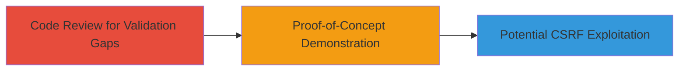

---
tags:
  - csrf
  - web
  - python
type: attack_chain
tools: []
tactics:
  - '[[Initial Access]]'
commands: []
platforms:
  - Web
complexity: low
procedures:
  - '[[procedures/Review-Code-for-CSRF-Validation-Gaps]]'
  - '[[procedures/Demonstrate-CSRF-Proof-of-Concept]]'
step_count: 2
techniques:
  - '[[Exploit Public-Facing Application]]'
description: >-
  Attack chain demonstrating identification and proof-of-concept exploitation of
  a CSRF vulnerability in Gratipay due to incomplete server-side token
  validation, particularly for GET requests.
skill_level: intermediate
impact_level: medium
id: a26b1d75-c441-414d-a1c1-46d97ce8b4b2
created_at: '2025-12-14T17:27:03.196Z'
updated_at: '2025-12-14T17:27:03.196Z'
verified: false
validated: true
submitted: true
mitre_tactics:
  - '[[Initial Access]]'
mitre_techniques:
  - '[[Exploit Public-Facing Application]]'
---
# CSRF Exploitation via Missing Server-Side Token Validation for GET Requests

## Overview

This attack chain outlines the process of identifying and demonstrating a Cross-Site Request Forgery (CSRF) vulnerability in the Gratipay application. The vulnerability stems from server-side CSRF token validation being limited to POST requests only, leaving GET requests unprotected. Although the application treats GET requests as idempotent (non-state-changing), this design choice exposes potential risks if sensitive actions are performed via GET. The chain involves code review to spot the gap and creating a proof-of-concept to show exploitation, as reported in HackerOne report #163815. No actual exploitation commands are used, as the discovery relies on static analysis and video demonstration.

## Chain Metrics Dashboard

| Metric | Value |
|--------|-------|
| Chain Status | Unverified |
| Total Steps | 2 |
| Execution Time | ~30 minutes |
| Skill Level | Intermediate |
| Complexity | Low |
| Impact Level | Medium |

## Attack Flow Visualization

## Prerequisites & Requirements

### Required Tools

- Code review tools (e.g., text editor or IDE for Python analysis)
- Browser for testing requests

### Target Environment

- Web platform
- Python-based application (Gratipay)
- Access to source code or running instance

### Initial Access Requirements

- Read access to application source code (e.g., via GitHub)
- Ability to inspect network requests in a browser
- No credentials required for identification, but authenticated session for testing

## Detailed Attack Procedures

### Step 1: Identify CSRF Validation Gaps
procedure: [[procedures/Review-Code-for-CSRF-Validation-Gaps]]

**Objective**: Analyze the application's security code to identify incomplete CSRF protection, focusing on method-specific validation.

**Instructions**: Review the Python source code, particularly the CSRF module. Examine the file `gratipay/security/csrf.py` around line 49 to confirm that token validation is enforced only for POST requests. Note the absence of checks for GET or other HTTP methods, allowing bypass for non-POST requests.

**Expected Output**: Confirmation that CSRF tokens are validated solely for POST, as per the code logic.

**Success Indicators**:
- Code snippet showing POST-only validation
- Documentation or comments indicating design intent for idempotent GET requests

### Step 2: Demonstrate Proof-of-Concept
procedure: [[procedures/Demonstrate-CSRF-Proof-of-Concept]]

**Objective**: Create and record a demonstration of the vulnerability to show how an attacker could forge requests without token validation.

**Instructions**: Set up a malicious webpage that sends a forged GET request to the Gratipay application, simulating a sensitive action (e.g., account modification if via GET). Use browser developer tools to capture the request lacking a CSRF token and verify it succeeds on the server. Record the process in a video, showing the bypass.

**Expected Output**: A video or log demonstrating a successful forged request without token validation.

**Success Indicators**:
- Forged request accepted by server
- No token required for the action, confirming the gap

## Attack Chain Summary

### Key Achievements

1. Identified CSRF protection limited to POST requests in Gratipay's Python codebase.
2. Demonstrated potential for CSRF attacks on GET-based actions via proof-of-concept.
3. Highlighted design risks despite idempotency assumptions, leading to informative classification.

## Technique & Tactic Coverage

### MITRE ATT&CK Techniques

- [[Exploit Public-Facing Application]]

### MITRE ATT&CK Tactics

- [[Initial Access]]

---
*Last updated: 2023-10-01*
