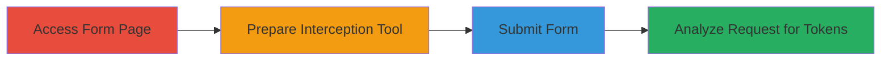

---
tags:
  - csrf
  - web-vulnerability
  - slack
  - form-submission
type: attack_chain
tools:
  - '[[tools/Tamper-Data]]'
tactics:
  - '[[Initial Access]]'
verified: false
platforms:
  - Web
submitted: true
complexity: low
created_at: '2023-10-01T00:00:00Z'
procedures:
  - '[[procedures/Access-Slack-Help-Request-Form]]'
  - '[[procedures/Launch-Tamper-Data-for-Interception]]'
  - '[[procedures/Submit-Slack-Support-Request]]'
  - '[[procedures/Intercept-and-Analyze-Request-for-CSRF-Tokens]]'
step_count: 4
techniques:
  - '[[Exploit Public-Facing Application]]'
updated_at: '2025-12-14T17:27:22.870Z'
description: >-
  Demonstrates the discovery and exploitation of a CSRF vulnerability in Slack's
  help request submission form, allowing unauthorized submissions on behalf of
  authenticated users.
skill_level: intermediate
impact_level: medium
id: c06585a1-e34f-437b-bb85-6c3a079afb46
validated: true
mitre_tactics:
  - '[[Initial Access]]'
mitre_techniques:
  - '[[Exploit Public-Facing Application]]'
---
# CSRF Exploitation via Missing Tokens in Slack Help Request Form

Multi-stage attack chain demonstrating the discovery of a CSRF vulnerability in Slack's support request form, enabling forged submissions that could trick support teams into unauthorized actions.

## Chain Metrics Dashboard

| Metric | Value |
|--------|-------|
| Chain Status | Unverified |
| Total Steps | 4 |
| Execution Time | ~5 minutes |
| Skill Level | Intermediate |
| Complexity | Low |
| Impact Level | Medium |

## Attack Flow Visualization

## Prerequisites & Requirements

### Required Tools

- [[tools/Tamper-Data]]

### Target Environment

- Web platform (Slack application)
- Authenticated session in Slack
- Firefox browser

### Initial Access Requirements

- Valid Slack user credentials for authentication
- Direct access to Slack's web interface
- No prior network restrictions

## Detailed Attack Procedures

### Step 1: Access Help Request Form
procedure: [[procedures/Access-Slack-Help-Request-Form]]

**Objective**: Load the support request form to prepare for analysis.

**Instructions**: Navigate to the Slack help requests page in an authenticated session.

Open Firefox and ensure you are logged into your Slack workspace. Visit the URL directly in the browser address bar.

**Expected Output**: The form page loads, displaying fields for submitting a new support request.

**Success Indicators**:
- Form page accessible without errors
- Authentication confirmed via session

### Step 2: Prepare Interception Tool
procedure: [[procedures/Launch-Tamper-Data-for-Interception]]

**Objective**: Set up the tool to monitor and intercept HTTP requests from the form.

**Instructions**: Launch the Tamper Data extension to enable request interception.

Click the Tamper Data icon in Firefox or access it via Tools menu. Start capturing traffic by clicking "Start Tamper" to prepare for the form submission.

**Expected Output**: Tamper Data panel opens, ready to intercept requests.

**Success Indicators**:
- Tamper Data is active and monitoring
- No browser errors during launch

### Step 3: Submit Support Request
procedure: [[procedures/Submit-Slack-Support-Request]]

**Objective**: Trigger the form submission to generate the HTTP request for inspection.

**Instructions**: Fill out and submit the form while interception is active.

Enter sample data into the form fields (e.g., a description of the issue) and click the submit button. Tamper Data will prompt to intercept the request.

**Expected Output**: Form submission initiates, with Tamper Data capturing the POST request.

**Success Indicators**:
- Form data entered successfully
- Submission button responds

### Step 4: Analyze Request for CSRF Tokens
procedure: [[procedures/Intercept-and-Analyze-Request-for-CSRF-Tokens]]

**Objective**: Inspect the intercepted request to confirm absence of CSRF protections.

**Instructions**: Review the request details in Tamper Data for token presence.

In the Tamper Data dialog, examine the POST request headers and body. Look for any CSRF token fields (e.g., _token, csrf_token) or custom headers. Proceed without modification to observe the raw request.

**Expected Output**: Request details show no anti-CSRF tokens in headers or body, confirming the vulnerability.

**Success Indicators**:
- No token parameters detected
- Request structure reveals missing protections

## Attack Chain Summary

### Key Achievements

1. Successfully accessed and loaded the vulnerable form.
2. Intercepted form submission without CSRF safeguards.
3. Confirmed potential for forged requests from external sites.
4. Identified impact on unauthorized support interactions.

## Technique & Tactic Coverage

### MITRE ATT&CK Techniques

- [[Exploit Public-Facing Application]]

### MITRE ATT&CK Tactics

- [[Initial Access]]

---

*Last updated: 2023-10-01T00:00:00Z*
