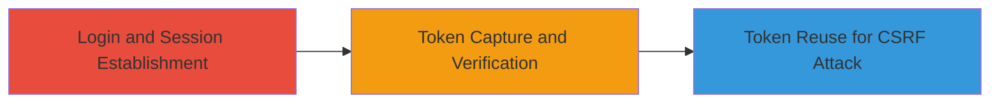

# CSRF Exploitation via Non-Rotating Tokens in drchrono Password Change

Multi-stage attack chain demonstrating the discovery and exploitation of a CSRF token design flaw in drchrono.com, where tokens remain static throughout a user session, enabling attackers to reuse captured tokens for unauthorized requests such as password changes.

## Chain Metrics Dashboard

| Metric | Value |
|--------|-------|
| Chain Status | Unverified |
| Total Steps | 3 |
| Execution Time | ~10 minutes |
| Skill Level | Intermediate |
| Complexity | Medium |
| Impact Level | High |

## Attack Flow Visualization

## Prerequisites & Requirements

### Required Tools

- [[tools/Burp-Suite]]

### Target Environment

- Web application: drchrono.com
- Required services/ports: HTTPS on port 443
- Network access requirements: Direct internet access to the target site

### Initial Access Requirements

- Valid user credentials for drchrono.com
- Network position: Attacker's machine with proxy interception capability
- Prior access needed: None, but assumes legitimate user session for discovery

## Detailed Attack Procedures

### Step 1: Login and Navigate to Password Change Form
procedure: [[procedures/Verify-CSRF-Token-Non-Rotation]]

**Objective**: Establish a user session and access the vulnerable password change form to prepare for token interception.

**Instructions**: Log in to drchrono.com using valid credentials. Navigate to the settings section, then to the profile subsection, and click on the change password option. Fill out the form fields with a new password.

**Expected Output**: The password change form is loaded and ready for submission, with a CSRF token embedded in the HTML or form.

**Success Indicators**:
- Successful login and navigation to profile settings
- Password change form visible with input fields

### Step 2: Intercept and Capture CSRF Token
procedure: [[procedures/Verify-CSRF-Token-Non-Rotation]]

**Objective**: Submit the form twice while intercepting requests to capture and compare CSRF tokens, confirming non-rotation.

**Instructions**: Configure [[tools/Burp-Suite]] as a proxy to intercept traffic. Submit the password change form via POST, copy the POST data including the CSRF token. Repeat the submission process to generate a second request and extract the token again. Compare the tokens to verify they are identical.

**Expected Output**: Two POST requests with the same CSRF token value in the parameters.

**Success Indicators**:
- Intercepted POST requests show matching CSRF tokens
- Token remains consistent across submissions within the session

### Step 3: Exploit Reusable Token for CSRF Attack
procedure: [[procedures/Verify-CSRF-Token-Non-Rotation]]

**Objective**: Demonstrate exploitation by reusing the captured token to perform unauthorized actions, such as changing a victim's password, even if the original session ID is invalid.

**Instructions**: In a simulated attack, capture the token via XSS or network interception on a victim's browser. Craft a malicious form or request using the reused token and the target's session context to submit a password change POST to the endpoint. Send the request to bypass CSRF protections due to token validity.

**Expected Output**: Successful unauthorized password change on the victim account.

**Success Indicators**:
- Malicious request accepted without CSRF validation failure
- Victim's account modified (e.g., password changed)

## Attack Chain Summary

### Key Achievements

1. Confirmed CSRF token non-rotation flaw in drchrono.com's password change functionality
2. Demonstrated token capture via interception and reuse potential
3. Highlighted risk of unauthorized account actions post-session invalidation

## Technique & Tactic Coverage

### MITRE ATT&CK Techniques

- [[Exploit Public-Facing Application]]

### MITRE ATT&CK Tactics

- [[Initial Access]]

---

*Last updated: 2023-10-01T00:00:00Z*
