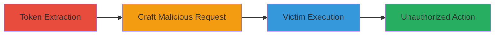

# CSRF Exploitation via Persistent Authenticity Token in Shared Workstations

Multi-stage attack chain demonstrating a complete attack workflow exploiting a CSRF vulnerability where the authenticity token remains unchanged after user login, allowing reuse in shared workstation environments.

## Chain Metrics Dashboard

| Metric | Value |
|--------|-------|
| Chain Status | Unverified |
| Total Steps | 3 |
| Execution Time | ~5 minutes |
| Skill Level | Intermediate |
| Complexity | Medium |
| Impact Level | High |

## Attack Flow Visualization



## Prerequisites & Requirements

### Required Tools

- Browser Developer Tools
- Text Editor for crafting HTML forms

### Target Environment

- Web application with CSRF protection via authenticity tokens
- Shared workstation environment (e.g., public computer lab)
- Physical access to the workstation

### Initial Access Requirements

- Temporary login to the target web application on the shared workstation
- Knowledge of the application's form structure and CSRF token location
- Ability to observe or access browser session data

## Detailed Attack Procedures

### Step 1: Token Extraction
procedure: [[procedures/Extract-Persistent-CSRF-Token-from-Session]]

**Objective**: Obtain the CSRF authenticity token from an active session, which persists unchanged after login for reuse.

**Instructions**: Log in to the target web application on the shared workstation using any account. Open browser developer tools (e.g., inspect element in Chrome) to locate the CSRF token in the HTML form or session cookies. Copy the token value, typically found in a hidden input field named 'authenticity' or similar.

**Expected Output**: A string representing the CSRF token, e.g., "abc123def456".

**Success Indicators**:
- Token extracted without regeneration
- Token visible in form elements or network requests

### Step 2: Craft Malicious Request
procedure: [[procedures/Craft-Malicious-CSRF-Request-with-Stolen-Token]]

**Objective**: Create a malicious link or HTML form that incorporates the stolen token to bypass CSRF protections.

**Instructions**: Use a text editor to build an HTML page or URL with a form that submits a POST request to the target application's sensitive endpoint (e.g., /change-email). Include the stolen token in a hidden input field. For example, construct a form like:

```html
<form action="https://target.com/change-email" method="POST">
  <input type="hidden" name="authenticity" value="abc123def456">
  <input type="hidden" name="new_email" value="attacker@evil.com">
  <input type="submit" value="Click Me">
</form>
```
Host this on a controllable server or encode as a data URI for delivery via email or chat.

**Expected Output**: A functional malicious link or HTML snippet ready for delivery to the victim.

**Success Indicators**:
- Form validates the token when tested locally
- Request structure matches the target's expected format

### Step 3: Victim Execution
procedure: [[procedures/Deliver-and-Execute-CSRF-Payload-on-Victim]]

**Objective**: Trick the victim into interacting with the crafted payload on the shared workstation, executing unauthorized actions.

**Instructions**: Deliver the malicious link or form to the victim via social engineering (e.g., email disguised as a legitimate update). Ensure the victim uses the same workstation where the token was extracted. When the victim clicks or submits, the request uses the persistent token to perform actions like changing account details.

**Expected Output**: Successful submission on the target site, e.g., account email updated to attacker's control.

**Success Indicators**:
- Victim's account modified without their direct input
- No CSRF errors in application logs

## Attack Chain Summary

### Key Achievements

1. Extracted persistent CSRF token from shared session
2. Bypassed CSRF protections via token reuse
3. Performed unauthorized actions on victim's behalf

## Technique & Tactic Coverage

### MITRE ATT&CK Techniques

- [[Exploit Public-Facing Application]] Exploit Public-Facing Application
- [[Drive-by Compromise]] Drive-by Compromise

### MITRE ATT&CK Tactics

- [[Initial Access]] Initial Access
- [[Execution]] Execution

---
*Last updated: 2023-10-01T00:00:00Z*
