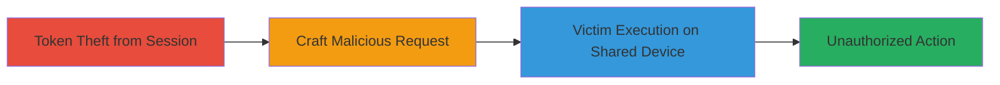

# CSRF Exploitation via Persistent Authenticity Token on Shared Workstations

Multi-stage attack chain demonstrating a complete attack workflow exploiting static CSRF tokens on shared workstations.

## Chain Metrics Dashboard

| Metric | Value |
|--------|-------|
| Chain Status | Unverified |
| Total Steps | 3 |
| Execution Time | ~5 minutes |
| Skill Level | Intermediate |
| Complexity | Medium |
| Impact Level | High |

## Attack Flow Visualization

## Prerequisites & Requirements

### Required Tools

- Browser developer tools for token extraction
- Text editor for crafting requests

### Target Environment

- Web application with static CSRF tokens post-login
- Shared workstation environment (e.g., public computer)
- Victim must log in after attacker on the same device

### Initial Access Requirements

- Physical or remote access to a shared workstation
- Ability to log in as a legitimate user briefly
- No special credentials beyond standard user access

## Detailed Attack Procedures

### Step 1: Token Theft from Session
procedure: [[procedures/Copy-Authenticity-Token-from-Logged-In-Session]]

**Objective**: Extract the static CSRF authenticity token from a logged-in browser session on the shared workstation.

**Instructions**: Log in to the target web application using a legitimate account. Open browser developer tools (e.g., inspect element in Chrome) and locate the CSRF token in the HTML form or session cookies. Copy the token value, which remains unchanged post-login.

**Expected Output**: A static token string, e.g., "csrf_token=abc123def456".

**Success Indicators**:
- Token extracted without errors
- Token verified as static by checking it persists after simulated logout/login

### Step 2: Craft Malicious Request
procedure: [[procedures/Craft-Malicious-CSRF-Request-with-Stolen-Token]]

**Objective**: Create a forged GET or POST request incorporating the stolen token to bypass CSRF protections.

**Instructions**: Use a text editor or browser console to build a malicious link or form. For example, construct a POST request to a sensitive endpoint like /transfer-funds, embedding the stolen token in the request body or headers.

**Expected Output**: A functional malicious URL or form HTML that includes the token.

**Success Indicators**:
- Request syntax validated (e.g., via curl test in a safe environment)
- Token integration confirmed without altering its value

### Step 3: Victim Execution on Shared Device
procedure: [[procedures/Trick-Victim-into-Executing-Malicious-Request]]

**Objective**: Deliver the malicious request to the victim on the same workstation, leveraging the persistent token after their login.

**Instructions**: Send the crafted link or embed the form in an email, chat, or webpage. When the victim logs in on the shared device and clicks/interacts, the request executes with their session, using the static token for validation.

**Expected Output**: Unauthorized action performed (e.g., fund transfer, data modification) without victim awareness.

**Success Indicators**:
- Victim interaction confirmed
- Server logs show successful request with victim's session

## Attack Chain Summary

### Key Achievements

1. Successful token theft enabling cross-session reuse
2. Bypassing CSRF protections via static token
3. Execution of unauthorized actions on victim's behalf

## Technique & Tactic Coverage

### MITRE ATT&CK Techniques

- [[Drive-by Compromise]]
- [[Exploit Public-Facing Application]]

### MITRE ATT&CK Tactics

- [[Initial Access]]
- [[Execution]]

---
*Last updated: 2023-10-01T00:00:00Z*
