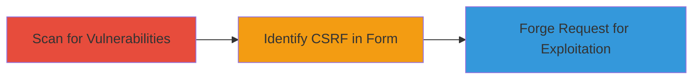

# CSRF Exploitation via Unprotected Enterprise Contact Form

Multi-stage attack chain demonstrating a complete attack workflow for identifying and exploiting CSRF in a web form.

## Chain Metrics Dashboard

| Metric | Value |
|--------|-------|
| Chain Status | Unverified |
| Total Steps | 1 |
| Execution Time | ~5 minutes |
| Skill Level | Intermediate |
| Complexity | Medium |
| Impact Level | High |

## Attack Flow Visualization



## Prerequisites & Requirements

### Required Tools

- [[tools/Acunetix]]

### Target Environment

- Web application with HTML forms
- Accessible via HTTP/HTTPS
- No specific ports beyond standard 80/443

### Initial Access Requirements

- Network access to the target URL (e.g., http://try.crashlytics.com/enterprise/)
- No prior credentials needed for scanning, but authenticated session for exploitation

## Detailed Attack Procedures

### Step 1: Vulnerability Scanning and CSRF Discovery
procedure: [[procedures/Discover-CSRF-in-Web-Forms-Using-Automated-Scanner]]

**Objective**: Scan the target website to identify unprotected HTML forms vulnerable to CSRF attacks.

**Instructions**: Launch an automated scan using [[tools/Acunetix]] to probe the target URL for web vulnerabilities, focusing on form protections.

Configure Acunetix with Aspect enabled and run the scan:

```bash
acunetix-scan --url http://try.crashlytics.com/enterprise/ --aspect-enabled --aspect-password 082119f75623eb7abd7bf357698ff66c --aspect-queries "filelist;aspectalerts"
```

Review the scan results for forms lacking CSRF tokens, such as GET method forms with name, email, and comment fields.

**Expected Output**: Scan report highlighting CSRF vulnerability in the HTML form at /enterprise/, with details on missing protection tokens.

**Success Indicators**:
- Detection of unprotected form
- Confirmation of GET method without CSRF countermeasures

## Attack Chain Summary

### Key Achievements

1. Automated discovery of CSRF vulnerability using Acunetix
2. Identification of impact on authenticated users submitting unintended data
3. Potential for admin-targeted exploitation leading to application compromise

## Technique & Tactic Coverage

### MITRE ATT&CK Techniques

- [[Exploit Public-Facing Application]]

### MITRE ATT&CK Tactics

- [[Initial Access]]

---
*Last updated: 2023-10-01T00:00:00Z*
