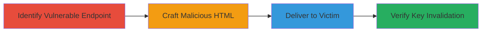

---
tags:
  - csrf
  - web
  - account-lockout
  - personal-key
type: attack_chain
tools: []
tactics:
  - '[[Initial Access]]'
  - '[[Execution]]'
verified: false
platforms:
  - Web
submitted: true
complexity: medium
created_at: '2023-10-01T00:00:00Z'
procedures:
  - '[[procedures/Identify-CSRF-Vulnerable-Endpoint-in-Personal-Key-Generation]]'
  - '[[procedures/Craft-Malicious-HTML-Page-for-CSRF-Attack]]'
  - '[[procedures/Deliver-Malicious-Page-to-Authenticated-Victim]]'
  - '[[procedures/Verify-Impact-of-Key-Regeneration]]'
step_count: 4
techniques:
  - '[[Exploit Public-Facing Application]]'
  - '[[T1566.002]]'
updated_at: '2025-12-14T17:27:22.443Z'
description: >-
  A multi-stage CSRF attack exploiting the lack of anti-CSRF protection in the
  personal key generation feature of staging.login.gov, allowing an attacker to
  invalidate a user's existing personal key without consent.
skill_level: intermediate
impact_level: high
id: 3e21894e-0812-4f7e-80ba-92293a019cee
validated: true
mitre_tactics:
  - '[[Initial Access]]'
  - '[[Execution]]'
mitre_techniques:
  - '[[Exploit Public-Facing Application]]'
  - '[[T1566.002]]'
---
# CSRF Forcing Personal Key Regeneration Leading to Account Lockout on Login.gov

Multi-stage attack chain demonstrating a complete CSRF workflow to force personal key regeneration on staging.login.gov, invalidating the user's existing key and potentially causing account lockout in scenarios like device theft or compromise.

## Chain Metrics Dashboard

| Metric | Value |
|--------|-------|
| Chain Status | Unverified |
| Total Steps | 4 |
| Execution Time | ~5 minutes |
| Skill Level | Intermediate |
| Complexity | Medium |
| Impact Level | High |

## Attack Flow Visualization

## Prerequisites & Requirements

### Required Tools

- None (relies on HTML/JavaScript crafting)

### Target Environment

- Web platform
- Authenticated session on https://staging.login.gov
- No specific services/ports beyond standard HTTPS (443)

### Initial Access Requirements

- Victim must be logged into staging.login.gov
- Attacker needs a way to deliver a malicious link (e.g., phishing email or social engineering)
- No prior credentials for the target account required

## Detailed Attack Procedures

### Step 1: Identify Vulnerable Endpoint
procedure: [[procedures/Identify-CSRF-Vulnerable-Endpoint-in-Personal-Key-Generation]]

**Objective**: Locate the personal key generation endpoint lacking CSRF protection to confirm exploitability.

**Instructions**: Review the application's form submission for the personal key feature at https://staging.login.gov/manage/personal_key. Inspect the HTML form and test submissions without a CSRF token to verify unauthorized access from external origins.

**Expected Output**: Confirmation that form submission with 'resend=true' parameter succeeds without token validation.

**Success Indicators**:
- Form submits successfully from a cross-origin page
- No CSRF token required or validated

### Step 2: Craft Malicious HTML Page
procedure: [[procedures/Craft-Malicious-HTML-Page-for-CSRF-Attack]]

**Objective**: Create an auto-submitting form that triggers the vulnerable endpoint when loaded.

**Instructions**: Develop an HTML page with a hidden form targeting the endpoint, including the 'resend=true' parameter, and use JavaScript to submit it automatically upon page load. Optionally, use history.pushState to avoid browser warnings.

**Expected Output**: A standalone HTML file that, when opened in a browser, submits the CSRF request silently.

**Success Indicators**:
- Form auto-submits without user interaction
- Browser history is manipulated to hide the submission

### Step 3: Deliver Malicious Page to Authenticated Victim
procedure: [[procedures/Deliver-Malicious-Page-to-Authenticated-Victim]]

**Objective**: Trick the victim into loading the malicious page while their session is active on the target site.

**Instructions**: Host the HTML page on an attacker-controlled server and send a phishing link to the victim (e.g., via email disguised as a legitimate notification). Ensure the victim clicks the link while logged into staging.login.gov.

**Expected Output**: Automatic form submission, redirecting the victim to the personal key page with a new key displayed.

**Success Indicators**:
- Victim's browser submits the request
- Old personal key is invalidated upon next login attempt

### Step 4: Verify Impact of Key Regeneration
procedure: [[procedures/Verify-Impact-of-Key-Regeneration]]

**Objective**: Confirm the attack's success by testing access with old and new keys.

**Instructions**: After the attack, log out the victim and attempt login with the old personal key (should fail). Then use the new key displayed post-attack (should succeed).

**Expected Output**: Failure with old key, success with new key, proving unauthorized change.

**Success Indicators**:
- Login with old key denied due to invalidation
- Account accessible only with newly generated key

## Attack Chain Summary

### Key Achievements

1. Identified CSRF vulnerability in personal key regeneration endpoint
2. Crafted and delivered a malicious page to force key change without consent
3. Invalidated existing key, demonstrating potential for account denial-of-service
4. Verified impact through login testing

## Technique & Tactic Coverage

### MITRE ATT&CK Techniques

- [[Exploit Public-Facing Application]]
- [[T1566.002]]

### MITRE ATT&CK Tactics

- [[Initial Access]]
- [[Execution]]

---
*Last updated: 2023-10-01T00:00:00Z*
