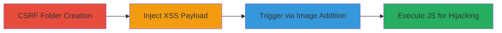

---
tags:
  - csrf
  - xss
  - stored-xss
  - imgur
  - web-vulnerability
type: attack_chain
tools: []
tactics:
  - '[[Initial Access]]'
  - '[[Execution]]'
verified: false
platforms:
  - Web
submitted: true
complexity: medium
created_at: '2023-10-01T00:00:00Z'
procedures:
  - '[[procedures/Create-Malicious-Favorites-Folder-via-CSRF]]'
  - '[[procedures/Trigger-XSS-by-Adding-Image-to-Folder]]'
  - '[[procedures/Deliver-CSRF-Payload-via-Malicious-Page]]'
step_count: 3
techniques:
  - '[[Exploit Public-Facing Application]]'
  - '[[JavaScript]]'
updated_at: '2025-12-13T23:56:03.940Z'
description: >-
  A multi-stage attack exploiting CSRF in Imgur's folder creation to inject an
  XSS payload, which triggers stored self-XSS when the victim interacts with
  images, potentially enabling account hijacking.
skill_level: intermediate
impact_level: high
id: e92c9e2a-507b-43d6-9c4b-7aa7636bb4f7
validated: true
mitre_tactics:
  - '[[Initial Access]]'
  - '[[Execution]]'
mitre_techniques:
  - '[[Exploit Public-Facing Application]]'
  - '[[JavaScript]]'
---
# CSRF Leading to Stored Self-XSS in Imgur Favorites Folders

Multi-stage attack chain demonstrating a complete attack workflow exploiting CSRF to create a favorites folder with an XSS payload on Imgur, leading to self-XSS execution upon user interaction.

## Chain Metrics Dashboard

| Metric | Value |
|--------|-------|
| Chain Status | Unverified |
| Total Steps | 3 |
| Execution Time | ~5 minutes |
| Skill Level | Intermediate |
| Complexity | Medium |
| Impact Level | High |

## Attack Flow Visualization

## Prerequisites & Requirements

### Required Tools

- Web browser (e.g., Chrome with developer tools)
- Local web server for hosting CSRF PoC (e.g., Python's http.server)

### Target Environment

- Imgur web application
- Logged-in user session on Imgur
- Access to Imgur API endpoints

### Initial Access Requirements

- Victim must be authenticated to Imgur
- Attacker needs to lure victim to malicious page while logged in
- No special credentials beyond standard Imgur account

## Detailed Attack Procedures

### Step 1: Create Malicious Favorites Folder
procedure: [[procedures/Create-Malicious-Favorites-Folder-via-CSRF]]

**Objective**: Use CSRF to automatically create a favorites folder named with an XSS payload without user consent.

**Instructions**: Host a malicious HTML page that auto-submits a POST to the Imgur API. Ensure the victim visits this page while logged into Imgur.

**Expected Output**: A new folder appears in the victim's favorites with the injected name, e.g., '"'>'.

**Success Indicators**:
- Folder created in victim's Imgur favorites
- Payload visible in folder name upon manual inspection

### Step 2: Trigger XSS by Adding Image to Folder
procedure: [[procedures/Trigger-XSS-by-Adding-Image-to-Folder]]

**Objective**: When the victim adds an image to the malicious folder, execute the stored XSS payload in their browser.

**Instructions**: Direct the victim to an Imgur image page via a malicious link (e.g., on Reddit). Instruct or trick them to add the image to favorites, selecting the malicious folder, which renders the payload.

**Expected Output**: JavaScript alert or prompt executes, e.g., prompt(1) fires in the browser console.

**Success Indicators**:
- XSS payload executes on image addition
- Potential for further JS like cookie theft if payload is escalated

### Step 3: Deliver CSRF Payload via Malicious Page
procedure: [[procedures/Deliver-CSRF-Payload-via-Malicious-Page]]

**Objective**: Host and distribute a page that performs the CSRF attack to create the folder seamlessly.

**Instructions**: Create and host an HTML form that targets https://api.imgur.com/3/folders with the XSS name. Lure the victim to visit the page (e.g., via phishing link in overlapping communities like Reddit).

**Expected Output**: Automatic form submission creates the folder without user interaction.

**Success Indicators**:
- Victim's browser sends POST request to Imgur API
- Folder creation confirmed in victim's account

## Attack Chain Summary

### Key Achievements

1. Bypassed CSRF protections to inject XSS into folder names
2. Achieved stored self-XSS requiring minimal user interaction
3. Enabled potential account hijacking through JS execution in authenticated context

## Technique & Tactic Coverage

### MITRE ATT&CK Techniques

- [[Exploit Public-Facing Application]] Exploit Public-Facing Application
- [[JavaScript]] JavaScript

### MITRE ATT&CK Tactics

- [[Initial Access]] Initial Access
- [[Execution]] Execution

---
*Last updated: 2023-10-01T00:00:00Z*
