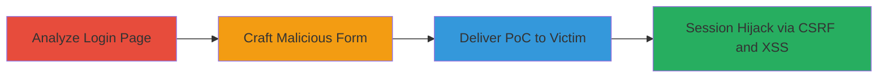

---
tags:
  - csrf
  - xss
  - recaptcha-bypass
  - login-bypass
  - session-hijacking
type: attack_chain
tools: []
tactics:
  - '[[Initial Access]]'
  - '[[Execution]]'
  - '[[Collection]]'
verified: false
platforms:
  - Web
submitted: true
complexity: medium
created_at: '2024-01-01T00:00:00Z'
procedures:
  - '[[procedures/Analyze-Login-Page-for-CSRF-Vulnerabilities]]'
  - '[[procedures/Craft-Malicious-CSRF-Form-for-Login-Bypass]]'
  - '[[procedures/Deliver-and-Execute-CSRF-XSS-PoC]]'
step_count: 3
techniques:
  - '[[Exploit Public-Facing Application]]'
  - '[[JavaScript]]'
  - '[[Drive-by Compromise]]'
updated_at: '2025-12-14T17:27:57.055Z'
description: >-
  A multi-stage web attack exploiting CSRF on the login page of www.drive2.ru by
  bypassing FCTX anti-CSRF token and reCAPTCHA, combined with XSS in the
  rememberMe parameter to hijack user sessions.
skill_level: intermediate
impact_level: high
id: e57210b4-f38b-4137-b0d6-3a51ee524e12
validated: true
mitre_tactics:
  - '[[Initial Access]]'
  - '[[Execution]]'
  - '[[Collection]]'
mitre_techniques:
  - '[[Exploit Public-Facing Application]]'
  - '[[JavaScript]]'
  - '[[Drive-by Compromise]]'
---
---

# CSRF Login Attack via FCTX Token Bypass and XSS in RememberMe on Drive2.ru

Multi-stage attack chain demonstrating a complete attack workflow exploiting CSRF and XSS on the Drive2.ru login page.

## Chain Metrics Dashboard

| Metric | Value |
|--------|-------|
| Chain Status | Unverified |
| Total Steps | 3 |
| Execution Time | ~5 minutes |
| Skill Level | Intermediate |
| Complexity | Medium |
| Impact Level | High |

## Attack Flow Visualization

## Prerequisites & Requirements

### Required Tools

- Browser developer tools for inspection
- Text editor for crafting HTML PoC

### Target Environment

- Web platform
- Target: www.drive2.ru login endpoint
- Required services/ports: HTTPS on port 443
- Network access requirements: Internet access to load the malicious page

### Initial Access Requirements

- No prior credentials needed
- Victim must be authenticated or visit the malicious page while logged in
- Attacker needs a way to deliver the PoC (e.g., phishing email or malicious site)

## Detailed Attack Procedures

### Step 1: Analyze the Login Page

procedure: [[procedures/Analyze-Login-Page-for-CSRF-Vulnerabilities]]

**Objective**: Identify missing FCTX token validation, reCAPTCHA bypass, and XSS in rememberMe parameter to confirm exploitability.

**Instructions**: Open the login page in a browser, inspect the form elements, and test submissions without tokens. Submit login requests via developer tools or proxy to observe that FCTX is not enforced and rememberMe accepts unsanitized input.

**Expected Output**: Confirmation that login succeeds without FCTX token and XSS payload triggers an alert.

**Success Indicators**:
- Login form posts without FCTX validation error
- Fake reCAPTCHA token accepted
- XSS payload in rememberMe executes JavaScript

### Step 2: Craft Malicious CSRF Form

procedure: [[procedures/Craft-Malicious-CSRF-Form-for-Login-Bypass]]

**Objective**: Create an HTML page that automatically submits a forged login request with attacker credentials and XSS payload.

**Instructions**: Use a text editor to build an HTML form targeting https://www.drive2.ru/reception/?.AMRU=https%3A%2F%2Fwww.drive2.ru%2F. Include hidden fields for login, password, a fake g-recaptcha-response, and an XSS payload like "onerror=alert(document.domain)" in rememberMe. Set the form to auto-submit on load using JavaScript.

**Expected Output**: A standalone HTML file ready for hosting or delivery.

**Success Indicators**:
- Form HTML validates and simulates successful submission
- XSS payload is embedded without breaking the form

### Step 3: Deliver and Execute CSRF-XSS PoC

procedure: [[procedures/Deliver-and-Execute-CSRF-XSS-PoC]]

**Objective**: Trick the victim into loading the malicious page, triggering unauthorized login as the attacker and executing XSS.

**Instructions**: Host the HTML file on a controllable server or send via email/phishing. When the victim loads it (while logged into Drive2.ru), the form submits, bypassing protections to log them in as the attacker and pop an alert via XSS.

**Expected Output**: Victim's browser logs in with attacker credentials and executes the XSS script.

**Success Indicators**:
- Victim's session is hijacked
- Alert box appears confirming XSS execution
- Attacker gains access to victim's account actions

## Attack Chain Summary

### Key Achievements

1. Bypassed FCTX anti-CSRF token to enable login CSRF
2. Evaded reCAPTCHA with fake tokens for automated attacks
3. Injected XSS via rememberMe for immediate script execution and potential data theft

## Technique & Tactic Coverage

### MITRE ATT&CK Techniques

- [[Exploit Public-Facing Application]]
- [[JavaScript]]
- [[Drive-by Compromise]]

### MITRE ATT&CK Tactics

- [[Initial Access]]
- [[Execution]]
- [[Collection]]

---

*Last updated: 2024-01-01T00:00:00Z*
