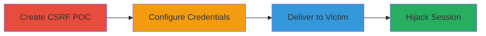

# CSRF Login Forgery to Force Victim into Attacker's Account on Unikrn

Multi-stage attack chain demonstrating a complete CSRF-based account hijacking workflow on the Unikrn platform.

## Chain Metrics Dashboard

| Metric | Value |
|--------|-------|
| Chain Status | Unverified |
| Total Steps | 3 |
| Execution Time | ~5 minutes |
| Skill Level | Intermediate |
| Complexity | Medium |
| Impact Level | High |

## Attack Flow Visualization

## Prerequisites & Requirements

### Required Tools

- None (uses basic HTML and hosting/email)

### Target Environment

- Web platform: Unikrn.com login endpoint at https://unikrn.com/apiv1/login
- Services: Wallet feature, Steam account linking via Unikrn Connect

### Initial Access Requirements

- Valid attacker credentials (email and password) for Unikrn account
- Ability to host or email an HTML file to the victim
- Victim must be a logged-out Unikrn user with browser access

## Detailed Attack Procedures

### Step 1: Create CSRF Login POC
procedure: [[procedures/Create-CSRF-Login-POC-HTML]]

**Objective**: Generate a malicious HTML form that submits login credentials to the vulnerable endpoint without user awareness.

**Instructions**: Craft a simple HTML page with a form targeting the login API. The form uses POST method and hidden inputs to avoid detection.

**Expected Output**: An HTML file ready for credential insertion.

**Success Indicators**:
- HTML form validates by testing locally (e.g., open in browser and inspect submission)
- Form action points to https://unikrn.com/apiv1/login

### Step 2: Configure with Attacker Credentials
procedure: [[procedures/Configure-CSRF-with-Attacker-Credentials]]

**Objective**: Insert the attacker's valid Unikrn credentials into the HTML form to force victim login into the attacker's session.

**Instructions**: Edit the HTML file's hidden inputs: set 'usr' to attacker's email and 'pwd' to password. Save the updated file.

**Expected Output**: Modified HTML with embedded credentials.

**Success Indicators**:
- Credentials are correctly hidden in form inputs
- Test submission (if possible in a safe environment) logs into attacker's account

### Step 3: Deliver Payload to Victim
procedure: [[procedures/Deliver-CSRF-Payload-to-Victim]]

**Objective**: Trick the victim into interacting with the HTML page, triggering the unauthorized login.

**Instructions**: Host the HTML file on a server (e.g., GitHub Pages) or attach via email. Send a phishing link or message urging the victim to click or submit, e.g., "Click here to claim your Unikrn reward."

**Expected Output**: Victim's browser submits the form, logging them into the attacker's account.

**Success Indicators**:
- Victim reports unexpected login or attacker observes new session activity
- Victim's actions (e.g., adding payment info) appear in attacker's account

## Attack Chain Summary

### Key Achievements

1. Successful CSRF exploitation bypassing session validation in login endpoint
2. Victim forced into attacker's account, enabling real-time monitoring of activities
3. Potential for secondary impacts like social engineering, payment info theft, or external account linking (e.g., Steam)

## Technique & Tactic Coverage

### MITRE ATT&CK Techniques

- [[Exploit Public-Facing Application]] Exploit Public-Facing Application
- [[Valid Accounts]] Valid Accounts
- [[User Execution]] User Execution

### MITRE ATT&CK Tactics

- [[Initial Access]] Initial Access
- [[Credential Access]] Credential Access

---
*Last updated: 2023-10-01T00:00:00Z*
