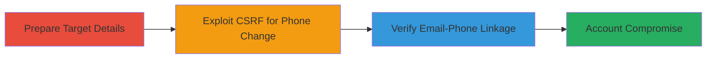

---
tags:
  - csrf
  - information-disclosure
  - account-takeover
  - web-vulnerability
type: attack_chain
tools: []
tactics:
  - '[[Initial Access]]'
  - '[[Discovery]]'
commands: []
platforms:
  - Web
complexity: medium
procedures:
  - '[[procedures/Prepare-CSRF-Attack-on-VK-Phone-Change]]'
  - '[[procedures/Execute-CSRF-to-Change-Phone-Number]]'
  - '[[procedures/Verify-Email-Phone-Association-on-VK]]'
step_count: 3
techniques:
  - '[[Exploit Public-Facing Application]]'
  - '[[System Information Discovery]]'
description: >-
  A multi-stage attack exploiting CSRF in VK.com's phone number change feature
  and an information disclosure vulnerability to link email and phone to user
  profiles, enabling account takeover risks.
skill_level: intermediate
impact_level: high
id: 3e7be26b-3199-45a8-8a7c-edfaf2510b9f
created_at: '2025-12-14T17:27:42.376Z'
updated_at: '2025-12-14T17:27:42.376Z'
verified: false
validated: true
submitted: true
mitre_tactics:
  - '[[Initial Access]]'
  - '[[Discovery]]'
mitre_techniques:
  - '[[Exploit Public-Facing Application]]'
  - '[[System Information Discovery]]'
---
# CSRF Phone Number Change and Email-Phone Association Disclosure on VK.com

## Overview

This attack chain exploits a CSRF vulnerability in VK.com's phone number change functionality, allowing an attacker with only the victim's last name and login to alter their phone number without authentication. It chains with an information disclosure flaw that verifies if an email and phone number are associated with the same user profile, likely due to weak hash generation. Discovered in 2018, this could lead to account takeover, privacy breaches, or social engineering. The attack requires no advanced tools, just crafting malicious requests via a browser or script, and targets VK.com's web platform.

## Chain Metrics Dashboard

| Metric | Value |
|--------|-------|
| Chain Status | Unverified |
| Total Steps | 3 |
| Execution Time | ~5 minutes |
| Skill Level | Intermediate |
| Complexity | Medium |
| Impact Level | High |

## Attack Flow Visualization



## Prerequisites & Requirements

### Required Tools

- Web browser (e.g., Chrome with developer tools)
- Optional: [[Burp Suite]] for request crafting

### Target Environment

- VK.com web platform
- No specific ports or services beyond standard HTTPS (443)
- Attacker needs victim's last name and login (publicly available or socially engineered)

### Initial Access Requirements

- No credentials needed for victim
- Network access to VK.com
- No prior access; attack is remote via CSRF

## Detailed Attack Procedures

### Step 1: Prepare Target Details
procedure: [[procedures/Prepare-CSRF-Attack-on-VK-Phone-Change]]

**Objective**: Gather and validate the victim's last name and login to target the phone change endpoint.

**Instructions**: Identify the victim's VK.com login (username) and last name from public profiles or social engineering. Use these to construct the CSRF payload targeting the phone change form. No specific command is needed; manually note the details.

**Expected Output**: Validated victim identifiers ready for payload crafting.

**Success Indicators**:
- Victim's login and last name confirmed
- Endpoint URL for phone change identified (e.g., via inspecting VK.com forms)

### Step 2: Exploit CSRF for Phone Change
procedure: [[procedures/Execute-CSRF-to-Change-Phone-Number]]

**Objective**: Send a malicious CSRF request to change the victim's phone number without token validation.

**Instructions**: Craft an HTML page with a form that auto-submits to VK.com's phone change endpoint, using the victim's details and attacker's desired phone number. Host this on a site controlled by the attacker and trick the victim into visiting it (e.g., via phishing link). The form lacks CSRF protection, allowing the change.

Example payload (embed in HTML):

```html
<form action="https://vk.com/al_phone_change" method="POST" id="csrf-form">
  <input type="hidden" name="last_name" value="VictimLastName">
  <input type="hidden" name="login" value="VictimLogin">
  <input type="hidden" name="new_phone" value="+AttackerPhone">
</form>
<script>document.getElementById('csrf-form').submit();</script>
```

**Expected Output**: Phone number updated on victim's account; confirmation from VK.com response.

**Success Indicators**:
- HTTP 200/302 response indicating successful update
- Victim's account phone changed (verifiable if attacker gains access)

### Step 3: Verify Email-Phone Association
procedure: [[procedures/Verify-Email-Phone-Association-on-VK]]

**Objective**: Exploit the association check to confirm if an email and phone belong to the same VK.com user profile.

**Instructions**: Use VK.com's profile verification feature or endpoint to input an email and phone, observing the response for linkage confirmation. This exploits a hash generation weakness that reveals associations without authorization.

Example request (via browser dev tools or curl):

```bash
curl -X POST 'https://vk.com/verify_association' \
  -d 'email=victim@email.com' \
  -d 'phone=+VictimPhone' \
  -d 'hash=weak_generated_hash'
```

**Expected Output**: Response indicating match (e.g., success message or linked profile data).

**Success Indicators**:
- Confirmation that email and phone are tied to the same user
- Potential hash or partial profile info disclosed

## Attack Chain Summary

### Key Achievements

1. Bypassed CSRF protections to modify sensitive account data
2. Disclosed private associations between email, phone, and profiles
3. Enabled potential account takeover with minimal victim info

## Technique & Tactic Coverage

### MITRE ATT&CK Techniques

- [[Exploit Public-Facing Application]]
- [[System Information Discovery]]

### MITRE ATT&CK Tactics

- [[Initial Access]]
- [[Discovery]]

---
*Last updated: 2023-10-01T00:00:00Z*
