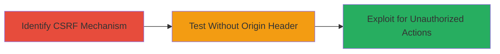

---
tags:
  - csrf
  - bypass
  - api
  - web
  - tiktok
type: attack_chain
tools: []
tactics:
  - '[[Initial Access]]'
verified: false
platforms:
  - Web
submitted: true
complexity: medium
created_at: '2023-10-01T00:00:00Z'
procedures:
  - '[[procedures/Identify-CSRF-Protection-Mechanism-on-Webcast-Endpoints]]'
  - '[[procedures/Test-Webcast-API-Request-Without-Origin-Header]]'
  - '[[procedures/Exploit-CSRF-Bypass-for-Unauthorized-Actions]]'
step_count: 3
techniques:
  - '[[Exploit Public-Facing Application]]'
updated_at: '2025-12-14T17:27:57.610Z'
description: >-
  A multi-stage attack exploiting a CSRF protection flaw in TikTok's Webcast
  API, where requests without an Origin header are accepted, enabling
  unauthorized actions on behalf of authenticated users.
skill_level: intermediate
impact_level: high
id: 9914e100-be54-4883-abd8-772531a215f3
validated: true
mitre_tactics:
  - '[[Initial Access]]'
mitre_techniques:
  - '[[Exploit Public-Facing Application]]'
---
# CSRF Protection Bypass in TikTok Webcast API via Missing Origin Header Validation

Multi-stage attack chain demonstrating a complete attack workflow exploiting inadequate CSRF protection in TikTok's Webcast API endpoints. The vulnerability allows cross-origin requests without an Origin header to be processed, enabling attackers to forge requests on behalf of authenticated users for unauthorized actions like modifying live streams or user data without detection.

## Chain Metrics Dashboard

| Metric | Value |
|--------|-------|
| Chain Status | Unverified |
| Total Steps | 3 |
| Execution Time | ~5 minutes |
| Skill Level | Intermediate |
| Complexity | Medium |
| Impact Level | High |

## Attack Flow Visualization



## Prerequisites & Requirements

### Required Tools

- [[tools/curl]]

### Target Environment

- Web platform
- Access to TikTok Webcast API endpoints
- Authenticated session (e.g., valid cookies or tokens)

### Initial Access Requirements

- Network access to TikTok's API
- No special credentials beyond user authentication
- Browser or tool for sending HTTP requests

## Detailed Attack Procedures

### Step 1: Identify CSRF Protection Mechanism
procedure: [[procedures/Identify-CSRF-Protection-Mechanism-on-Webcast-Endpoints]]

**Objective**: Analyze the Webcast API endpoints to understand the CSRF protection relying on the Origin header.

**Instructions**: Review API documentation or use network inspection tools to identify endpoints. Send a standard request with Origin header to observe validation behavior.

Use [[commands/curl-test-with-origin]] to send a request including the Origin header:

```bash
curl -X POST https://api.tiktok.com/webcast/endpoint \
  -H "Origin: https://www.tiktok.com" \
  -H "Cookie: session=valid_session" \
  -d "data=payload"
```

Observe that the request is validated and processed.

**Expected Output**: Successful response confirming Origin validation is enforced when present.

**Success Indicators**:
- Request accepted with Origin header
- No errors related to CSRF in response

### Step 2: Test Request Without Origin Header
procedure: [[procedures/Test-Webcast-API-Request-Without-Origin-Header]]

**Objective**: Verify if requests omitting the Origin header are still processed, bypassing CSRF checks.

**Instructions**: Craft and send a request to the same endpoint without the Origin header to test acceptance.

Execute [[commands/curl-test-without-origin]]:

```bash
curl -X POST https://api.tiktok.com/webcast/endpoint \
  -H "Cookie: session=valid_session" \
  -d "data=payload" \
  --no-origin
```

Note: Use curl's default behavior or explicitly omit Origin; confirm the request succeeds.

**Expected Output**: API processes the request without rejection, indicating bypass.

**Success Indicators**:
- 200 OK or successful action response
- No CSRF error despite missing Origin

### Step 3: Exploit Bypass for Unnoticed Requests
procedure: [[procedures/Exploit-CSRF-Bypass-for-Unauthorized-Actions]]

**Objective**: Simulate cross-site requests to perform unauthorized actions on behalf of the victim user.

**Instructions**: From a malicious site, forge requests using the victim's session without Origin, targeting sensitive actions like updating webcast settings.

Use [[commands/curl-exploit-csrf]] to mimic a cross-origin attack:

```bash
curl -X POST https://api.tiktok.com/webcast/update \
  -H "Cookie: session=victim_session" \
  -d "action=unauthorized_update&value=malicious"
```

Host a malicious HTML page with a form or script that submits such requests automatically.

**Expected Output**: Unauthorized action completes without user interaction or notice.

**Success Indicators**:
- Action performed (e.g., settings changed)
- No alerts or blocks from the API

## Attack Chain Summary

### Key Achievements

1. Identified flawed CSRF protection dependent on Origin header presence
2. Confirmed bypass by omitting the header in cross-origin requests
3. Demonstrated potential for stealthy unauthorized actions on authenticated users

## Technique & Tactic Coverage

### MITRE ATT&CK Techniques

- [[Exploit Public-Facing Application]]

### MITRE ATT&CK Tactics

- [[Initial Access]]

---
*Last updated: 2023-10-01T00:00:00Z*
