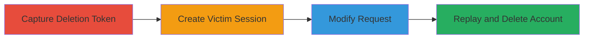

---
tags:
  - csrf
  - token-bypass
  - account-deletion
  - web-vulnerability
type: attack_chain
tools:
  - '[[tools/Burp-Suite]]'
tactics:
  - '[[Initial Access]]'
verified: false
platforms:
  - Web
submitted: true
complexity: medium
created_at: '2024-01-01T00:00:00Z'
procedures:
  - '[[procedures/Capture-Account-Deletion-Request-Using-Burp-Suite]]'
  - '[[procedures/Create-Second-Account-in-Same-Session]]'
  - '[[procedures/Modify-Captured-Request-with-New-Session-Cookie]]'
  - '[[procedures/Replay-Modified-Request-to-Delete-Account]]'
step_count: 4
techniques:
  - '[[Exploit Public-Facing Application]]'
updated_at: '2025-12-14T17:27:29.462Z'
description: >-
  A multi-step attack exploiting CSRF token reuse in GitLab's account deletion
  process to delete a victim's account using a token from an attacker's account
  and the victim's session cookie.
skill_level: intermediate
impact_level: high
id: 594b8b41-ce68-4208-a58a-0c07d0d206ad
validated: true
mitre_tactics:
  - '[[Initial Access]]'
mitre_techniques:
  - '[[Exploit Public-Facing Application]]'
---
# CSRF Token Bypass for Unauthorized Account Deletion in GitLab

Multi-stage attack chain demonstrating a complete attack workflow exploiting CSRF token reuse in GitLab's account deletion to unauthorizedly delete a victim's account.

## Chain Metrics Dashboard

| Metric | Value |
|--------|-------|
| Chain Status | Unverified |
| Total Steps | 4 |
| Execution Time | ~10 minutes |
| Skill Level | Intermediate |
| Complexity | Medium |
| Impact Level | High |

## Attack Flow Visualization



## Prerequisites & Requirements

### Required Tools

- [[tools/Burp-Suite]]

### Target Environment

- Web platform (GitLab instance)
- Required services/ports: HTTP/HTTPS on port 80/443 (or 3000 for local)
- Network access requirements: Ability to register accounts and access profile pages

### Initial Access Requirements

- Attacker must be able to create temporary accounts (e.g., using disposable emails)
- Victim must be logged in to GitLab in the same browser session or with capturable cookies
- No prior access needed beyond public registration

## Detailed Attack Procedures

### Step 1: Capture Deletion Token
procedure: [[procedures/Capture-Account-Deletion-Request-Using-Burp-Suite]]

**Objective**: Create an attacker account and intercept the account deletion POST request to obtain the CSRF authenticity_token.

**Instructions**: Register a new account on GitLab using a temporary email. Log in, navigate to the account settings at `/profile/account`, and submit the deletion form while intercepting with Burp Suite. Capture the POST request to `/users` containing `_method=delete` and `authenticity_token`.

Use [[commands/curl-capture-deletion-request]] to simulate or verify the capture:

```bash
curl -X POST https://gitlab.com/users \
  -H "Cookie: _gitlab_session=1staccount_cookie;" \
  -H "Content-Type: application/x-www-form-urlencoded" \
  -d "_method=delete&authenticity_token=auth_1staccount"
```

**Expected Output**: The request is intercepted in Burp Suite, revealing the authenticity_token for reuse.

**Success Indicators**:
- POST request captured with valid authenticity_token
- Token value noted for later steps

### Step 2: Create Victim Session
procedure: [[procedures/Create-Second-Account-in-Same-Session]]

**Objective**: Establish a second account (simulating victim) in the same browser session without clearing cookies, preserving the old session cookie while obtaining a new one.

**Instructions**: In the same browser session (without logging out or clearing cookies), register a new account using another temporary email. Note the new `_gitlab_session` cookie value from browser dev tools or Burp Suite.

No specific command needed, but verify session persistence by checking cookies in subsequent requests.

**Expected Output**: New account created; old `_gitlab_session` cookie from first account still present, new cookie obtained.

**Success Indicators**:
- Second account registered successfully
- Both session cookies available for modification

### Step 3: Modify Captured Request
procedure: [[procedures/Modify-Captured-Request-with-New-Session-Cookie]]

**Objective**: Alter the intercepted deletion request by replacing the session cookie with the victim's (second account's) cookie while retaining the attacker's authenticity_token.

**Instructions**: In Burp Suite Repeater, load the captured POST request from Step 1. Replace the `_gitlab_session` cookie value with the one from the second account. Keep the `authenticity_token` unchanged. Forward the modified request.

Simulate with [[commands/curl-modified-deletion-request]]:

```bash
curl -X POST https://gitlab.com/users \
  -H "Cookie: _gitlab_session=568a0c6e266c55938182945af357dda4;" \
  -H "Content-Type: application/x-www-form-urlencoded" \
  -d "_method=delete&authenticity_token=a57BV%2BO0KhEtRe%2FS9W2%2FIBqZj2bWA8jbfE38VlA4pzN1wBKov8F4UV7gYerBaLOumjqpnIoC2Dsx1jufaAZGsg%3D%3D"
```

**Expected Output**: Modified request ready in Burp Suite or curl response indicating preparation for replay.

**Success Indicators**:
- Cookie updated in request headers
- Authenticity_token unchanged

### Step 4: Replay and Delete Account
procedure: [[procedures/Replay-Modified-Request-to-Delete-Account]]

**Objective**: Send the modified request to exploit the token bypass and delete the victim's account.

**Instructions**: Replay the modified POST request from Burp Suite or use curl to send it to the `/users` endpoint. The request succeeds because the CSRF token is not reset after email confirmation login (Warden hook issue).

Use [[commands/curl-replay-deletion-request]]:

```bash
curl -X POST https://localhost:3000/users \
  -H "Cookie: _gitlab_session=b9dbae76ceaed44954d57d0d505eca00;" \
  -H "Content-Type: application/x-www-form-urlencoded" \
  -d "_method=delete&authenticity_token=a57BV%2BO0KhEtRe%2FS9W2%2FIBqZj2bWA8jbfE38VlA4pzN1wBKov8F4UV7gYerBaLOumjqpnIoC2Dsx1jufaAZGsg%3D%3D"
```

**Expected Output**: Account deletion confirmed; no InvalidAuthenticityToken error in vulnerable versions.

**Success Indicators**:
- Victim's account deleted
- No CSRF protection triggered

## Attack Chain Summary

### Key Achievements

1. Captured reusable CSRF token from attacker account
2. Preserved session cookies across account creations
3. Bypassed CSRF via token reuse with victim session
4. Achieved unauthorized account deletion

## Technique & Tactic Coverage

### MITRE ATT&CK Techniques

- [[Exploit Public-Facing Application]]

### MITRE ATT&CK Tactics

- [[Initial Access]]

---

*Last updated: 2024-01-01T00:00:00Z*
