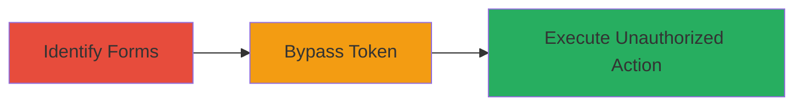

---
tags:
  - csrf
  - bypass
  - web-vulnerability
type: attack_chain
tools: []
tactics:
  - '[[Initial Access]]'
verified: false
platforms:
  - Web
submitted: true
complexity: low
created_at: '2023-10-01T00:00:00Z'
procedures:
  - '[[procedures/Identify-CSRF-Protected-Forms-in-Web-Application]]'
  - '[[procedures/Bypass-CSRF-Token-Validation-by-Omitting-Token]]'
step_count: 2
techniques:
  - '[[Exploit Public-Facing Application]]'
updated_at: '2025-12-14T17:27:36.119Z'
description: >-
  A low-severity vulnerability allowing CSRF attacks on reply and send message
  functions by omitting the CSRF token in requests.
skill_level: beginner
impact_level: low
id: 6aa0a6de-cfbe-4609-ae62-67bab945c36c
validated: true
mitre_tactics:
  - '[[Initial Access]]'
mitre_techniques:
  - '[[Exploit Public-Facing Application]]'
---
# CSRF Token Bypass in Reverb Messaging Features

Multi-stage attack chain demonstrating a CSRF token bypass vulnerability in Reverb.com's sandbox environment messaging features, enabling unauthorized actions on behalf of authenticated users.

## Chain Metrics Dashboard

| Metric | Value |
|--------|-------|
| Chain Status | Unverified |
| Total Steps | 2 |
| Execution Time | ~5 minutes |
| Skill Level | Beginner |
| Complexity | Low |
| Impact Level | Low |

## Attack Flow Visualization

## Prerequisites & Requirements

### Required Tools

- Browser developer tools or web proxy like Burp Suite

### Target Environment

- Web application (e.g., Reverb.com sandbox)
- Authenticated user session

### Initial Access Requirements

- Valid user account on the target site
- Network access to the web application

## Detailed Attack Procedures

### Step 1: Identify CSRF-Protected Forms
procedure: [[procedures/Identify-CSRF-Protected-Forms-in-Web-Application]]

**Objective**: Locate forms in the reply message and send message features that rely on CSRF tokens for protection.

**Instructions**: Navigate to the messaging section in the sandbox environment using a browser. Inspect the HTML forms for reply and send message actions to identify the presence of CSRF token fields, typically named like `_token` or `csrf_token`.

**Expected Output**: Confirmation of CSRF token fields in the form elements.

**Success Indicators**:
- Forms for reply and send message identified
- CSRF token input visible in form source

### Step 2: Bypass CSRF Token Validation
procedure: [[procedures/Bypass-CSRF-Token-Validation-by-Omitting-Token]]

**Objective**: Submit form requests without the CSRF token to test if validation is enforced, allowing unauthorized CSRF attacks.

**Instructions**: Use browser developer tools or a proxy to intercept the form submission. Remove the CSRF token parameter from the POST request and resubmit. Observe if the action (reply or send message) completes successfully without the token.

**Expected Output**: Successful message reply or send without token validation error.

**Success Indicators**:
- Request succeeds without CSRF token
- Unauthorized action performed on behalf of the user

## Attack Chain Summary

### Key Achievements

1. Identified CSRF-protected messaging forms in Reverb sandbox.
2. Demonstrated bypass by omitting token, enabling low-severity CSRF attacks.
3. Highlighted validation flaw quickly remediated by the team.

## Technique & Tactic Coverage

### MITRE ATT&CK Techniques

- [[Exploit Public-Facing Application]]

### MITRE ATT&CK Tactics

- [[Initial Access]]

---
*Last updated: 2023-10-01T00:00:00Z*
