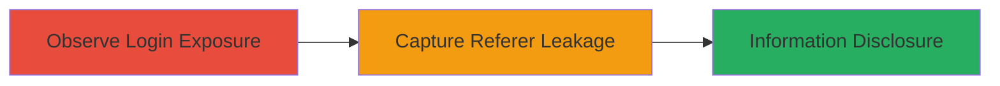

# CSRF Token Disclosure via GET Method Login and Referer Header Leakage to Third-Party Sites

Multi-stage attack chain demonstrating a complete attack workflow for information disclosure of CSRF tokens through improper login method and header leakage.

## Chain Metrics Dashboard

| Metric | Value |
|--------|-------|
| Chain Status | Unverified |
| Total Steps | 2 |
| Execution Time | ~5 minutes |
| Skill Level | Basic |
| Complexity | Low |
| Impact Level | Medium |

## Attack Flow Visualization

## Prerequisites & Requirements

### Required Tools

- Browser Developer Tools (e.g., Chrome DevTools)
- Optional: Proxy tool like Burp Suite for header inspection

### Target Environment

- Web application with account login functionality
- External third-party services (e.g., analytics like Google Analytics, New Relic)
- No special ports required; standard HTTPS (443)

### Initial Access Requirements

- Valid user account or public login page access
- Network access to the target web application
- No prior privileged access needed

## Detailed Attack Procedures

### Step 1: Observe Login Process
procedure: [[procedures/Observe-GET-Login-Exposure-of-CSRF-Token]]

**Objective**: Identify that the login endpoint uses the GET method, embedding the CSRF token in the URL query parameters, making it visible and loggable.

**Instructions**: Open the target web application's login page in a browser. Use developer tools to monitor network requests during login attempt. Submit login credentials and inspect the request URL for query parameters containing the CSRF token.

**Expected Output**: The login request appears as a GET to a URL like `/login?csrf_token=abc123&username=user&password=pass`, exposing the token.

**Success Indicators**:
- CSRF token visible in URL query string
- No POST method used for sensitive submission

### Step 2: Capture Referer Header Leakage
procedure: [[procedures/Capture-Referer-Header-Leakage-of-CSRF-Token]]

**Objective**: Demonstrate how the exposed URL is leaked to external third-party domains via the Referer header when post-login resources are loaded.

**Instructions**: After initiating login, observe subsequent resource loads (e.g., analytics scripts from Google Analytics or New Relic). Use developer tools or a proxy to inspect outgoing requests to external domains. The full login URL, including CSRF token, will be sent in the Referer header.

**Expected Output**: Requests to external sites (e.g., `bam.nr-data.net`) include Referer: `https://target.com/login?csrf_token=abc123&...`.

**Success Indicators**:
- Referer header contains the full login URL with CSRF token
- Leakage confirmed to multiple third-party services like CloudFront, Mixpanel

## Attack Chain Summary

### Key Achievements

1. Confirmed exposure of CSRF token in GET login URL
2. Demonstrated automatic leakage to external analytics and tracking services via Referer header
3. Highlighted potential for attackers to harvest tokens for CSRF bypass if third-parties are compromised

## Technique & Tactic Coverage

### MITRE ATT&CK Techniques

- [[T1213.003]]

### MITRE ATT&CK Tactics

- [[Collection]]

---
*Last updated: 2023-10-01T00:00:00Z*
