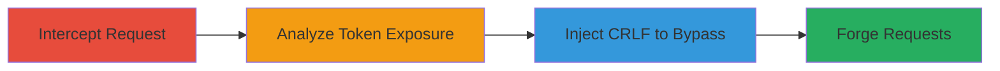

---
tags:
  - csrf
  - crlf-injection
  - token-exposure
  - web-vulnerability
type: attack_chain
tactics:
  - '[[Initial Access]]'
  - '[[Collection]]'
verified: false
platforms:
  - Web
complexity: medium
procedures:
  - '[[procedures/Intercept-HTTP-Requests-to-Identify-CSRF-Token-Storage]]'
  - '[[procedures/Analyze-CSRF-Token-Exposure-in-Cookies]]'
  - '[[procedures/Exploit-CRLF-Injection-to-Overwrite-CSRF-Token-Cookie]]'
step_count: 3
techniques:
  - '[[Exploit Public-Facing Application]]'
  - '[[Cloud Instance Metadata API]]'
description: >-
  Attack chain demonstrating the discovery of CSRF tokens stored in cookies and
  a potential CRLF injection to overwrite them, leading to CSRF protection
  bypass on a web application.
skill_level: intermediate
impact_level: medium
id: eff69997-ce61-4218-a26b-3ede8a39fed6
created_at: '2025-12-14T17:27:22.597Z'
updated_at: '2025-12-14T17:27:22.597Z'
validated: true
submitted: true
mitre_tactics:
  - '[[Initial Access]]'
  - '[[Collection]]'
mitre_techniques:
  - '[[Exploit Public-Facing Application]]'
  - '[[Cloud Instance Metadata API]]'
---
# CSRF Token Exposure in Cookies Enabling Potential Bypass via CRLF Injection

Multi-stage attack chain demonstrating the identification of improper CSRF token storage in cookies and a proof-of-concept for bypassing protections via CRLF injection on the Gratipay web application. The chain highlights best practice violations and a potential header injection vulnerability, though the bypass was not reproducible by the reporting team, resulting in an informative resolution.

## Chain Metrics Dashboard

| Metric | Value |
|--------|-------|
| Chain Status | Unverified |
| Total Steps | 3 |
| Execution Time | ~10 minutes |
| Skill Level | Intermediate |
| Complexity | Medium |
| Impact Level | Medium |

## Attack Flow Visualization

## Prerequisites & Requirements

### Required Tools

- Web browser with developer tools (e.g., Chrome DevTools)
- Proxy tool for request interception (e.g., Burp Suite or browser proxy)

### Target Environment

- Web platform (e.g., Gratipay.com)
- Access to authenticated user session
- No specific ports required beyond standard HTTPS (443)

### Initial Access Requirements

- Valid user account on the target site
- Network access to the web application
- Ability to edit user statements or similar state-changing actions

## Detailed Attack Procedures

### Step 1: Intercept HTTP Requests
procedure: [[procedures/Intercept-HTTP-Requests-to-Identify-CSRF-Token-Storage]]

**Objective**: Capture network traffic to the edit statement endpoint to observe how CSRF tokens are handled and stored.

**Instructions**: Use a proxy tool or browser developer tools to monitor requests to the target endpoint, such as https://gratipay.com/~username/statement.json. Look for Set-Cookie headers in responses that set the csrftoken.

**Expected Output**: Intercepted request showing csrftoken in a Set-Cookie header, e.g., Set-Cookie: csrftoken=zxRdWnGq3I5bMcXDRUWuWWXjxdsO1JtZ.

**Success Indicators**:
- Request to edit endpoint captured
- CSRF token visible in cookie response

### Step 2: Analyze Token Exposure
procedure: [[procedures/Analyze-CSRF-Token-Exposure-in-Cookies]]

**Objective**: Examine the CSRF token storage mechanism to identify risks from cookie-based handling.

**Instructions**: Review the captured cookies alongside session cookies. Note that the csrftoken is not isolated and could be compromised if cookies are intercepted via network attacks or XSS.

**Expected Output**: Documentation of token value (e.g., zxRdWnGq3I5bMcXDRUWuWWXjxdsO1JtZ) stored in a cookie, violating separation best practices.

**Success Indicators**:
- Token confirmed in cookies
- Potential exposure risks identified

### Step 3: Attempt CRLF Injection Bypass
procedure: [[procedures/Exploit-CRLF-Injection-to-Overwrite-CSRF-Token-Cookie]]

**Objective**: Test for CRLF injection in URLs to inject a Set-Cookie header and overwrite the CSRF token, enabling forged requests.

**Instructions**: Craft an HTML page with an img tag using a malicious src attribute targeting the application, injecting %0d (CR) for CRLF. Include a form for the state-changing POST and an onerror handler to submit it.

**Expected Output**: If successful, new csrftoken cookie set (e.g., xxxxxxxxxxxxxxxxxxxxxxxxxxxxxxxx), allowing form submission without valid token; however, this was not reproducible.

**Success Indicators**:
- CRLF injection attempted
- Cookie overwrite observed (if vulnerable)
- Unauthorized request succeeds

## Attack Chain Summary

### Key Achievements

1. Identified improper CSRF token storage in cookies, risking exposure.
2. Demonstrated potential for token compromise in transit.
3. Provided PoC for CRLF-based bypass, highlighting header injection risks.

## Technique & Tactic Coverage

### MITRE ATT&CK Techniques

- [[Exploit Public-Facing Application]] Exploit Public-Facing Application
- [[Cloud Instance Metadata API]] Credentials from Password Stores

### MITRE ATT&CK Tactics

- [[Initial Access]] Initial Access
- [[Collection]] Collection

---
*Last updated: 2023-10-01*
