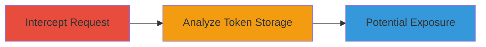

# CSRF Token Exposure via Insecure Cookie Storage

Multi-stage attack chain demonstrating a complete attack workflow.

## Chain Metrics Dashboard

| Metric | Value |
|--------|-------|
| Chain Status | Unverified |
| Total Steps | 1 |
| Execution Time | ~5 minutes |
| Skill Level | Beginner |
| Complexity | Low |
| Impact Level | Low |

## Attack Flow Visualization

## Prerequisites & Requirements

### Required Tools

- Web proxy tool (e.g., browser developer tools or Burp Suite)

### Target Environment

- Web application with user authentication
- Access to edit endpoints (e.g., statement editing functionality)

### Initial Access Requirements

- Valid user session
- Ability to perform authenticated POST requests
- Network access to the target web app

## Detailed Attack Procedures

### Step 1: Intercept and Analyze Request
procedure: [[procedures/Intercept-HTTP-Requests-to-Reveal-CSRF-Token-in-Cookies]]

**Objective**: Capture an HTTP POST request to an edit endpoint to observe CSRF token storage in cookies.

**Instructions**: Log in to the web application and navigate to the statement editing feature. Use a proxy or browser developer tools to intercept the POST request to the endpoint (e.g., /~[USER ID]/statement.json). Examine the request headers and cookies for the presence of a 'csrf_token' cookie.

**Expected Output**: The request will show a 'csrf_token' cookie with a value (e.g., y44PyqG67bRQljEA5mLK1bez4hgZ8XSD) that matches the X-CSRF-Token header, indicating insecure storage.

**Success Indicators**:
- CSRF token visible in the 'csrf_token' cookie
- Token value matches the X-CSRF-Token header
- No separation between token storage and transmission mechanisms

## Attack Chain Summary

### Key Achievements

1. Identified insecure CSRF token storage in cookies
2. Demonstrated potential for token exposure via cookie compromise
3. Highlighted risk of CSRF bypass if tokens are stolen

## Technique & Tactic Coverage

### MITRE ATT&CK Techniques

- [[Steal Web Session Cookie]]

### MITRE ATT&CK Tactics

- [[Collection]]

---
*Last updated: 2023-10-01T12:00:00Z*
