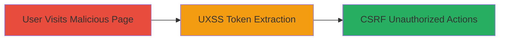

---
tags:
  - csrf
  - uxss
  - sop-bypass
  - token-extraction
  - web-exploitation
type: attack_chain
tools: []
tactics:
  - '[[Initial Access]]'
  - '[[Execution]]'
  - '[[Collection]]'
verified: false
platforms:
  - Web
submitted: true
complexity: medium
created_at: '2023-10-01T00:00:00Z'
procedures:
  - '[[procedures/Initiate-UXSS-via-Malicious-Page]]'
  - '[[procedures/Extract-CSRF-Token-from-Framed-Resource]]'
  - '[[procedures/Execute-CSRF-Attack-with-Extracted-Token]]'
step_count: 3
techniques:
  - '[[Drive-by Compromise]]'
  - '[[JavaScript]]'
  - '[[Exploit Public-Facing Application]]'
updated_at: '2025-12-14T17:27:35.798Z'
description: >-
  Multi-stage attack exploiting UXSS in vulnerable browsers to extract CSRF
  tokens and perform unauthorized actions on HackerOne, such as adding malicious
  team members.
skill_level: intermediate
impact_level: high
id: f1582cbf-97df-4f65-a576-30ff097af1c0
validated: true
mitre_tactics:
  - '[[Initial Access]]'
  - '[[Execution]]'
  - '[[Collection]]'
mitre_techniques:
  - '[[Drive-by Compromise]]'
  - '[[JavaScript]]'
  - '[[Exploit Public-Facing Application]]'
---
# CSRF Token Extraction via UXSS Leading to Unauthorized HackerOne Actions

Multi-stage attack chain demonstrating exploitation of Universal XSS (UXSS) in vulnerable browsers like Internet Explorer, combined with CSRF token exposure on HackerOne, to perform unauthorized actions such as adding malicious team members or external users to access sensitive reports.

## Chain Metrics Dashboard

| Metric | Value |
|--------|-------|
| Chain Status | Unverified |
| Total Steps | 3 |
| Execution Time | ~5 minutes |
| Skill Level | Intermediate |
| Complexity | Medium |
| Impact Level | High |

## Attack Flow Visualization

## Prerequisites & Requirements

### Required Tools

- Vulnerable browser (e.g., Internet Explorer with UXSS)
- Malicious webpage hosting (e.g., attacker-controlled domain)

### Target Environment

- HackerOne platform (Ruby on Rails backend)
- CloudFlare CDN services
- Web platform with forms at https://hackerone.com/settings/profile/edit

### Initial Access Requirements

- Logged-in user session on HackerOne
- User visits attacker-controlled page in vulnerable browser
- No direct JavaScript execution on target domain required

## Detailed Attack Procedures

### Step 1: Initiate UXSS via Malicious Page
procedure: [[procedures/Initiate-UXSS-via-Malicious-Page]]

**Objective**: Trick a logged-in user into visiting a malicious page that exploits a browser UXSS vulnerability to gain cross-origin access without full JavaScript execution.

**Instructions**: Host a malicious HTML page on an attacker-controlled domain. When the victim (logged-in to HackerOne) visits it in a vulnerable browser like IE, the page triggers the UXSS to frame and interact with HackerOne resources.

**Expected Output**: Successful framing of HackerOne resources, setting up for token extraction.

**Success Indicators**:
- Victim browser loads the malicious page without errors
- Cross-origin frame is established on HackerOne endpoints

### Step 2: Extract CSRF Token from Framed Resource
procedure: [[procedures/Extract-CSRF-Token-from-Framed-Resource]]

**Objective**: Use the UXSS to frame a CloudFlare endpoint and fetch/parse the CSRF token from the user profile edit form HTML.

**Instructions**: From the malicious page, frame https://hackerone.com/cdn-cgi/trace (which lacks X-Frame-Options) and use AJAX to request https://hackerone.com/settings/profile/edit. Parse the HTML response to extract the exposed CSRF token.

**Expected Output**: CSRF token value retrieved and stored for use in subsequent requests.

**Success Indicators**:
- AJAX request succeeds and returns HTML containing the token
- Token parsed without triggering SOP restrictions

### Step 3: Execute CSRF Attack with Extracted Token
procedure: [[procedures/Execute-CSRF-Attack-with-Extracted-Token]]

**Objective**: Use the extracted token to forge requests for unauthorized actions, bypassing mitigations like Origin header checks.

**Instructions**: Submit forged POST requests with the CSRF token and _method parameter to spoof PATCH/DELETE actions, e.g., adding a malicious team member via the profile or team management forms.

**Expected Output**: Successful unauthorized action, such as new team member added or report access granted.

**Success Indicators**:
- Server accepts the forged request and performs the action
- No CSRF validation errors; actions reflected in HackerOne account

## Attack Chain Summary

### Key Achievements

1. Bypassed SOP via UXSS to read cross-origin content
2. Extracted unbound CSRF tokens from HTML responses
3. Performed unauthorized modifications on HackerOne without user interaction

## Technique & Tactic Coverage

### MITRE ATT&CK Techniques

- [[Drive-by Compromise]]
- [[JavaScript]]
- [[Exploit Public-Facing Application]]

### MITRE ATT&CK Tactics

- [[Initial Access]]
- [[Execution]]
- [[Collection]]

---
*Last updated: 2023-10-01T00:00:00Z*
