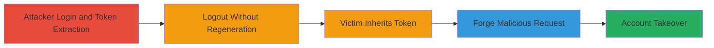

---
tags:
  - csrf
  - token-fixation
  - account-takeover
  - web-vulnerability
type: attack_chain
tools: []
tactics:
  - '[[Initial Access]]'
  - '[[Lateral Movement]]'
verified: false
platforms:
  - Web
submitted: true
complexity: medium
created_at: '2023-10-01T00:00:00Z'
procedures:
  - '[[procedures/Login-and-Obtain-Fixed-fkey]]'
  - '[[procedures/Extract-CSRF-fkey-Token]]'
  - '[[procedures/Logout-Without-Token-Regeneration]]'
  - '[[procedures/Victim-Login-Inherits-Fixed-Token]]'
  - '[[procedures/Forge-Email-Change-Request]]'
step_count: 5
techniques:
  - '[[Exploit Public-Facing Application]]'
  - '[[Credentials In Files]]'
updated_at: '2025-12-14T17:33:06.111Z'
description: >-
  Multi-stage attack exploiting fixed CSRF tokens (fkey) in Khan Academy that do
  not regenerate across sessions, enabling shared token reuse on the same
  browser for forging authenticated requests like email changes.
skill_level: intermediate
impact_level: high
id: 4fad1a8e-4f9f-4d9a-a445-3dd8991fb96a
validated: true
mitre_tactics:
  - '[[Initial Access]]'
  - '[[Lateral Movement]]'
mitre_techniques:
  - '[[Exploit Public-Facing Application]]'
  - '[[Credentials In Files]]'
---
# CSRF Token Fixation Leading to Account Takeover

Multi-stage attack chain demonstrating a complete attack workflow exploiting CSRF token fixation in Khan Academy, where the 'fkey' parameter remains constant across browser sessions, even after login or logout. This allows attackers to reuse the token on shared computers or steal it via XSS, leading to account takeover through forged requests like changing the victim's email.

## Chain Metrics Dashboard

| Metric | Value |
|--------|-------|
| Chain Status | Unverified |
| Total Steps | 5 |
| Execution Time | ~10 minutes |
| Skill Level | Intermediate |
| Complexity | Medium |
| Impact Level | High |

## Attack Flow Visualization

## Prerequisites & Requirements

### Required Tools

- Browser developer tools (e.g., Chrome DevTools)
- Optional: XSS payload for token theft

### Target Environment

- Web platform
- Khan Academy website (https://www.khanacademy.org)
- Shared browser or computer environment

### Initial Access Requirements

- Attacker account on Khan Academy
- Access to victim's browser session (e.g., shared device or via social engineering/XSS)
- No special network privileges needed; operates over standard HTTPS

## Detailed Attack Procedures

### Step 1: Attacker Login and Token Acquisition
procedure: [[procedures/Login-and-Obtain-Fixed-fkey]]

**Objective**: Establish an authenticated session to acquire the fixed CSRF fkey token.

**Instructions**: Navigate to the Khan Academy login page and authenticate with attacker credentials. The session will generate a fixed fkey that persists.

**Expected Output**: Successful login with visible fkey in form elements or cookies.

**Success Indicators**:
- Authenticated dashboard access
- fkey value observable in browser inspection

### Step 2: Extract the Fixed CSRF Token
procedure: [[procedures/Extract-CSRF-fkey-Token]]

**Objective**: Capture the unchanging fkey value for later reuse.

**Instructions**: Use browser developer tools to inspect forms or network requests post-login to copy the fkey parameter value.

**Expected Output**: Copied fkey string (e.g., a static token like 'abc123def').

**Success Indicators**:
- Token value extracted and noted
- Token confirmed as static via multiple requests

### Step 3: Logout Without Token Change
procedure: [[procedures/Logout-Without-Token-Regeneration]]

**Objective**: Terminate the attacker's session while preserving the fixed fkey in the browser.

**Instructions**: Perform logout action on the site; verify the fkey remains the same in browser storage.

**Expected Output**: Logout confirmation, but fkey unchanged in dev tools.

**Success Indicators**:
- Session ended for attacker
- fkey persists in browser

### Step 4: Victim Session Inheritance
procedure: [[procedures/Victim-Login-Inherits-Fixed-Token]]

**Objective**: Have the victim log in on the same browser, adopting the attacker's fixed fkey.

**Instructions**: Trick or wait for victim to log in on the shared browser; the pre-existing fkey will be used for their session.

**Expected Output**: Victim authenticated with the inherited fkey.

**Success Indicators**:
- Victim's session active
- Dev tools show same fkey as attacker's

### Step 5: Forge Request for Account Takeover
procedure: [[procedures/Forge-Email-Change-Request]]

**Objective**: Use the known fkey to submit a forged request changing the victim's email to the attacker's.

**Instructions**: Create a malicious HTML form posting to the email change endpoint with the fixed fkey and attacker's email; deliver via phishing or XSS.

**Expected Output**: Victim's email updated to attacker's control.

**Success Indicators**:
- Email change confirmation
- Attacker gains reset access to victim's account

## Attack Chain Summary

### Key Achievements

1. Demonstrated CSRF token fixation vulnerability allowing token sharing across sessions.
2. Enabled unauthorized email changes leading to full account takeover.
3. Highlighted risks in shared environments or when combined with XSS for token theft.

## Technique & Tactic Coverage

### MITRE ATT&CK Techniques

- [[Exploit Public-Facing Application]] Exploit Public-Facing Application
- [[Credentials In Files]] Credentials In-Files (for token reuse)

### MITRE ATT&CK Tactics

- [[Initial Access]] Initial Access
- [[Lateral Movement]] Lateral Movement

---
*Last updated: 2023-10-01T00:00:00Z*
