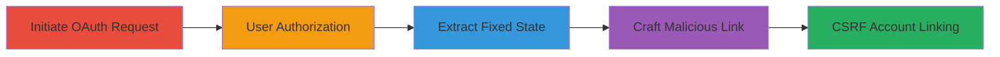

# CSRF Token Fixation in Shopify Facebook Store App Leading to Unauthorized Account Linking

Multi-stage attack chain demonstrating a complete CSRF workflow via OAuth token fixation in Shopify's official Facebook Store app. The fixed 'state' parameter allows attackers to predict and reuse it, enabling unauthorized linking of Facebook accounts to Shopify stores.

## Chain Metrics Dashboard

| Metric | Value |
|--------|-------|
| Chain Status | Unverified |
| Total Steps | 4 |
| Execution Time | ~5 minutes |
| Skill Level | Intermediate |
| Complexity | Medium |
| Impact Level | High |

## Attack Flow Visualization



## Prerequisites & Requirements

### Required Tools

- Browser developer tools for inspecting requests
- [[tools/Burp-Suite]] (optional for intercepting OAuth flows)

### Target Environment

- Web platform
- Access to Shopify Facebook Store app (https://facebookstore.shopifyapps.com)
- Facebook Graph API integration

### Initial Access Requirements

- Victim's Shopify session (via phishing or XSS for state extraction)
- Attacker's own Facebook authorization code
- Ability to deliver malicious links (e.g., email, social engineering)

## Detailed Attack Procedures

### Step 1: Initiate OAuth Authorization Request
procedure: [[procedures/Initiate-OAuth-Authorization-Request]]

**Objective**: Start the OAuth flow to reveal the fixed state parameter used in the Facebook Store app.

**Instructions**: Use [[commands/curl-oauth-initiate]] to send the initial authorization request to Facebook's Graph API, capturing the fixed state.

```bash
curl -X GET "https://graph.facebook.com/oauth/authorize?client_id=410312912374011&display=popup&redirect_uri=https%3A%2F%2Ffacebookstore.shopifyapps.com%2Fauthenticated&response_type=code&scope=manage_pages+email&state=c2f449f2df5ee64df6173702846bce72e3a57319"
```

**Expected Output**: Response with authorization URL containing the fixed state parameter.

**Success Indicators**:
- Fixed state 'c2f449f2df5ee64df6173702846bce72e3a57319' observed in request
- No regeneration of state across multiple requests

### Step 2: Authorize App on Facebook
procedure: [[procedures/Authorize-App-on-Facebook]]

**Objective**: Simulate or observe the victim's authorization to obtain the callback with auth code and fixed state.

**Instructions**: Direct the victim (or test account) to the authorization URL, then inspect the redirect to the callback.

**Expected Output**: Redirect to https://facebookstore.shopifyapps.com/authenticated with code and state parameters.

**Success Indicators**:
- Callback includes victim's auth code and the same fixed state
- No additional CSRF protection enforced

### Step 3: Obtain Fixed State Parameter
procedure: [[procedures/Obtain-Fixed-State-Parameter]]

**Objective**: Extract the predictable state value from the victim's session via XSS or inspection.

**Instructions**: Inject XSS payload in victim's Shopify session to capture the state, e.g., using a script to log the parameter.

**Expected Output**: State value 'c2f449f2df5ee64df6173702846bce72e3a57319' retrieved.

**Success Indicators**:
- State value matches across sessions
- Attacker can reuse it without detection

### Step 4: Craft and Deliver Malicious Link
procedure: [[procedures/Craft-and-Deliver-Malicious-Link]]

**Objective**: Trick the victim into clicking a link that submits the attacker's auth code with the fixed state, completing the CSRF.

**Instructions**: Create an HTML page with the malicious callback URL using [[commands/curl-malicious-link-craft]] to test, then deliver via phishing.

```bash
curl -X GET "https://facebookstore.shopifyapps.com/authenticated?code=ATTACKER_AUTH_CODE&state=c2f449f2df5ee64df6173702846bce72e3a57319#=_"
```

**Expected Output**: Successful redirect linking attacker's Facebook to victim's Shopify.

**Success Indicators**:
- Attacker's Facebook account connected to victim's store
- Unauthorized access granted without victim consent

## Attack Chain Summary

### Key Achievements

1. Exposed fixed OAuth state enabling prediction and reuse
2. Performed CSRF to link external accounts without authentication
3. Demonstrated potential for unauthorized store control via Facebook integration

## Technique & Tactic Coverage

### MITRE ATT&CK Techniques

- [[Exploit Public-Facing Application]] Exploit Public-Facing Application
- [[Drive-by Compromise]] Drive-by Compromise

### MITRE ATT&CK Tactics

- [[Initial Access]] Initial Access

---

*Last updated: 2023-10-01T00:00:00Z*
