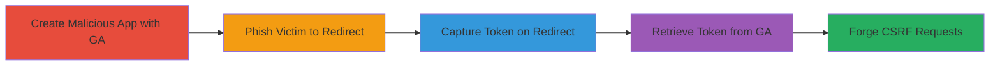

# CSRF Token Leakage via Google Analytics on Shopify Apps

Multi-stage attack chain demonstrating the exploitation of CSRF token leakage in Shopify's app platform through embedded Google Analytics tracking, allowing attackers to steal tokens and impersonate victims for unauthorized actions like editing app listings or submitting fake reviews.

## Chain Metrics Dashboard

| Metric | Value |
|--------|-------|
| Chain Status | Unverified |
| Total Steps | 5 |
| Execution Time | ~15 minutes |
| Skill Level | Intermediate |
| Complexity | Medium |
| Impact Level | High |

## Attack Flow Visualization

## Prerequisites & Requirements

### Required Tools

- [[tools/Google-Analytics]]

### Target Environment

- Shopify Partner Dashboard (apps.shopify.com)
- Web browser for victim interaction
- Attacker's Google Analytics account

### Initial Access Requirements

- Shopify Partner account for app creation
- Control over a malicious HTML page (e.g., hosted on attacker's domain)
- No prior victim credentials needed; social engineering for login trigger

## Detailed Attack Procedures

### Step 1: Create Malicious App with GA Embedding
procedure: [[procedures/Create-Shopify-App-with-Google-Analytics-Embedding]]

**Objective**: Set up a Shopify app listing that embeds Google Analytics to capture full URLs including sensitive query parameters.

**Instructions**: Log in to the Shopify Partner Dashboard and create a new app, then edit the listing to insert GA tracking code.

**Expected Output**: App listing page with embedded GA code active.

**Success Indicators**:
- App created successfully at https://apps.shopify.com/[app_id]
- GA code visible in app listing source

### Step 2: Trick Victim into Redirecting to Attacker App
procedure: [[procedures/Trick-Victim-into-Redirecting-to-Attacker-App]]

**Objective**: Use social engineering to direct the victim to a page that forces a redirect to the attacker's app support page, prompting login.

**Instructions**: Host an HTML page with JavaScript that opens a new window or iframe to the app's support interactions endpoint.

**Expected Output**: Victim's browser loads the malicious page and initiates redirect.

**Success Indicators**:
- Victim visits the controlled HTML page
- New window/iframe opens to https://apps.shopify.com/[app_id]/support_interactions/new

### Step 3: Trigger Victim Login and Redirect with Token
procedure: [[procedures/Trigger-Victim-Login-and-Redirect-with-Token]]

**Objective**: Ensure the victim authenticates, causing a redirect that appends the CSRF token to the app page URL.

**Instructions**: Upon redirect, if unauthenticated, Shopify prompts login at https://apps.shopify.com/#login, then redirects to the app page with token.

**Expected Output**: URL like https://apps.shopify.com/[app_id]?authenticity_token=[token].

**Success Indicators**:
- Victim logs in successfully
- GA captures the full redirect URL with token

### Step 4: Retrieve Stolen CSRF Token from Google Analytics
procedure: [[procedures/Retrieve-Stolen-CSRF-Token-from-Google-Analytics]]

**Objective**: Monitor the GA real-time dashboard to extract the leaked token from the captured URL.

**Instructions**: Access the GA dashboard and check real-time reports for the referral URL containing the token.

**Expected Output**: Full URL with authenticity_token parameter visible in active users section.

**Success Indicators**:
- Token appears in GA real-time analytics
- Attacker copies the token value

### Step 5: Forge CSRF-Protected Requests with Stolen Token
procedure: [[procedures/Forge-CSRF-Protected-Requests-with-Stolen-Token]]

**Objective**: Use the stolen token to bypass CSRF protections and perform unauthorized actions on behalf of the victim.

**Instructions**: Craft POST requests to protected endpoints, including the stolen token in the authenticity_token field.

**Expected Output**: Successful modification, e.g., edited app listing or submitted review.

**Success Indicators**:
- Request to https://apps.shopify.com/services/shopify_applications/edit succeeds
- Victim's account shows unauthorized changes

## Attack Chain Summary

### Key Achievements

1. Embedded GA in app listing to passively capture sensitive URLs
2. Social engineering to trigger victim authentication and token exposure
3. Real-time token retrieval enabling immediate exploitation
4. Forged requests leading to account impersonation and data manipulation

## Technique & Tactic Coverage

### MITRE ATT&CK Techniques

- [[T1566.002]] Spearphishing Link
- [[Steal Web Session Cookie]] Steal Web Session Cookie
- [[Forge Web Credentials]] Forge Web Credentials

### MITRE ATT&CK Tactics

- [[Initial Access]] Initial Access
- [[Credential Access]] Credential Access

---

*Last updated: 2023-10-01T00:00:00Z*
