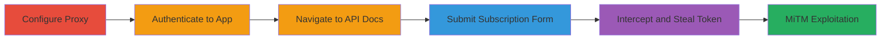

# CSRF Token Leakage via Unencrypted HTTP Subscription Form Leading to Bypass

Multi-stage attack chain demonstrating the discovery and exploitation of CSRF token leakage in Coinbase's developer subscription form, allowing MiTM interception to bypass protections.

## Chain Metrics Dashboard

| Metric | Value |
|--------|-------|
| Chain Status | Unverified |
| Total Steps | 5 |
| Execution Time | ~10 minutes |
| Skill Level | Intermediate |
| Complexity | Medium |
| Impact Level | High |

## Attack Flow Visualization

## Prerequisites & Requirements

### Required Tools

- [[tools/Burp-Suite]]

### Target Environment

- Web platform
- Access to Coinbase website (https://coinbase.com)
- Valid user credentials for authentication

### Initial Access Requirements

- Network access to Coinbase domain
- No prior privileged access needed; standard user session suffices
- Browser with proxy support (e.g., Firefox or Chrome)

## Detailed Attack Procedures

### Step 1: Configure Proxy Tool
procedure: [[procedures/Configure-Burp-Suite-Proxy]]

**Objective**: Set up interception of HTTP traffic from the browser to capture requests.

**Instructions**: Launch Burp Suite and configure your browser to route traffic through the proxy on localhost:8080. Install the Burp CA certificate in the browser to handle HTTPS interception if needed, though this attack focuses on HTTP leaks.

**Expected Output**: Proxy active, ready to intercept requests.

**Success Indicators**:
- Browser traffic routed through Burp
- No connection errors in proxy logs

### Step 2: Authenticate to Coinbase Application
procedure: [[procedures/Authenticate-to-Coinbase-App]]

**Objective**: Establish an authenticated session to access protected pages like API documentation.

**Instructions**: Open the browser, navigate to https://coinbase.com, and log in using valid credentials. Ensure cookies are accepted and session is active.

**Expected Output**: Dashboard or user profile visible, indicating successful login.

**Success Indicators**:
- Authenticated session confirmed
- CSRF token present in session (verifiable in dev tools)

### Step 3: Navigate to API Documentation
procedure: [[procedures/Navigate-to-API-Docs]]

**Objective**: Reach the page containing the vulnerable subscription form.

**Instructions**: In the authenticated browser session, go to https://coinbase.com/docs/api/overview. Verify the "Developer Updates" section is visible.

**Expected Output**: API overview page loaded with subscription form.

**Success Indicators**:
- Page loads without errors
- Form fields (e.g., email) are accessible

### Step 4: Submit Subscription Form
procedure: [[procedures/Submit-Subscription-Form]]

**Objective**: Trigger the POST request that leaks the CSRF token over HTTP.

**Instructions**: Enter a test email address in the "Developer Updates" subscription form and click "Subscribe". Monitor the proxy for the outgoing request.

**Expected Output**: Form submission initiates a POST to an external HTTP endpoint.

**Success Indicators**:
- Request intercepted in proxy
- No immediate errors on page

### Step 5: Intercept and Analyze Request
procedure: [[procedures/Intercept-and-Analyze-POST-Request]]

**Objective**: Capture the CSRF token from the unencrypted HTTP POST body for MiTM exploitation.

**Instructions**: In Burp Suite, inspect the intercepted POST request to the external endpoint (e.g., a marketing service). Note the CSRF token in the request body, confirming it's sent over HTTP without encryption.

**Expected Output**: Visible CSRF token in plaintext within the POST body.

**Success Indicators**:
- Token extracted and readable
- Endpoint confirmed as HTTP (not HTTPS)

## Attack Chain Summary

### Key Achievements

1. Successful interception of CSRF token via HTTP leak
2. Demonstration of MiTM feasibility to steal tokens in transit
3. Bypass of CSRF protections, enabling unauthorized actions on user behalf

## Technique & Tactic Coverage

### MITRE ATT&CK Techniques

- [[Adversary-in-the-Middle]] Adversary-in-the-Middle
- [[Network Sniffing]] Network Sniffing
- [[Exploit Public-Facing Application]] Exploit Public-Facing Application

### MITRE ATT&CK Tactics

- [[Credential Access]] Credential Access
- [[Initial Access]] Initial Access

---

*Last updated: 2023-10-01T00:00:00Z*
