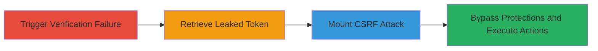

---
tags:
  - csrf
  - token-leakage
  - web-vulnerability
  - browser-history
type: attack_chain
tools: []
tactics:
  - '[[Initial Access]]'
  - '[[Collection]]'
  - '[[Execution]]'
verified: false
platforms:
  - Web
submitted: true
complexity: medium
created_at: '2023-10-01T00:00:00Z'
procedures:
  - '[[procedures/Trigger-Verification-Failure-to-Leak-CSRF-Token]]'
  - '[[procedures/Retrieve-Leaked-CSRF-Token-from-Browser-History]]'
  - '[[procedures/Mount-CSRF-Attack-with-Reusable-Token]]'
step_count: 3
techniques:
  - '[[Exploit Public-Facing Application]]'
  - '[[Data from Local System]]'
  - '[[Exploitation for Client Execution]]'
updated_at: '2025-12-14T17:27:29.232Z'
description: >-
  A multi-stage attack exploiting CSRF token exposure in the Robocoin wallet
  verification process, allowing attackers to bypass protections and perform
  unauthorized actions on behalf of victims.
skill_level: intermediate
impact_level: high
id: 83b3a8b4-ca78-4cbc-8223-d9c21f7e1cf6
validated: true
mitre_tactics:
  - '[[Initial Access]]'
  - '[[Collection]]'
  - '[[Execution]]'
mitre_techniques:
  - '[[Exploit Public-Facing Application]]'
  - '[[Data from Local System]]'
  - '[[Exploitation for Client Execution]]'
---
# CSRF Token Leakage via Verification Error in Robocoin Wallet

Multi-stage attack chain demonstrating a complete attack workflow exploiting CSRF token leakage in the Robocoin wallet verification process.

## Chain Metrics Dashboard

| Metric | Value |
|--------|-------|
| Chain Status | Unverified |
| Total Steps | 3 |
| Execution Time | ~5 minutes |
| Skill Level | Intermediate |
| Complexity | Medium |
| Impact Level | High |

## Attack Flow Visualization

## Prerequisites & Requirements

### Required Tools

- Browser developer tools for inspection
- No specialized tools required beyond a standard web browser

### Target Environment

- Web platform
- Robocoin wallet service at https://wallet.robocoin.com/
- Access to victim's browser or network position to observe history (e.g., shared device or malware)

### Initial Access Requirements

- Victim must be authenticated or attempting verification
- Attacker needs to induce victim interaction with verification endpoint
- No prior credentials needed, but social engineering may be required to trigger

## Detailed Attack Procedures

### Step 1: Trigger Verification Failure
procedure: [[procedures/Trigger-Verification-Failure-to-Leak-CSRF-Token]]

**Objective**: Cause an error in the account verification process to expose the CSRF token in the URL query parameter.

**Instructions**: Direct the victim to access the verification endpoint https://wallet.robocoin.com/verify/ with invalid parameters (e.g., via a phishing link or malicious form submission). This triggers a failure, resulting in a redirect to https://wallet.robocoin.com/verify/id?_csrf=token, where the token is appended visibly.

**Expected Output**: Browser redirects to a URL containing the _csrf query parameter with the token value.

**Success Indicators**:
- URL in address bar shows ?_csrf= followed by a token string
- Token appears in browser history entry

### Step 2: Retrieve Leaked CSRF Token
procedure: [[procedures/Retrieve-Leaked-CSRF-Token-from-Browser-History]]

**Objective**: Extract the exposed CSRF token from the victim's browser history for reuse.

**Instructions**: Inspect the browser history (e.g., via Ctrl+H in Chrome or developer console) to locate the verification URL. Copy the token value from the query parameter. The token is stored due to the GET request method and error handling.

**Expected Output**: Token string retrieved, e.g., _csrf=abc123def456.

**Success Indicators**:
- Token successfully copied from history
- No expiration or invalidation on retrieval

### Step 3: Mount CSRF Attack
procedure: [[procedures/Mount-CSRF-Attack-with-Reusable-Token]]

**Objective**: Use the leaked token to forge requests and perform unauthorized actions as the victim.

**Instructions**: Construct a malicious HTML form or request including the stolen token, targeting sensitive endpoints (e.g., fund transfers). Submit via POST to https://wallet.robocoin.com/ with the token in the headers or body to bypass CSRF checks. The token's reusability allows multiple attempts.

**Expected Output**: Successful execution of victim actions, such as account modifications, without authentication prompts.

**Success Indicators**:
- Forged request completes without CSRF errors
- Victim's account state changes (e.g., unauthorized transaction)

## Attack Chain Summary

### Key Achievements

1. Exposed CSRF token through error handling flaw
2. Retrieved reusable token from browser history
3. Bypassed CSRF protections to execute attacks

## Technique & Tactic Coverage

### MITRE ATT&CK Techniques

- [[Exploit Public-Facing Application]] Exploit Public-Facing Application
- [[Data from Local System]] Data from Local System
- [[Exploitation for Client Execution]] Exploitation for Client Execution

### MITRE ATT&CK Tactics

- [[Initial Access]] Initial Access
- [[Collection]] Collection
- [[Execution]] Execution

---
*Last updated: 2023-10-01T00:00:00Z*
