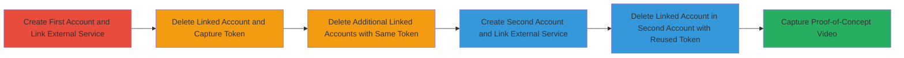

---
tags:
  - csrf
  - token-reuse
  - web-vulnerability
  - account-management
type: attack_chain
tools: []
tactics:
  - '[[Initial Access]]'
verified: false
platforms:
  - Web
submitted: true
complexity: low
created_at: '2023-10-01T00:00:00Z'
procedures:
  - '[[procedures/Create-Liberapay-Account-and-Link-External-Service]]'
  - '[[procedures/Demonstrate-Token-Reuse-in-Account-Deletions]]'
  - '[[procedures/Create-Second-Account-and-Verify-Cross-Account-Token-Reuse]]'
  - '[[procedures/Capture-Proof-of-Concept-Evidence]]'
step_count: 6
techniques:
  - '[[Exploit Public-Facing Application]]'
updated_at: '2025-12-14T17:27:15.318Z'
description: >-
  Demonstrates reuse of CSRF tokens in Liberapay for deleting linked third-party
  accounts within and across multiple accounts in the same browser session,
  potentially weakening protections against CSRF attacks when combined with
  other vulnerabilities like XSS.
skill_level: beginner
impact_level: medium
id: 99f95a31-c62c-44ca-a932-839656d326b0
validated: true
mitre_tactics:
  - '[[Initial Access]]'
mitre_techniques:
  - '[[Exploit Public-Facing Application]]'
---
# CSRF Token Reuse Across Liberapay Accounts Enabling Potential Web Exploitation

## Overview

This attack chain outlines a vulnerability in Liberapay's CSRF token handling where the same token is reused for sensitive actions like deleting linked third-party accounts (e.g., Google+, Facebook) within a single account and across multiple accounts created in the same browser session. The token, stored in a generic 7-day cookie not regenerated on login or logout, could potentially enable CSRF attacks or session manipulation if exploited alongside issues like XSS. Although Liberapay assessed this as not fully breaking CSRF protections due to the token's randomness, it highlights a misconfiguration in token scoping. The chain demonstrates the issue through account creation, linking, deletion, and token observation in a browser environment.

## Chain Metrics Dashboard

| Metric | Value |
|--------|-------|
| Chain Status | Unverified |
| Total Steps | 6 |
| Execution Time | ~10 minutes |
| Skill Level | Beginner |
| Complexity | Low |
| Impact Level | Medium |

## Attack Flow Visualization

## Prerequisites & Requirements

### Required Tools

- Web browser (e.g., Chrome with Developer Tools for network inspection)
- Access to external accounts (e.g., Google+, Facebook for linking)

### Target Environment

- Liberapay web platform
- No specific ports or services beyond standard HTTPS (443)
- Same browser session required for token cookie persistence

### Initial Access Requirements

- No prior credentials needed; accounts are created during the process
- Internet access to Liberapay.com
- No elevated privileges; uses standard user registration

## Detailed Attack Procedures

### Step 1: Create First Liberapay Account and Link External Service
procedure: [[procedures/Create-Liberapay-Account-and-Link-External-Service]]

**Objective**: Establish a baseline Liberapay account and link a third-party service to prepare for deletion actions that reveal token behavior.

**Instructions**: Navigate to Liberapay.com, sign up for a new account using email or username, then access the profile's 'Accounts Elsewhere' section to link a Google+ account via OAuth flow.

**Expected Output**: Successful account creation and external service linkage confirmed in the profile.

**Success Indicators**:
- New account dashboard accessible
- Linked Google+ account visible in 'Accounts Elsewhere'

### Step 2: Delete Linked Account and Capture CSRF Token
procedure: [[procedures/Demonstrate-Token-Reuse-in-Account-Deletions]]

**Objective**: Perform a deletion action to observe and capture the initial CSRF token used in the request.

**Instructions**: In the 'Accounts Elsewhere' section, initiate deletion of the linked Google+ account. Use browser Developer Tools (Network tab) to inspect the POST request to the deletion endpoint and note the CSRF token value (e.g., 'J0Lk5iXTpp40iDN5KNcrI24bulPcF0PV') in the form data or cookie.

**Expected Output**: Linked account deleted; token captured from request headers or body.

**Success Indicators**:
- Deletion successful without errors
- Token value logged (e.g., 32-character random string)

### Step 3: Delete Additional Linked Accounts with Same Token
procedure: [[procedures/Demonstrate-Token-Reuse-in-Account-Deletions]]

**Objective**: Verify token reuse within the same account by performing multiple deletion actions.

**Instructions**: Link and delete another external service (e.g., another Google+ or different platform) within the same Liberapay account. Inspect the network request again to confirm the identical CSRF token is reused.

**Expected Output**: Multiple deletions succeed using the same token value.

**Success Indicators**:
- Same token observed across deletion requests
- No token regeneration triggered

### Step 4: Create Second Liberapay Account and Link External Service
procedure: [[procedures/Create-Second-Account-and-Verify-Cross-Account-Token-Reuse]]

**Objective**: Set up a second account in the same browser session to test cross-account token persistence.

**Instructions**: Without clearing cookies or logging out, sign up for a new Liberapay account and link a Facebook account via the 'Accounts Elsewhere' section using OAuth.

**Expected Output**: Second account created and Facebook linkage confirmed.

**Success Indicators**:
- New account functional
- Facebook account listed as linked
- Original cookie (including CSRF token) persists in browser storage

### Step 5: Delete Linked Account in Second Account with Reused Token
procedure: [[procedures/Create-Second-Account-and-Verify-Cross-Account-Token-Reuse]]

**Objective**: Confirm the CSRF token from the first account is reused in the second account's deletion action.

**Instructions**: Delete the linked Facebook account in the second Liberapay account. Inspect the network request to verify the same CSRF token (e.g., 'J0Lk5iXTpp40iDN5KNcrI24bulPcF0PV') is sent.

**Expected Output**: Deletion succeeds with the reused token.

**Success Indicators**:
- Identical token value across accounts
- Cookie remains valid for 7 days without account-specific tying

### Step 6: Capture Proof-of-Concept Evidence
procedure: [[procedures/Capture-Proof-of-Concept-Evidence]]

**Objective**: Document the token reuse for validation and reporting.

**Instructions**: Use screen recording software to capture the entire process from account creation to token observation across actions and accounts. Include Developer Tools views showing the token in requests.

**Expected Output**: Video file demonstrating the vulnerability.

**Success Indicators**:
- Clear footage of token reuse
- Reproducible steps shown

## Attack Chain Summary

### Key Achievements

1. Successful creation and management of multiple Liberapay accounts in one session
2. Linking and deletion of third-party accounts (Google+, Facebook) with observed CSRF token reuse
3. Documentation of generic 7-day cookie storage not regenerating on login/logout, highlighting potential for CSRF exploitation if combined with XSS

## Technique & Tactic Coverage

### MITRE ATT&CK Techniques

- [[Exploit Public-Facing Application]]

### MITRE ATT&CK Tactics

- [[Initial Access]]

---
*Last updated: 2023-10-01T00:00:00Z*
